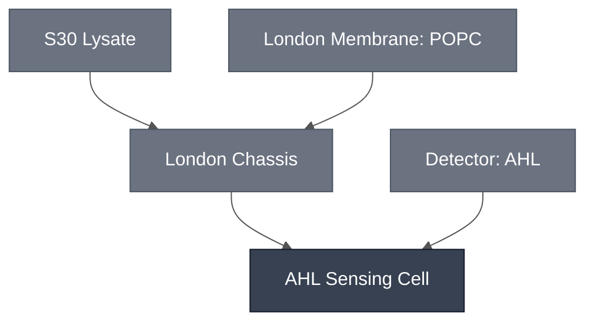

# Overview

The AHL Sensing Cell combines the [London Chassis](../london-chassis/spec.md) with the [AHL Sensing Module](../detector-3oc6-hsl/spec.md), encapsulating the LuxR/pLux AHL sensor plasmid (`pLux-GFP`) inside a POPC synthetic cell filled with S30 Lysate. AHL supplied in the outer solution diffuses across the POPC membrane, LuxR binds it, and the activated pLux promoter drives GFP expression inside the liposome. This composed synthetic cell is used in the London quorum-sensing demo.

:::{attention} 🚧 Draft
This page is a work in progress and not yet ready for use.
:::

(ahl-sensing-cell-reference-composition)=
# Reference Composition

:::::{tab-set}

<!-- gen:composition-diagram -->
::::{tab-item} Module Dependencies

::::
<!-- /gen:composition-diagram -->

::::{tab-item} DNA

:::{table}
| **Name** | **Length (bp)** | **File** | **Supply route** |
| --- | --- | --- | --- |
| `pLux-GFP` | not documented | — | Expressed in the sensing cell; the LuxR/pLux reporter plasmid |
| `p70`-driven LuxR cassette | not documented | — | Expressed in-reaction; not recorded whether it sits on `pLux-GFP` or on a second construct |
:::

:::{attention} Sensor plasmid not in `nucleus-eng/DNA`
@Editor(london): `pLux-GFP` has no confirmed sequence file in [nucleus-eng/DNA](https://github.com/nucleus-eng/DNA). The mechanism has LuxR expressed from a constitutive p70 cassette, but no source records whether that cassette is carried on `pLux-GFP` itself or on a second plasmid — and if it is a second plasmid, both this table and the reaction below are missing a row for it. Confirm with the London Node.
:::

See [Detector: AHL](../detector-3oc6-hsl/spec.md) for sensor specification.

::::

::::{tab-item} Cytosol
The inner solution is [S30 Lysate](../s30-lysate/spec.md) at reaction concentration, plus the [AHL Sensing Module](../detector-3oc6-hsl/spec.md)'s `pLux-GFP` reporter plasmid.

:::{table} Combined synthetic cell reaction, one level deep.
:label: comp-ahl-cell-inner

| Module | Working concentration | Notes |
| --- | --- | --- |
| [London Chassis](../london-chassis/spec.md) | S30 Lysate at reaction concentration, in a 100% POPC synthetic cell membrane | Transcription, translation, and encapsulation. The 27.2 µL recipe on that page carries over unchanged, except that 0.95 µL of the nuclease-free water is displaced by sensor plasmid. |
| [AHL Sensing Module](../detector-3oc6-hsl/spec.md) | `pLux-GFP` sensor plasmid at 37 ng/µL final, from a 1056 ng/µL stock — 0.95 µL per reaction | The `p70`-driven LuxR cassette is expressed in-reaction at an unrecorded concentration. See the DNA tab for what is missing. |

:::

::::

::::{tab-item} Membrane

:::{table}
:label: comp-ahl-cell-membrane

| Component | Target Percentage (%) |
| --------- | ---------------------- |
| POPC      | 100                     |

:::

See [London Membrane: POPC](../membrane-popc/spec.md) for details.

::::

::::{tab-item} Outer Solution

:::{table}
:label: comp-ahl-cell-outer

| Component | Concentration |
| --------- | ------------- |
| Potassium L-glutamate | 578 mM |
| HEPES (pH 7.4) | 72 mM |
| Glucose | 300 mM |
| AHL (3OC6-HSL) | 10 µM |

:::

Inner and outer osmolarity are matched (~920 mOsm) to keep encapsulated synthetic cells stable.

::::

:::::

# Expected Behavior

The AHL Sensing Cell is expected to express an effector gene (here: GFP) when AHL diffuses from the outer solution into the inner solution of the cell. Across nine configurations spanning bulk, solution and gel formats in Base Cytosol, S30 Lysate and live-bacteria co-culture, reproducibility varies and no configuration is yet fully validated. GFP outperforms the colorimetric readout, and solution and bulk formats outperform gel. A colorimetric readout in a gel-based cytosol system has not yet been demonstrated.

## Cells

Without Optiprep in the inner solution, the encapsulated sensor expresses GFP on AHL induction: green fluorescence appears across all imaged fields, with liposome-associated GFP puncta co-localizing with round synthetic cells, consistent with an active encapsulated reaction. The source reaction includes a matched condition omitting the `pLux-GFP` plasmid, but the reported imaging result carries no minus-AHL control and no biological replicates, so the GFP signal is not yet formally attributable.

In [S30 Lysate](../s30-lysate/spec.md), the AHL-gated [colorimetric](../../processes/colorimetric-readout/main.md) sensor works in solution as well as in gel. An AHL Sensing Cell combined with a [CPRG-loaded SUV](../../processes/encapsulate-suv/main.md) and AHL has not been reproduced. Negative controls in that test turned purple, attributed to leaky old-stock liposomes rather than an AHL response.

:::{attention} Caveats
- Optiprep above ~5% of the inner solution broadly suppresses cell-free expression, independent of the AHL detector module. At 10% and 15% it gives abundant, stable synthetic cells with no reporter expression.
- Plasmid dose is critical — roughly seven-fold under-dosing accounts for early failures. Use ~1000 ng per reaction.
- Fold-induction is strongest near 25 °C and drops at 37 °C. Incubate at 25 °C where minimal background matters.
- Encapsulation is stochastic. Expect a GFP-positive subpopulation rather than uniform signal across synthetic cells.
:::

:::{attention} Plasmid concentration is two conflicting figures, not a range
@Editor(london): the source gives 37 ng/µL in its reaction table and 80 ng/µL in its prose. The [Reference Composition](#ahl-sensing-cell-reference-composition) above uses 37 ng/µL. Confirm with the London Node which applies.
:::

## Gels

Embedded in 1% ultra-low-gelling-temperature agarose (ULGA), POPC synthetic cells produce a GFP response after 2.5 h incubation with either overnight bacterial culture or bacterial culture supernatant, confirmed by Z-stack imaging. An LB-only control gives no signal at matched imaging settings. In [S30 Lysate](../s30-lysate/spec.md), GFP synthetic cells dosed with AHL give a reproducible plate-reader signal over a 1000 min time course.

The gel-format colorimetric sensor has been repeated across two laboratories but is temperamental: synthetic cells sometimes fail to rupture. In [Base Cytosol](../base-cytosol/spec.md), a constitutive (non-AHL-gated) [PLA1](../effector-pla1/spec.md)/[CPRG](../substrate-cprg-suv/spec.md) two-liposome colorimetric configuration gives a measurable, reproducible color change by UV-Vis after 3 h. Leaky expression is the limiting problem in gel formats.

The [London Cascade](../london-cascade/spec.md) swaps this Cell's GFP payload for a `P70lux-PLA1-term` construct, so that AHL exposure triggers a two-liposome PLA1/LacZ colorimetric handoff instead.

## Live-bacteria co-culture

:::{warning} Not yet validated
A single agar-pad AHL-diffusion test of lysate synthetic cells alongside live bacteria produced no observable GFP. One attempt, no replicates.
:::

# Requirements

Requires sigma-70 transcription and translation (e.g. [S30 Lysate](../s30-lysate/spec.md)). The `pLux-GFP` construct is driven by the *E. coli* pLux promoter, not pT7, so it does not express in a T7-only cytosol.

Requires AHL (3-oxo-C6-HSL) in the outer solution and the LuxR receiver protein to gate the promoter (e.g. [Detector: AHL](../detector-3oc6-hsl/spec.md)).

Requires a membrane permeable to AHL (e.g. [London Membrane: POPC](../membrane-popc/spec.md)). Keep Optiprep below ~5% of the inner solution; above that it suppresses expression.

# Implementations

- [London DevCell](../../implementations/london-devcell/main.md): places this Cell in the London quorum-sensing demo.

# Processes

- [Encapsulation: Phase Transfer](../../processes/assemble-base-cell/main.md) — forms the synthetic cell, encapsulating [S30 Lysate](../s30-lysate/spec.md) plus the `pLux-GFP` sensor plasmid in a POPC membrane
- [ULGA Hydrogel Embedding](../../processes/embed-ulga-hydrogel/main.md) — immobilizes the Cell in gel, for the gel-format configurations

:::{attention} The London encapsulation route may be a variant
@Editor(london): this Cell is formed by an Elani-lab mineral-oil phase-transfer protocol, the same route described on the [London Chassis](../london-chassis/spec.md) spec. [Encapsulation: Phase Transfer](../../processes/assemble-base-cell/main.md) documents emulsion phase transfer as a general method, but it is not confirmed that the London mineral-oil route is that protocol rather than a variant needing its own page. Confirm with the London Node.
:::

# Constituent Modules

- [London Chassis](../london-chassis/spec.md)
- [AHL Sensing Module](../detector-3oc6-hsl/spec.md)

# Credits

Developed by Ion Ioannou and Jonah McDonald (London Node) — synthetic cell encapsulation.

:::{attention} Credits are draft
Contributor attribution on this page has not been confirmed with the Node. Assign each credit explicitly before this page is merged to `main`.
:::
