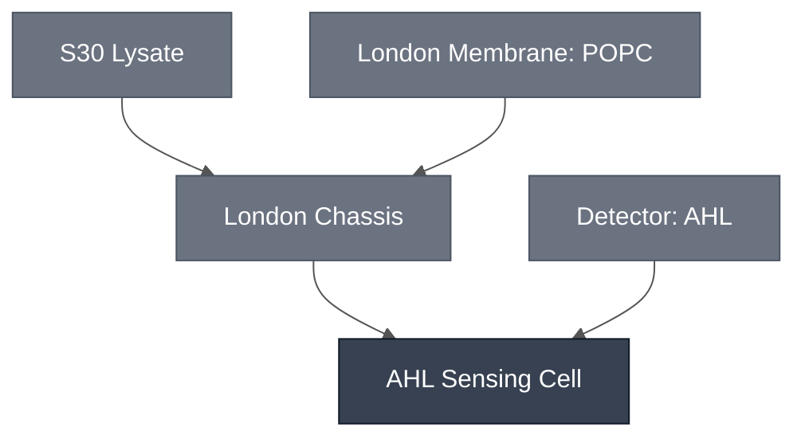

# Overview

The AHL Sensing Cell combines the [London Chassis](../london-chassis/spec.md) with the [AHL Sensing Module](../detector-ahl/spec.md), encapsulating the LuxR/pLux AHL sensor plasmid (`pLux-GFP`) inside a POPC synthetic cell filled with S30 Lysate. AHL supplied in the outer solution diffuses across the POPC membrane, LuxR binds it, and the activated pLux promoter drives GFP expression inside the liposome — so GFP reports both an active encapsulated cell-free reaction and AHL exposure. This is the composed synthetic-cell substrate used in the London quorum-sensing demo; on its own the London Chassis is an empty encapsulation shell, and the AHL Sensing Module has not been characterized outside a lysate/synthetic cell context (see the [AHL Sensing Module](../detector-ahl/spec.md) spec).

:::{attention} 🚧 Draft
This page is a work in progress and not yet ready for use.
:::

# Reference Composition

:::::{tab-set}

<!-- gen:composition-diagram -->
::::{tab-item} Module Dependencies

::::
<!-- /gen:composition-diagram -->

::::{tab-item} DNA

:::{table}
| **Name** | **Length (bp)** | **File** | **Supply route** |
| --- | --- | --- | --- |
| `pLux-GFP` | not documented | — | Expressed in the sensing cell; the LuxR/pLux reporter plasmid |
| LuxR receiver | not documented | — | Not documented — expressed or supplied as protein |
:::

:::{attention} Sensor plasmid not in `nucleus-eng/DNA`
@Editor: `pLux-GFP` has no confirmed sequence file in [nucleus-eng/DNA](https://github.com/nucleus-eng/DNA), and it is not recorded whether LuxR is expressed from a construct or added as protein. Confirm both with the London Node.
:::

See [Detector: AHL](../detector-ahl/spec.md) for the sensor's own characterization.

::::

::::{tab-item} Cytosol

The inner solution is [S30 Lysate](../s30-lysate/spec.md) at reaction concentration, plus the AHL Sensing Module's `pLux-GFP` reporter plasmid.

:::{table} Composition of the AHL Sensing Cell inner solution, as used in the encapsulation experiment. Volumes in µL.
:label: comp-ahl-cell-inner

| Component | Stock Concentration | Final Concentration | Condition 1 (− DNA) | Condition 2 (+ DNA) |
| --- | --- | --- | --- | --- |
| S30 premix | supplied | 1x | 10 | 10 |
| S30 extract | supplied | 1x | 7.5 | 7.5 |
| Amino acid mix (pooled) | supplied | 1x | 2.5 | 2.5 |
| `pLux-GFP` sensor plasmid DNA | 1056 ng/µL | 37 ng/µL | 0 | 0.95 |
| Sucrose | 2 M | 276 mM | 3.75 | 3.75 |
| RNase inhibitor | 40 000 U/mL | 1840 U/mL | 1.25 | 1.25 |
| Nuclease-free water | — | — | 2.2 | 1.25 |

:::

See the [AHL Sensing Module](../detector-ahl/spec.md) spec for the sensor plasmid's own bacterial-lysate (non-encapsulated) characterization, and the [S30 Lysate](../s30-lysate/spec.md) spec for the base cytosol-equivalent this reaction is built on.

::::

::::{tab-item} Membrane

:::{table}
:label: comp-ahl-cell-membrane

| Component | Target Percentage (%) |
| --------- | ---------------------- |
| POPC      | 100                     |

:::

Same membrane recipe as the [London Chassis](../london-chassis/spec.md): a POPC film (2 mg from 80 µL of 25 mg/mL chloroform stock) dried and resuspended in 500 µL mineral oil to a 4 mg/mL working lipid concentration, formed into a synthetic cell by mineral-oil phase transfer. This carries no cholesterol at all — see the London Chassis spec for the open question about whether a POPC:cholesterol ratio should apply here, which this page does not resolve.

::::

::::{tab-item} Outer Solution

:::{table}
:label: comp-ahl-cell-outer

| Component | Concentration |
| --------- | ------------- |
| Potassium L-glutamate | 578 mM |
| HEPES (pH 7.4) | 72 mM |
| Glucose | 300 mM |
| AHL (3OC6-HSL, + condition only) | 10 µM |

:::

Inner and outer osmolarity are matched (~920 mOsm) to keep encapsulated synthetic cells stable.

::::

:::::

# Expected Behavior

Without Optiprep in the inner solution, the encapsulated sensor expresses GFP on AHL induction: green fluorescence appears across all imaged fields, with liposome-associated GFP puncta co-localizing with round synthetic cells, consistent with an active encapsulated reaction. Minus-AHL and no-DNA negative controls, plus biological replicates, were still needed at the time of writing to formally attribute the signal — treat this result as directional, not a fully controlled positive.

Separately, the sensor was embedded in POPC synthetic cells within 1% ultra-low-gelling-temperature agarose (ULGA) hydrogel. These hydrogel-embedded synthetic cells produced a GFP response after 2.5 h incubation with either overnight bacterial culture or bacterial culture supernatant, confirmed by Z-stack imaging; an LB-only control showed no signal at matched imaging settings.

:::{attention} Caveats
- Optiprep above ~5% of the inner solution broadly suppresses cell-free expression (not AHL-specific); the 10% and 15% Optiprep conditions tested gave abundant, stable synthetic cells but no reporter signal. Encapsulate without Optiprep to preserve expression.
- Plasmid dosing is critical: early failures traced to roughly seven-fold under-dosing; use ~1000 ng per reaction (~37–80 ng/µL in-reaction).
- Sensor fold-induction is strongest near 25 °C and drops at 37 °C; incubate at 25 °C when minimal background matters.
- Encapsulation is stochastic — expect a GFP-positive subpopulation rather than uniform signal across synthetic cells.
:::

Across nine configurations spanning solution, gel, and bulk formats, and cytosol, lysate, and live-bacteria expression systems, reproducibility varies and no configuration is yet fully validated:

**Lysate**
- Gel: GFP synthetic cells (synthetic cell + AHL) give a reproducible signal on a plate reader over a 1000-minute time course.
- Solution and gel: the AHL-gated colorimetric sensor works in both formats. The gel version has been repeated across two different labs, but is temperamental — SynCells sometimes do not rupture.

**Cytosol**
- Gel: a constitutive (non-AHL-gated) PLA1/CPRG two-liposome colorimetric configuration gives a measurable, reproducible color change by UV-Vis after 3 h.
- Bulk: the sensor also works as a GFP readout, alongside a low-cost spectrometer build for quantifying the output.

**Live bacteria**
- A lysate-synthetic cell-plus-live-bacteria test (agar-pad AHL diffusion) was attempted once and produced no observable GFP.

The target configuration is a colorimetric readout in a gel-based cytosol system. Currently, GFP outperforms the colorimetric readout, and solution/bulk formats outperform gel formats. Leaky expression is a bigger issue than first thought, consistent with the leakiness caveat above.

Separately, an AHL Sensing Cell + [CPRG-loaded SUV](../../processes/encapsulate-suv/main.md) + AHL result has not yet been reproduced. Negative controls in that test turned purple, attributed to leaky old-stock liposomes rather than an AHL response. This is a distinct, more nascent data point from the configurations above and should not be conflated with them — it is an active lead, not a result.

:::{attention} Net characterization
Taken together, the AHL Sensing Cell has real, multi-format experimental traction — GFP and colorimetric readouts have both worked in at least one lysate/synthetic cell/gel configuration, in some cases repeated across labs or over long time courses. It has not, however, reached the point of established reproducibility: leakiness (signal in the absence of AHL) is a recurring, explicitly unresolved caveat across multiple configurations, and the most recent reported result is both unreproduced and subject to a known false-positive risk from old-stock liposome leakage. Treat this Module as demonstrating feasibility, not as a validated Sensing Cell.
:::

The [London Cascade](../london-cascade/spec.md) swaps this Cell's GFP payload for a `P70lux-PLA1-term` construct, so that AHL exposure triggers a two-liposome PLA1/LacZ colorimetric handoff instead.

# Requirements

Requires sigma-70 transcription and translation (e.g. [S30 Lysate](../s30-lysate/spec.md)). The `pLux-GFP` construct is driven by the *E. coli* pLux promoter, not pT7, so it does not express in a T7-only cytosol.

Requires AHL (3-oxo-C6-HSL) in the outer solution and the LuxR receiver protein to gate the promoter (e.g. [Detector: AHL](../detector-ahl/spec.md)).

Requires a membrane permeable to AHL (e.g. [London Membrane: POPC](../membrane-popc/spec.md)). Keep Optiprep below ~5% of the inner solution; above that it suppresses expression.

# Implementations

- [London DevCell](../../implementations/london-devcell/main.md): places this Cell in the London quorum-sensing demo.

# Process

The AHL Sensing Cell is formed by encapsulating S30 Lysate plus the `pLux-GFP` sensor plasmid in a POPC membrane as a synthetic cell, using an Elani-lab mineral-oil phase-transfer protocol — the same route documented on the [London Chassis](../london-chassis/spec.md) spec. Hydrogel-embedded configurations additionally require a ULGA hydrogel-embedding step.

:::{attention} Process gap
@Editor: no mineral-oil phase-transfer encapsulation process and no ULGA hydrogel-embedding process are documented in `docs/processes/`. Both need pages. [Encapsulation: Phase Transfer](../../processes/assemble-base-cell/main.md) has not been confirmed to apply to either step.
:::

:::{caution}
**Not yet controlled.** The core Optiprep-free GFP expression result has no minus-AHL or no-DNA negative controls yet, and no biological replicates. Treat the GFP signal as promising but unattributed until those controls are run.
:::

# Constituent Modules

- [London Chassis](../london-chassis/spec.md)
- [AHL Sensing Module](../detector-ahl/spec.md)

# Credits

Developed by Ion Ioannou and Jonah McDonald (London Node) — synthetic cell encapsulation.
