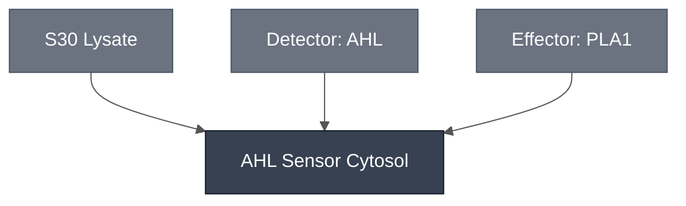

# Overview

The AHL Sensor Cytosol is the aqueous phase of the [AHL Sensing Cell](../ahl-sensing-cell/spec.md): [S30 Lysate](../s30-lysate/spec.md) carrying the [AHL Sensing Module](../detector-3oc6-hsl/spec.md) and, through it, the [PLA1 Lysis Module](../effector-pla1/spec.md). It is mixed before encapsulation, not added to a closed compartment.

It exists as its own Module because the London decomposition assembles the cytosol first and then performs one encapsulation. Compare [Base Cytosol](../base-cytosol/spec.md), which is PURE-based and carries no sensing function, and the [aTc](../atc-sensor-cytosol/spec.md) and [pH](../ph-sensor-cytosol/spec.md) sensor cytosols, which fill the same role for the Chicago Node on a Base Cytosol background.

:::{attention} 🚧 Draft
This page is a work in progress and not yet ready for use.
:::

# Reference Composition

:::::{tab-set}

<!-- gen:composition-diagram -->
::::{tab-item} Module Dependencies

::::
<!-- /gen:composition-diagram -->

::::{tab-item} DNA

:::{table} Constructs in the AHL Sensor Cytosol.
| **Name** | **Length (bp)** | **File** | **Supply route** |
| --- | --- | --- | --- |
| `pOpen-LuxR-PLA1` | 4175 | pending — [PR #10](https://github.com/nucleus-eng/DNA/pull/10) | **Circular.** S30 Lysate degrades linear DNA, so this route takes the plasmid |
| `LuxR-PLA1-linear` | 2237 | [LuxR-PLA1-linear.gb](https://github.com/nucleus-eng/DNA/blob/main/effectors/detector-3oc6-hsl/LuxR-PLA1-linear.gb) | Cassette form. **Not for this cytosol** — listed so the two are not confused |
:::

One molecule carries the detector and the effector, so [PLA1](../effector-pla1/spec.md) has no construct of its own here.

::::

::::{tab-item} Cytosol

:::{table} Cytosolic components of the AHL Sensor Cytosol, at reaction concentration.
| Module | Working concentration | Notes |
| --- | --- | --- |
| [S30 Lysate](../s30-lysate/spec.md) | At reaction concentration, per kit | Transcription and translation. **Requires circular DNA** — no GamS is added, so a linear template is degraded |
| [AHL Sensing Module](../detector-3oc6-hsl/spec.md) | `LuxR-deGFP` sensor plasmid at 37 ng/µL final, from a 1056 ng/µL stock — 0.95 µL per reaction | One molecule carries constitutive `BBa_J23101`→`luxR` and the `pLux`-driven payload, so LuxR is never supplied separately |
| [PLA1 Lysis Module](../effector-pla1/spec.md) | Covered by the sensor plasmid | The `LuxR-PLA1` variant puts the effector on the same molecule as the detector |
:::

::::

:::::

:::{attention} Two source values for the sensor plasmid
@Editor(london): the source gives 37 ng/µL in its reaction table and 80 ng/µL in its prose. The table above uses 37 ng/µL, matching [AHL Sensing Cell](../ahl-sensing-cell/spec.md). Confirm with the London Node.
:::

**The analyte is not part of this composition.** 3OC6-HSL reaches the sensing cell from the outer solution after encapsulation, so it appears on [AHL Sensing Cell](../ahl-sensing-cell/spec.md), not here.

# Constituent Modules

- [S30 Lysate](../s30-lysate/spec.md) — transcription and translation
- [AHL Sensing Module](../detector-3oc6-hsl/spec.md) — the sensor plasmid
- [PLA1 Lysis Module](../effector-pla1/spec.md) — carried on the same molecule as the detector

# Process

- [Assemble Cytosol](../../processes/assemble-base-cytosol/main.md) — the mixing step that produces this Module. Every constituent above enters the same compartment.

This cytosol is consumed by [Encapsulation: Phase Transfer](../../processes/assemble-base-cell/main.md), which combines it with the [London Membrane](../membrane-popc/spec.md) to form the [AHL Sensing Cell](../ahl-sensing-cell/spec.md).

# Credits

Developed by the London Node.

:::{attention} Credits are draft
Contributor attribution on this page has not been confirmed with the Node. Assign each credit explicitly before this page is merged to `main`.
:::
