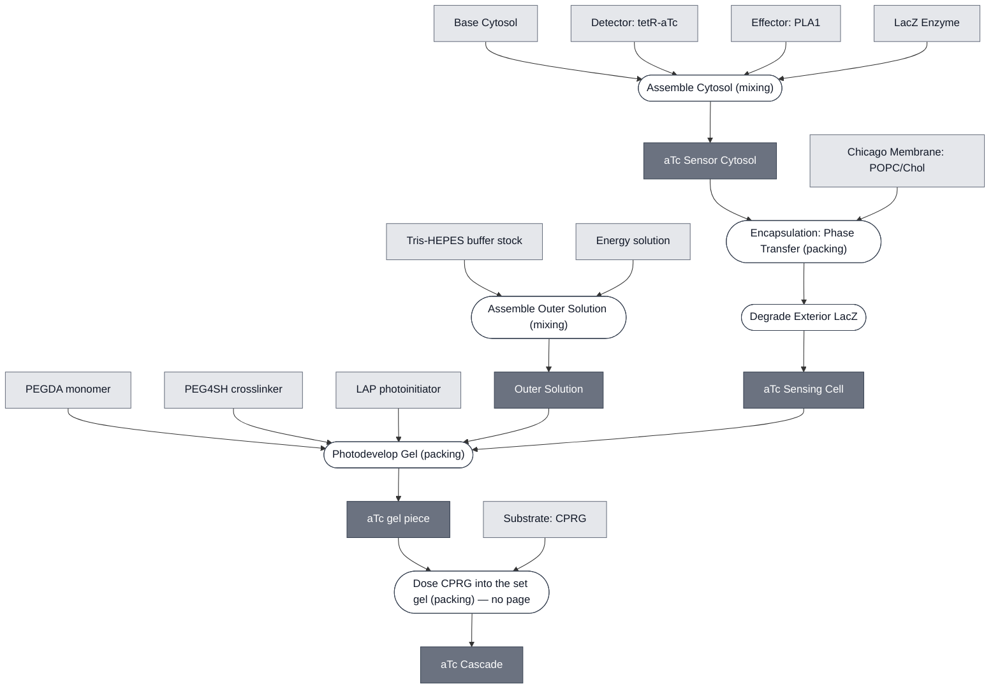

# Overview

The aTc Cascade turns anhydrotetracycline (aTc) exposure into a visible colorimetric readout. The [aTc Sensing Cell](../atc-sensing-cell/spec.md) supplies the `TetO-PLA1` sensing circuit, the [PLA1 Lysis Module](../effector-pla1/spec.md) supplies the lysis trigger, and [LacZ Reporter Module](../reporter-lacz/spec.md) provides a visible color change as a signal.

The sensing cell encapsulates `TetO-PLA1` and LacZ, with aTc and CPRG in the surrounding outer solution. aTc transits the membrane to the interior of the synthetic cell, activating expression of PLA1, which then ruptures the membrane and releases LacZ into the outer solution that then reacts with CPRG. Compare with the [pH Cascade](../ph-cascade/spec.md), which encapsulates the substrate and leaves the enzyme in the outer solution instead.

:::{attention} 🚧 Draft
This page is a work in progress and not yet ready for use.
:::

(atc-cascade-reference-composition)=
# Reference Composition

The aTc Cascade combines its Modules as follows:

- **Sensing input:** [aTc Sensing Cell](../atc-sensing-cell/spec.md) — the `TetO-PLA1` sensing construct, gated by aTc/TetR, encapsulated in the Chicago Chassis synthetic cell.
- **Lysis trigger:** [PLA1 Lysis Module](../effector-pla1/spec.md) — expressed once the aTc/TetR sensing circuit fires; couples sensing to readout. In the confirmed result, this is co-encapsulated in the same synthetic cell as the sensing construct rather than triggering a separate neighboring liposome.
- **Colorimetric readout:** [LacZ Reporter Module](../reporter-lacz/spec.md) — LacZ/CPRG chemistry, with the enzyme encapsulated and the substrate outside, so color appears only once lysis brings them together.

:::::{tab-set}

<!-- gen:composition-diagram -->
::::{tab-item} Module Dependencies

::::
<!-- /gen:composition-diagram -->

::::{tab-item} DNA

:::{table}
| **Name** | **Length (bp)** | **File** | **Supply route** |
| --- | --- | --- | --- |
| `TetO-PLA1` | not documented | — | Expressed in the synthetic cell; distinct from `pT7-tetO-plamGFP` |
:::

:::{attention} Construct not yet in `nucleus-eng/DNA`
`TetO-PLA1` has no sequence file in [`nucleus-eng/DNA`](https://github.com/nucleus-eng/DNA) and no recorded length. It is distinct from `pT7-tetO-plamGFP`, so that file cannot stand in for it. The same gap is recorded on [aTc Sensing Cell](../atc-sensing-cell/spec.md). Do not add a length or file entry here until the construct is confirmed and its length verified against the source file.
:::

::::

::::{tab-item} Cytosol

The sensing cell interior. It carries the enzyme but not its substrate — see the note under Outer Solution.

:::{table} Sensing cell interior.
:label: comp-atc-cascade

| Component | Working concentration |
| --- | --- |
| `TetO-PLA1` DNA | 1 nM (headline condition); also tested at 0.5 nM |
| TetR | 50 nM (headline condition); also tested at 100 nM |
| LacZ enzyme | 20 U/mL |
| Base Cytosol components | At reaction concentration; not separately documented for this cascade |
:::

::::

::::{tab-item} Membrane

:::{table} Synthetic cell membrane — [Chicago Membrane: POPC/Chol](../membrane-popc-chol-chicago/spec.md).
:label: comp-atc-cascade-membrane

| Component | Target percentage (%) |
| --- | --- |
| POPC | 89.9 |
| Cholesterol | 10 |
| Liss-Rhod PE | 0.1 |
:::

::::

::::{tab-item} Substrate

[CPRG](../substrate-cprg/spec.md) reaches this cascade as a **free dye dosed into the gel after crosslinking**, not inside a liposome. The photodeveloped gel this path uses imposes UV, which bleaches CPRG, so the substrate goes in once crosslinking is done.

:::{table} CPRG in the aTc path.
| Component | Working concentration | Notes |
| --- | --- | --- |
| CPRG | not documented | @Editor(chicago): the free-dye dosing concentration for the photodeveloped path is not recorded. Confirm on 11 Sept |
:::

**This path carries no substrate liposome.** The pH path does — see [pH Cascade](../ph-cascade/spec.md). The difference follows from the gel, not from the reporter chemistry.

::::

::::{tab-item} Outer Solution

:::{table} Outer solution.
:label: comp-atc-cascade-outer

| Component | Working concentration |
| --- | --- |
| CPRG substrate | 0.5 mM |
| aTc | 1 µM — the response saturates at or below this, so higher doses add nothing. See [Expected Behavior](#atc-cascade-expected-behavior) for the dose series. |
:::

In the photodeveloped format CPRG is added to the gel **after** crosslinking rather than pre-loaded, because the UV that crosslinks the gel bleaches it. This holds for both photodevelopment routes — see [Photodevelop Gel](../../processes/photodevelop-gel/photodevelop-gel-main.md).

::::

:::::

(atc-cascade-expected-behavior)=
# Expected Behavior

## Cells

The aTc Cascade is expected to run the full sensing → lysis → LacZ readout chain in one compartment and to produce a detectable aTc-dependent color change, confirmed in synthetic cells. **The response is not graded.** Fold change in absorbance at 5 h (n = 3) separates dosed from undosed at roughly 1.15× to 1.33×, across three DNA/TetR combinations dosed at 0, 1, 5, and 10 µM aTc. It is non-monotonic in two of the three combinations, and the error bars across the 1, 5, and 10 µM points overlap in all three. Expect a working end-to-end chain with a detectable signal, not a characterized dose-response.

The [aTc Sensing Module](../detector-tetr-atc/spec.md#teto-pla1-encapsulated-with-lacz) spec covers why the 0 µM point is a normalization baseline rather than a negative control.

## Gels

:::{warning} Not yet validated
This Module has not been validated in hydrogels. The aTc-response result above is confirmed in synthetic cells only. Hydrogel integration has not been completed — see the [aTc Sensing Cell](../atc-sensing-cell/spec.md#atc-sensing-cell-expected-behavior) spec for the same caveat. Do not treat this cascade as validated for hydrogel-embedded use.
:::

# Requirements

Requires pT7 transcription and translation (e.g. [Base Cytosol](../base-cytosol/spec.md)) to express the `TetO-PLA1` construct, and TetR as the repressor holding it off in the absence of aTc (e.g. [Detector: tetR-aTc](../detector-tetr-atc/spec.md)).

Requires a lipid compartment for PLA1 to lyse (e.g. [Chicago Chassis](../chicago-chassis/spec.md)). The readout is produced by lysis releasing CPRG to LacZ, so this cascade has no bulk-cytosol route.

Requires that no LacZ protein share a compartment with CPRG until the reporter module is turned on (see [LacZ Reporter Module](../reporter-lacz/spec.md)).

Must not be exposed to theophylline, which is reported to interfere with LacZ activity. See [LacZ Reporter Module § Requirements](../reporter-lacz/spec.md#reporter-lacz-requirements) for the constraint and the state of the evidence behind it.

# Implementations

- [Chicago DevCell](../../implementations/chicago-devcell/main.md): places the Chicago cascades in a hydrogel with spatial patterning.

# Processes

Encapsulation follows the shared phase-transfer method in [Encapsulation: Phase Transfer](../../processes/assemble-base-cell/main.md), with the Chicago-specific lipid composition documented on [Chicago Membrane](../membrane-popc-chol-chicago/spec.md). Hydrogel embedding of this cascade is not documented.

:::{attention} Process gap
@Editor(chicago): no process page covers hydrogel embedding for this cascade, and [Encapsulation: Phase Transfer](../../processes/assemble-base-cell/main.md) has not been confirmed to apply as written at synthetic-cell scale. Both need process pages.
:::

# Constituent Modules

- [aTc Sensing Cell](../atc-sensing-cell/spec.md) — `TetO-PLA1` sensing construct gated by aTc/TetR, encapsulated in the Chicago Chassis synthetic cell
- [LacZ Enzyme](../reporter-lacz-enzyme/spec.md) — encapsulated with the sensing reaction at 20 U/mL
- [Substrate: CPRG](../substrate-cprg/spec.md) — dosed free into the gel after crosslinking, because UV bleaches it. This path carries no substrate liposome

:::{attention} PLA1 is inside the sensing cell, not beside it
The effector is expressed from the same molecule as the detector, so it enters this cascade inside the sensing cell rather than as a separate ingredient a composer supplies. It is listed on [Effector: PLA1](../effector-pla1/spec.md) and in the sensing cell's own cytosol.
:::

# Credits

Developed by Mary Kelly (Chicago Node, Kamat Lab).

:::{attention} Credits are draft
Contributor attribution on this page has not been confirmed with the Node. Assign each credit explicitly before this page is merged to `main`.
:::
