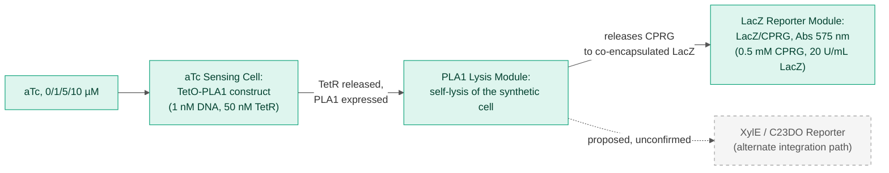
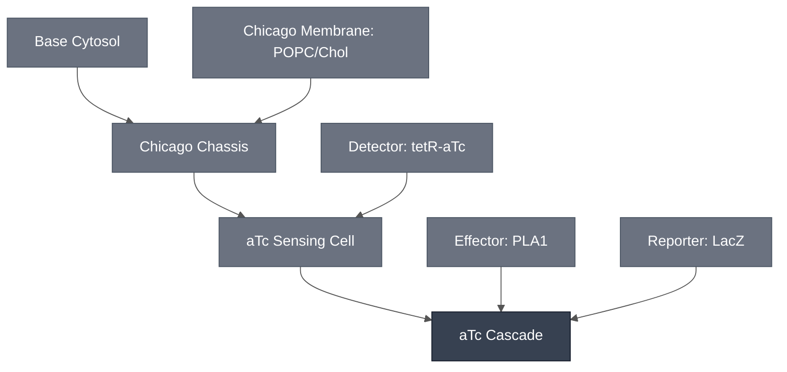

# Overview

The aTc Cascade names the chain from aTc sensing to a visible colorimetric readout as its own Module: the [aTc Sensing Cell](../atc-sensing-cell/spec.md) supplies the `TetO-PLA1` sensing circuit gated by anhydrotetracycline (aTc), the [PLA1 Lysis Module](../effector-pla1/spec.md) supplies the lysis trigger that couples sensing to readout, and a downstream colorimetric reporter converts the released substrate into a visible signal. Unlike the [pH Cascade](../ph-cascade/spec.md), whose three Modules have each only been shown to work in separate, partial combinations, this cascade's combined chain has a confirmed result behind it: the aTc Sensing Cell already co-encapsulates the `TetO-PLA1` construct, PLA1, and the LacZ reporter together in a single synthetic cell, and that combined configuration is what produced the 2026-08-14 aTc-response data. This page names that confirmed chain as the Chicago diagram's `ATCCAS` node and cites the aTc Sensing Cell spec for the underlying data rather than duplicating it.

:::{attention} 🚧 Draft
This page is a work in progress and not yet ready for use.
:::

:::{attention} Confirmed in synthetic cytosols and in synthetic cells — two gaps remain
The combined sensing → lysis → LacZ readout chain is confirmed in synthetic cytosols and in synthetic cells (see [Expected Behavior](#expected-behavior) below). Two things are **not** yet true of this cascade:

1. **Gel integration is not complete.** Hydrogel embedding is in progress and has not been finished (14 Aug 2026 meeting slide deck). Do not treat this cascade as validated for hydrogel-embedded use.
2. **Merge into the overall Chicago Cascade is not yet attempted**, not confirmed or blocked. The aTc Cascade works standalone, but its multiplexed integration alongside the theophylline and pH cascades into one combined Chicago Cascade has not been demonstrated. Unlike the theophylline integration path (which cannot combine with this cascade due to a confirmed LacZ/CPRG interference), this cascade's merge into the Chicago Cascade has not yet been attempted, not been shown to be blocked.
:::

Schematic representation of the confirmed aTc Cascade integration path: aTc relieves TetR repression of the `TetO-PLA1` construct, PLA1 expression lyses the synthetic cell, and the released CPRG reacts with co-encapsulated LacZ to produce the colorimetric readout. The XylE/C23DO alternate integration path (dashed) is a proposed substitute for the LacZ readout step, not yet run in this cascade — see the [Reference Composition](#reference-composition) and [Expected Behavior](#expected-behavior) sections below for the confirmed-vs-proposed distinction. No published schematic exists for this mechanism; the diagram above is a simplified summary, not a reproduction of a lab figure.

# Reference Composition

The aTc Cascade combines its Modules as follows:

- **Sensing input:** [aTc Sensing Cell](../atc-sensing-cell/spec.md) — the `TetO-PLA1` sensing construct, gated by aTc/TetR, encapsulated in the Chicago Chassis synthetic cell.
- **Lysis trigger:** [PLA1 Lysis Module](../effector-pla1/spec.md) — expressed once the aTc/TetR sensing circuit fires; couples sensing to readout. In the confirmed result, this is co-encapsulated in the same synthetic cell as the sensing construct rather than triggering a separate neighboring liposome.
- **Colorimetric readout — confirmed integration path:** [LacZ Reporter Module](../reporter-lacz/spec.md) — LacZ/CPRG chemistry, co-encapsulated with the sensing and lysis constructs. This is the integration path used in the 2026-08-14 aTc-response data.
- **Colorimetric readout — proposed alternate integration path:** [XylE / C23DO Reporter Module](../reporter-xyle/spec.md) — a second, orthogonal colorimetric enzyme (catechol 2,3-dioxygenase). It is a proposed alternative, **not** what the confirmed data used, and is still a gap: it has been validated only in bulk cytosol (a different, TetR/aTc-inducible construct, `pT7-TetO-catecholase` / `pMN067`), with no synthetic cell encapsulation or hydrogel data and no confirmed use in this cascade. Do not conflate the two reporter integration paths. LacZ and XylE are separate, at different levels of readiness, and only LacZ has been demonstrated together with the aTc sensing and PLA1 lysis constructs in one synthetic cell.

:::::{tab-set}

<!-- gen:composition-diagram -->
::::{tab-item} Module Dependencies

::::
<!-- /gen:composition-diagram -->

::::{tab-item} Working Concentrations

The table below aggregates the working concentrations behind the 2026-08-14 aTc-response result, one row per Module. It is sourced directly from the [aTc Sensing Module](../detector-tetr_atc/spec.md#chicago-cascade-encapsulation-teto-pla1-lacz-cprg-readout) spec's "Chicago Cascade Encapsulation" section, the 14 Aug 2026 meeting slide deck (p. 7, "aTc sensor working in b.next cytosol: Encapsulating TetO-PLA1 with LacZ," Mary Kelly, Kamat Lab), and the meeting-reconciliation notes reconciling the transcript against that deck.

:::{table} Reference composition — confirmed aTc Cascade integration path (Chicago, 2026-08-14)
:label: comp-atc-cascade

| Module | Component | Working concentration |
| --- | --- | --- |
| aTc Sensing Cell | `TetO-PLA1` DNA | 1 nM (headline condition); also tested at 0.5 nM |
| aTc Sensing Cell | TetR | 50 nM (headline condition); also tested at 100 nM |
| aTc Sensing Cell | aTc inducer | 0, 1, 5, 10 µM; 0 µM is the normalization baseline (no −TetR/−DNA control panel in the source figure) |
| PLA1 Lysis Module | PLA1 lysis trigger | Co-encapsulated with the sensing construct; no separate working concentration documented for this synthetic cell formulation |
| LacZ Reporter Module | CPRG substrate | 0.5 mM, encapsulated |
| LacZ Reporter Module | LacZ enzyme | 20 U/mL, encapsulated |
:::

:::{attention} Confirmed path only — does not include XylE
This table covers only the confirmed LacZ integration path described above. The proposed XylE / C23DO alternate integration path has no encapsulated working concentrations to report — see the Module list in [Reference Composition](#reference-composition) above and [XylE / C23DO Reporter Module](../reporter-xyle/spec.md#expected-behavior) for its separate, more preliminary bulk-cytosol result.
:::

::::

:::::

# Expected Behavior

## Cells

The full sensing → lysis → LacZ readout chain has been run together in synthetic cytosols and in synthetic cells, and it responds to aTc — but the response is **not graded**. Fold change in absorbance at 5 h (n = 3) separates dosed from undosed at roughly 1.15× to 1.33×, across three DNA/TetR combinations dosed at 0, 1, 5, and 10 µM aTc (14 Aug 2026 meeting slide deck, slide 7). The response is non-monotonic in two of the three combinations, and the error bars across the 1, 5, and 10 µM points overlap in all three.

What this cascade can claim, therefore, is a working end-to-end chain with a detectable aTc-dependent signal — not a characterized dose-response. Full detail, including why the 0 µM point is a normalization baseline rather than a negative control, is on the [aTc Sensing Module](../detector-tetr_atc/spec.md#chicago-cascade-encapsulation-teto-pla1-lacz-cprg-readout) spec and is not duplicated here.

No result exists for the XylE alternate integration path run as part of this cascade — the XylE/C23DO chemistry has only been tested in bulk cytosol, in isolation, downstream of the same aTc/TetR sensing construct family, and never together with the PLA1 lysis trigger or in a synthetic cell. See [XylE / C23DO Reporter Module](../reporter-xyle/spec.md#expected-behavior) for that separate, more preliminary result.

## Gels

:::{warning} Not yet validated
This Module has not been validated in hydrogels. The aTc-response result above is confirmed in synthetic cytosols and in synthetic cells only. Hydrogel integration has not been completed — see the [aTc Sensing Cell](../atc-sensing-cell/spec.md#expected-behavior) spec for the same caveat. Do not treat this cascade as validated for hydrogel-embedded use.
:::

# Requirements

Requires pT7 transcription and translation (e.g. [Base Cytosol](../base-cytosol/spec.md)) to express the `TetO-PLA1` construct, and TetR as the repressor holding it off in the absence of aTc (e.g. [Detector: tetR-aTc](../detector-tetr_atc/spec.md)).

Requires a lipid compartment for PLA1 to lyse (e.g. [Chicago Chassis](../chicago-chassis/spec.md)). The readout is produced by lysis releasing CPRG to co-encapsulated LacZ, so this cascade has no bulk-cytosol route.

Requires CPRG and LacZ co-encapsulated with the sensing and lysis constructs (e.g. [LacZ Reporter Module](../reporter-lacz/spec.md)).

Cannot be co-encapsulated with theophylline sensing. This cascade shares the LacZ/CPRG readout's co-encapsulation constraint with theophylline sensing. The requirement is settled; the mechanism usually given for it — theophylline inhibiting the LacZ/CPRG conversion — is not established, and the only primary figure available points the other way. See [Theophylline Sensing Module § Requirements](../detector-theophylline/spec.md#requirements) for the evidence on both sides. Do not restate the inhibition mechanism as fact.

# Implementations

- [Chicago Cascade](../chicago-cascade/spec.md): the aTc integration path of the multiplexed Chicago demo. That combination has not been built.
- [Chicago DevCell](../../implementations/chicago-devcell/main.md): places the Chicago cascades in a hydrogel with spatial patterning.

# Process

Encapsulation follows the shared phase-transfer method in [Encapsulation: Phase Transfer](../../processes/assemble-base-cell/main.md), with the Chicago-specific lipid composition documented on [Chicago Membrane](../membrane-popc-chol-chicago/spec.md). What remains undocumented is hydrogel embedding **of this cascade specifically** — gel integration was still in progress as of 2026-08-14.

:::{attention} Process gap
Do not assume [Encapsulation: Phase Transfer](../../processes/assemble-base-cell/main.md) applies as written to synthetic-cell scale prep, and do not assume any existing process page covers hydrogel embedding for this cascade — flag both for follow-up process pages rather than treating a citation here as equivalent.
:::

# Constituent Modules

- [aTc Sensing Cell](../atc-sensing-cell/spec.md) — `TetO-PLA1` sensing construct gated by aTc/TetR, encapsulated in the Chicago Chassis synthetic cell
- [PLA1 Lysis Module](../effector-pla1/spec.md) — lysis trigger coupling sensing to readout
- [LacZ Reporter Module](../reporter-lacz/spec.md) — LacZ/CPRG colorimetric readout chemistry — the confirmed readout, used in the 2026-08-14 aTc-response data

The [XylE / C23DO Reporter Module](../reporter-xyle/spec.md) is a proposed alternate colorimetric readout. It is deliberately not listed as a Module above: it has not been confirmed and was not used in the demonstrated cascade data, so it is not part of this cascade's composition.

# Credits

Developed by Mary Kelly (Chicago Node, Kamat Lab) — the TetO-PLA1/LacZ-CPRG encapsulation result.

Attribution is pending a formal DevNote.
