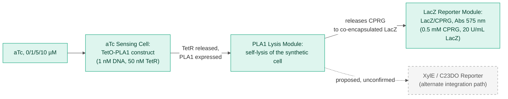
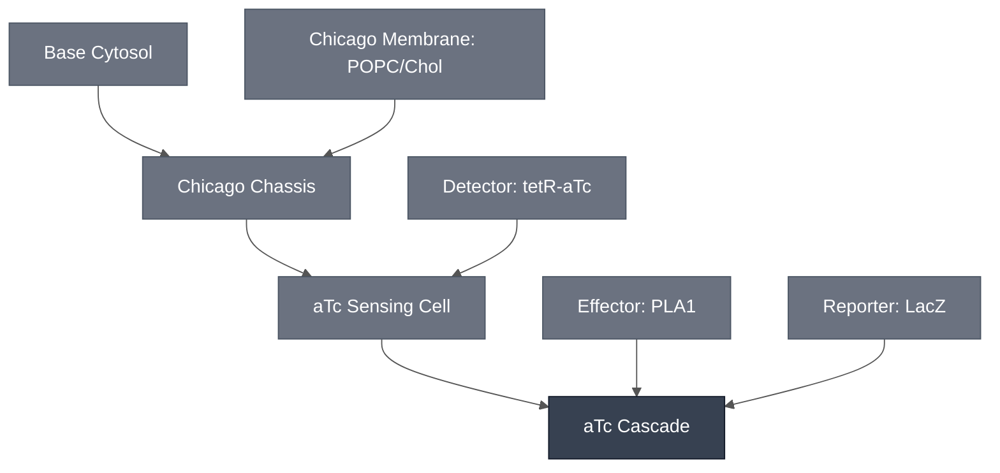

# Overview

The aTc Cascade turns anhydrotetracycline (aTc) exposure into a visible colorimetric readout. The [aTc Sensing Cell](../atc-sensing-cell/spec.md) supplies the `TetO-PLA1` sensing circuit, the [PLA1 Lysis Module](../effector-pla1/spec.md) supplies the lysis trigger, and a colorimetric reporter converts the released substrate into a visible signal.

The whole chain runs in one compartment: the aTc Sensing Cell co-encapsulates the `TetO-PLA1` construct, PLA1 and the LacZ reporter in a single synthetic cell, and that configuration produced the 2026-08-14 aTc-response data.

:::{attention} 🚧 Draft
This page is a work in progress and not yet ready for use.
:::

:::{attention} Confirmed in synthetic cytosols and in synthetic cells — two gaps remain
The combined sensing → lysis → LacZ readout chain is confirmed in synthetic cytosols and in synthetic cells (see [Expected Behavior](#expected-behavior) below). Two things are **not** yet true of this cascade:

1. **Gel integration is not complete.** Hydrogel embedding has not been finished. Do not treat this cascade as validated for hydrogel-embedded use.
2. **The multiplexed Chicago Cascade has not been demonstrated.** The aTc Cascade works standalone; combining it with the theophylline and pH cascades has not been shown. Unlike the theophylline integration path (which cannot combine with this cascade due to a confirmed LacZ/CPRG interference), this cascade's merge into the Chicago Cascade has not yet been attempted, not been shown to be blocked.
:::

Schematic representation of the confirmed aTc Cascade integration path: aTc relieves TetR repression of the `TetO-PLA1` construct, PLA1 expression lyses the synthetic cell, and the released CPRG reacts with co-encapsulated LacZ to produce the colorimetric readout. The XylE/C23DO alternate integration path (dashed) is a proposed substitute for the LacZ readout step, not yet run in this cascade — see the [Reference Composition](#reference-composition) and [Expected Behavior](#expected-behavior) sections below for the confirmed-vs-proposed distinction. No published schematic exists for this mechanism; the diagram above is a simplified summary, not a reproduction of a lab figure.

# Reference Composition

The aTc Cascade combines its Modules as follows:

- **Sensing input:** [aTc Sensing Cell](../atc-sensing-cell/spec.md) — the `TetO-PLA1` sensing construct, gated by aTc/TetR, encapsulated in the Chicago Chassis synthetic cell.
- **Lysis trigger:** [PLA1 Lysis Module](../effector-pla1/spec.md) — expressed once the aTc/TetR sensing circuit fires; couples sensing to readout. In the confirmed result, this is co-encapsulated in the same synthetic cell as the sensing construct rather than triggering a separate neighboring liposome.
- **Colorimetric readout:** [LacZ Reporter Module](../reporter-lacz/spec.md) — LacZ/CPRG chemistry, co-encapsulated with the sensing and lysis constructs.

:::::{tab-set}

<!-- gen:composition-diagram -->
::::{tab-item} Module Dependencies

::::
<!-- /gen:composition-diagram -->

::::{tab-item} DNA

:::{table}
| **Name** | **Length (bp)** | **File** | **Supply route** |
| --- | --- | --- | --- |
| `TetO-PLA1` | not documented | — | Expressed in the synthetic cell; distinct from `pT7-tetO-plamGFP` |
| TetR repressor | not applicable | — | Co-encapsulated as purified protein |
| β-galactosidase (LacZ) | not applicable | — | Co-encapsulated as purified enzyme, not expressed |
:::

See [Detector: tetR-aTc](../detector-tetr-atc/spec.md) for the sensing construct and [Effector: PLA1](../effector-pla1/spec.md) for the PLA1 constructs.

::::

::::{tab-item} Cytosol

Every component below is co-encapsulated in a single synthetic cell.

:::{table} Confirmed aTc Cascade integration path (Chicago, 2026-08-14).
:label: comp-atc-cascade

| Component | Working concentration |
| --- | --- |
| `TetO-PLA1` DNA | 1 nM (headline condition); also tested at 0.5 nM |
| TetR | 50 nM (headline condition); also tested at 100 nM |
| CPRG substrate | 0.5 mM |
| LacZ enzyme | 20 U/mL |
| Base Cytosol components | At reaction concentration; not separately documented for this cascade |
:::

aTc is dosed at 0, 1, 5 and 10 µM, with 0 µM as the normalization baseline; the source figure carries no −TetR or −DNA control panel. Whether aTc is added to the inner or the outer solution is not documented.

PLA1 has no row of its own. It is expressed from the `TetO-PLA1` construct already counted above, not added as a reagent.

::::

::::{tab-item} Membrane

:::{table} Synthetic cell membrane — [Chicago Membrane: POPC/Chol](../membrane-popc-chol-chicago/spec.md).
:label: comp-atc-cascade-membrane

| Component | Target percentage (%) |
| --- | --- |
| POPC | 89.9 |
| Cholesterol | 10 |
| Liss-Rhod PE | 0.1 |
:::

::::

:::::

# Expected Behavior

## Cells

The full sensing → lysis → LacZ readout chain has been run together in synthetic cytosols and in synthetic cells, and it responds to aTc — but the response is **not graded**. Fold change in absorbance at 5 h (n = 3) separates dosed from undosed at roughly 1.15× to 1.33×, across three DNA/TetR combinations dosed at 0, 1, 5, and 10 µM aTc. The response is non-monotonic in two of the three combinations, and the error bars across the 1, 5, and 10 µM points overlap in all three.

What this cascade can claim, therefore, is a working end-to-end chain with a detectable aTc-dependent signal — not a characterized dose-response. The [aTc Sensing Module](../detector-tetr-atc/spec.md#chicago-cascade-encapsulation-teto-pla1-lacz-cprg-readout) spec covers why the 0 µM point is a normalization baseline rather than a negative control.

## Gels

:::{warning} Not yet validated
This Module has not been validated in hydrogels. The aTc-response result above is confirmed in synthetic cytosols and in synthetic cells only. Hydrogel integration has not been completed — see the [aTc Sensing Cell](../atc-sensing-cell/spec.md#expected-behavior) spec for the same caveat. Do not treat this cascade as validated for hydrogel-embedded use.
:::

# Requirements

Requires pT7 transcription and translation (e.g. [Base Cytosol](../base-cytosol/spec.md)) to express the `TetO-PLA1` construct, and TetR as the repressor holding it off in the absence of aTc (e.g. [Detector: tetR-aTc](../detector-tetr-atc/spec.md)).

Requires a lipid compartment for PLA1 to lyse (e.g. [Chicago Chassis](../chicago-chassis/spec.md)). The readout is produced by lysis releasing CPRG to co-encapsulated LacZ, so this cascade has no bulk-cytosol route.

Requires CPRG and LacZ co-encapsulated with the sensing and lysis constructs (e.g. [LacZ Reporter Module](../reporter-lacz/spec.md)).

Cannot be co-encapsulated with theophylline sensing. This cascade shares the LacZ/CPRG readout's co-encapsulation constraint with theophylline sensing. The mechanism usually given for the constraint — theophylline inhibiting the LacZ/CPRG conversion — is not established, and the only primary figure available points the other way. See [Theophylline Sensing Module § Requirements](../detector-theophylline/spec.md#requirements) for the evidence on both sides. Do not restate the inhibition mechanism as fact.

# Implementations

- [Chicago DevCell](../../implementations/chicago-devcell/main.md): places the Chicago cascades in a hydrogel with spatial patterning.

# Processes

Encapsulation follows the shared phase-transfer method in [Encapsulation: Phase Transfer](../../processes/assemble-base-cell/main.md), with the Chicago-specific lipid composition documented on [Chicago Membrane](../membrane-popc-chol-chicago/spec.md). Hydrogel embedding of this cascade is not documented.

:::{attention} Process gap
@Editor: no process page covers hydrogel embedding for this cascade, and [Encapsulation: Phase Transfer](../../processes/assemble-base-cell/main.md) has not been confirmed to apply as written at synthetic-cell scale. Both need process pages.
:::

# Constituent Modules

- [aTc Sensing Cell](../atc-sensing-cell/spec.md) — `TetO-PLA1` sensing construct gated by aTc/TetR, encapsulated in the Chicago Chassis synthetic cell
- [PLA1 Lysis Module](../effector-pla1/spec.md) — lysis trigger coupling sensing to readout
- [LacZ Reporter Module](../reporter-lacz/spec.md) — LacZ/CPRG colorimetric readout chemistry — the confirmed readout, used in the 2026-08-14 aTc-response data

# Credits

Developed by Mary Kelly (Chicago Node, Kamat Lab).
