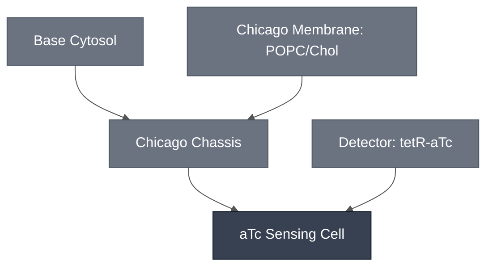

# Overview

The aTc Sensing Cell combines the [Chicago Chassis](../chicago-chassis/spec.md) with a `TetO-PLA1` / LacZ-CPRG sensing-and-readout circuit, giving a synthetic cell that reports anhydrotetracycline (aTc) dose as a colorimetric (absorbance) signal. It encapsulates the Modules below into a single synthetic cell: the [aTc Sensing Module](../detector-tetr_atc/spec.md) supplies the `TetO-PLA1` sensing construct, the [PLA1 Lysis Module](../effector-pla1/spec.md) supplies the lysis trigger that couples sensing to readout, and the [LacZ Reporter Module](../reporter-lacz/spec.md) supplies the enzyme and CPRG substrate chemistry that produce the visible color change.

:::{attention} 🚧 Draft
This page is a work in progress and not yet ready for use.
:::

:::{attention} Interim source
The dose-response result on this page is sourced from the Chicago Module Integration Status notes and the August DevCell Status Update meeting (2026-08-14). See the [aTc Sensing Module](../detector-tetr_atc/spec.md#chicago-cascade-encapsulation-teto-pla1-lacz-cprg-readout) spec's "Chicago Cascade Encapsulation" section for the same result at the module level.
:::

:::{figure} mechanism-schematic.png
:name: fig-atc-sensing-cell-schematic
:align: center
:width: 75%

Schematic representation of the aTc Sensing Cell mechanism. Inside the synthetic cell, the `TetO-PLA1` construct is transcribed and translated to produce PLA1; co-encapsulated LacZ is also expressed. Membrane-permeable aTc (ATC) enters the synthetic cell and (via TetR, not shown) de-represses `TetO-PLA1` expression. CPRG substrate is co-loaded in the same reaction. Figure by Mary Kelly, Kamat Lab, from the 2026-08-14 DevStudio status meeting slide "aTc sensor working in b.next cytosol: Encapsulating TetO-PLA1 with LacZ"; cropped from the original slide (data panels omitted).
:::

# Reference Composition

:::::{tab-set}

<!-- gen:composition-diagram -->
::::{tab-item} Module Dependencies

::::
<!-- /gen:composition-diagram -->

::::{tab-item} Cytosol

The inner solution follows the [Chicago Chassis](../chicago-chassis/spec.md) cytosol at reaction concentration, with the `TetO-PLA1` construct from the [aTc Sensing Module](../detector-tetr_atc/spec.md) and LacZ from the [LacZ Reporter Module](../reporter-lacz/spec.md) added as the sensing and reporter DNA, and CPRG substrate ([LacZ Reporter Module](../reporter-lacz/spec.md#substrate)) co-loaded for the colorimetric handoff. The table below flattens the combined synthetic cell reaction one level deep, to the four Modules — see each module's own spec for its full internal composition (not repeated here).

:::{table} Combined synthetic cell reaction, one level deep (Chicago Node, 2026-08-14)
| Module | Working concentration | Notes |
| --- | --- | --- |
| [Chicago Chassis](../chicago-chassis/spec.md) | Base Cytosol at reaction concentration, in a 9:1 POPC:cholesterol synthetic cell membrane | Supplies the reaction mix and encapsulation shell; see that page for its own reference composition — not re-expanded here. |
| [aTc Sensing Module](../detector-tetr_atc/spec.md) (`TetO-PLA1` DNA + TetR) | Three DNA/TetR combinations tested: 1 nM DNA + 50 nM TetR (headline condition); 0.5 nM DNA + 50 nM TetR; 1 nM DNA + 100 nM TetR | aTc analyte dosed at 0/1/5/10 µM against each combination — see [Expected Behavior](#expected-behavior) below. All three combinations are documented as tested; none is singled out as canonical. |
| [PLA1 Lysis Module](../effector-pla1/spec.md) | No independent concentration — PLA1 is expressed from the `TetO-PLA1` construct already counted in the aTc Sensing Module row above, not added as a separate reagent | No dedicated PLA1 devnote exists yet; see that page's documentation-gap notice. |
| [LacZ Reporter Module](../reporter-lacz/spec.md) | LacZ: 20 U/mL; CPRG substrate: 0.5 mM | LacZ and CPRG are both encapsulated in the same synthetic cell per the source slide. |
:::

Source: DevStudio status meeting slide "aTc sensor working in b.next cytosol: Encapsulating TetO-PLA1 with LacZ" (Mary Kelly, Kamat Lab, 2026-08-14), cross-checked against the [aTc Sensing Module](../detector-tetr_atc/spec.md#chicago-cascade-encapsulation-teto-pla1-lacz-cprg-readout) spec's "Chicago Cascade Encapsulation" section.

::::

::::{tab-item} Membrane

The membrane follows the [Chicago Chassis](../chicago-chassis/spec.md) reference composition (9:1 POPC:cholesterol, synthetic-cell scale) — see that page for the full membrane spec.

::::

:::::

# Expected Behavior

This configuration detects aTc confirmed in synthetic cytosols and in synthetic cells, but the response is **not graded**. Fold change in absorbance at 5 h (n = 3) separates dosed from undosed at roughly 1.15× to 1.33×, across three DNA/TetR combinations — 1 nM DNA with 50 nM TetR, 0.5 nM DNA with 50 nM TetR, and 1 nM DNA with 100 nM TetR — each dosed at 0, 1, 5, and 10 µM aTc. The response is non-monotonic in two of the three combinations, and the error bars across the 1, 5, and 10 µM points overlap in all three. Treat it as saturating at or below 1 µM, with no resolvable dose-dependence from 1 to 10 µM.

Full detail, including the reading of the source figure and why the 0 µM point is a normalization baseline rather than a negative control, is documented in the [aTc Sensing Module](../detector-tetr_atc/spec.md#chicago-cascade-encapsulation-teto-pla1-lacz-cprg-readout) spec and is not duplicated here.

:::{warning}
**Gel integration not yet complete.** This result is confirmed confirmed in synthetic cytosols and in synthetic cells only. Hydrogel integration was reported as "just... in the process of putting this into our gel" and had not been completed. Do not treat the aTc Sensing Cell as validated for hydrogel-embedded (Chicago Cascade) use yet — the edge from this cell into the Chicago Cascade should be kept dashed/in-progress until a gel-integrated result is confirmed.
:::

# Requirements

Requires pT7 transcription and translation (e.g. [Base Cytosol](../base-cytosol/spec.md)), supplied here by the [Chicago Chassis](../chicago-chassis/spec.md).

Requires TetR, and aTc as the derepressing analyte — see the [aTc Sensing Module](../detector-tetr_atc/spec.md).

The aTc Sensing Cell shares its LacZ/CPRG readout with the Theophylline Sensing Cell, and the two must not be co-encapsulated. The requirement is settled; the mechanism usually given for it — theophylline inhibiting the LacZ/CPRG conversion — is not established, and the only primary figure available points the other way. See [Theophylline Sensing Module § Requirements](../detector-theophylline/spec.md#requirements) for the evidence on both sides. Do not restate the inhibition mechanism as fact.

# Constituent Modules

- [Chicago Chassis](../chicago-chassis/spec.md) — chassis (cytosol + 9:1 POPC:cholesterol synthetic cell membrane)
- [aTc Sensing Module](../detector-tetr_atc/spec.md) — `TetO-PLA1` sensing construct, gated by aTc/TetR

:::{note} The effector and reporter belong to the Cascade, not to this Cell
This Sensing Cell is chassis + detector. Its Function is to express PLA1 in response to aTc — PLA1 is what it *produces*, not a Module it is composed of. Likewise the LacZ/CPRG chemistry is the readout, which belongs to the [aTc Cascade](../atc-cascade/spec.md).

The 2026-08-14 result did physically co-encapsulate the `TetO-PLA1` construct, LacZ, and CPRG in one cell. That is the **Cascade** configuration realized in a single compartment, not a property of the Sensing Cell Module — see [aTc Cascade](../atc-cascade/spec.md).
:::

# Credits

Developed by Mary Kelly (Chicago Node, Kamat Lab) — TetO-PLA1/LacZ-CPRG encapsulation result, from the 2026-08-14 DevStudio status meeting.
