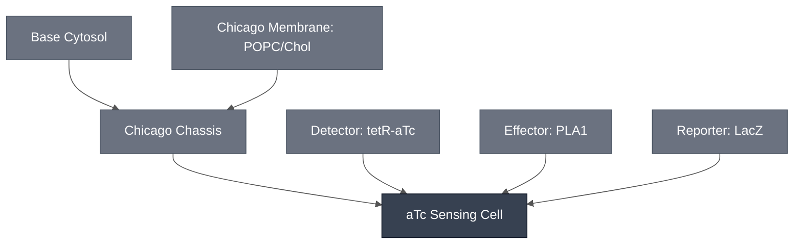

# Overview

The aTc Sensing Cell combines the [Chicago Chassis](../chicago-chassis/spec.md) with a `TetO-PLA1` / LacZ-CPRG sensing-and-readout circuit, giving a synthetic cell that reports anhydrotetracycline (aTc) dose as a colorimetric (absorbance) signal. It encapsulates the Modules below into a single synthetic cell: the [aTc Sensing Module](../detector-tetr-atc/spec.md) supplies the `TetO-PLA1` sensing construct, the [PLA1 Lysis Module](../effector-pla1/spec.md) supplies the lysis trigger that couples sensing to readout, and the [LacZ Reporter Module](../reporter-lacz/spec.md) supplies the enzyme and CPRG substrate chemistry that produce the visible color change.

:::{attention} 🚧 Draft
This page is a work in progress and not yet ready for use.
:::

:::{figure} mechanism-schematic.png
:name: fig-atc-sensing-cell-schematic
:align: center
:width: 75%

Schematic representation of the aTc Sensing Cell mechanism. Inside the synthetic cell, the `TetO-PLA1` construct is transcribed and translated to produce PLA1; co-encapsulated LacZ is also expressed. Membrane-permeable aTc (ATC) enters the synthetic cell and (via TetR, not shown) de-represses `TetO-PLA1` expression. CPRG substrate is co-loaded in the same reaction. Figure by Mary Kelly (Chicago Node, Kamat Lab); the data panels of the original are omitted.
:::

# Reference Composition

:::::{tab-set}
<!-- gen:composition-diagram -->
::::{tab-item} Module Dependencies

::::
<!-- /gen:composition-diagram -->

::::{tab-item} DNA

:::{attention} Construct not yet in `nucleus-eng/DNA`
@Editor: `TetO-PLA1` has no sequence file in [`nucleus-eng/DNA`](https://github.com/nucleus-eng/DNA) and no recorded length. It is distinct from `pT7-tetO-plamGFP`, so that file cannot stand in for it. Do not treat the name below as an identity claim against any existing DNA-repo file — flag for follow-up so the construct can be submitted before this page is used at the bench.
:::

:::{table}
| **Name** | **Length (bp)** | **File** | **Supply route** |
| --- | --- | --- | --- |
| `TetO-PLA1` | not documented | — | Expressed in the synthetic cell; distinct from `pT7-tetO-plamGFP` |
| TetR repressor | not applicable | — | Co-encapsulated as purified protein |
| β-galactosidase (LacZ) | not applicable | — | Co-encapsulated as purified enzyme, not expressed |
:::

See [Detector: tetR-aTc](../detector-tetr-atc/spec.md) for the sensing construct.

::::

::::{tab-item} Cytosol

The inner solution follows the [Chicago Chassis](../chicago-chassis/spec.md) cytosol at reaction concentration, with the `TetO-PLA1` construct from the [aTc Sensing Module](../detector-tetr-atc/spec.md), and both LacZ protein and CPRG substrate from the [LacZ Reporter Module](../reporter-lacz/spec.md).

:::{table} Combined synthetic cell reaction, one level deep.
| Module | Working concentration | Notes |
| --- | --- | --- |
| [Chicago Chassis](../chicago-chassis/spec.md) | Base Cytosol at reaction concentration, in a 9:1 POPC:cholesterol synthetic cell membrane | Transcription, translation, and encapsulation. |
| [aTc Sensing Module](../detector-tetr-atc/spec.md) | 1 nM `TetO-PLA1` DNA + 50 nM TetR | Two other DNA/TetR ratios have been characterized — see [Expected Behavior](#expected-behavior). |
| [PLA1 Lysis Module](../effector-pla1/spec.md) | covered by 1 nM `TetO-PLA1` DNA | |
| [LacZ Reporter Module](../reporter-lacz/spec.md) | LacZ: 20 U/mL; CPRG substrate: 0.5 mM |  |
:::

:::{attention} Reference DNA/TetR ratio not canonical in the source
@Editor: the source records three DNA/TetR combinations as tested and singles out none as canonical. The table above takes the headline condition as the reference. Confirm with the Chicago Node which ratio the Module should specify.
:::

::::

::::{tab-item} Membrane

:::{table} Synthetic cell membrane — [Chicago Membrane: POPC/Chol](../membrane-popc-chol-chicago/spec.md).
:label: comp-atc-sensing-cell-membrane

| Component | Target percentage (%) |
| --- | --- |
| POPC | 89.9 |
| Cholesterol | 10 |
| Liss-Rhod PE | 0.1 |
:::

::::

:::::

# Expected Behavior

This configuration detects aTc confirmed in synthetic cytosols and in synthetic cells, but the response is **not graded**. Fold change in absorbance at 5 h (n = 3) separates dosed from undosed at roughly 1.15× to 1.33×, across three DNA/TetR combinations — 1 nM DNA with 50 nM TetR, 0.5 nM DNA with 50 nM TetR, and 1 nM DNA with 100 nM TetR — each dosed at 0, 1, 5, and 10 µM aTc. The response is non-monotonic in two of the three combinations, and the error bars across the 1, 5, and 10 µM points overlap in all three. Treat it as saturating at or below 1 µM, with no resolvable dose-dependence from 1 to 10 µM.

Full detail, including the reading of the source figure and why the 0 µM point is a normalization baseline rather than a negative control, is documented in the [aTc Sensing Module](../detector-tetr-atc/spec.md#chicago-cascade-encapsulation-teto-pla1-lacz-cprg-readout) spec and is not duplicated here.

:::{caution} Gel integration not yet complete.
This result is confirmed confirmed in synthetic cytosols and in synthetic cells only.
:::

# Requirements

Requires pT7 transcription and translation (e.g. [Base Cytosol](../base-cytosol/spec.md)), supplied here by the [Chicago Chassis](../chicago-chassis/spec.md).

Requires TetR, and aTc as the analyte — see the [aTc Sensing Module](../detector-tetr-atc/spec.md).

# Implementations

- [Chicago DevCell](../../implementations/chicago-devcell/main.md): this Cell is the aTc sensing element of the Chicago demo.

# Constituent Modules

- [Chicago Chassis](../chicago-chassis/spec.md) — chassis (cytosol + 9:1 POPC:cholesterol synthetic cell membrane)
- [aTc Sensing Module](../detector-tetr-atc/spec.md) — `TetO-PLA1` sensing construct, gated by aTc/TetR
- [PLA1 Lysis Module](../effector-pla1/spec.md) — expressed from `TetO-PLA1`; lyses the cell to release the readout
- [LacZ Reporter Module](../reporter-lacz/spec.md) — LacZ and CPRG substrate, co-encapsulated in the same cell

# Processes

- [Encapsulation: Phase Transfer](../../processes/assemble-base-cell/main.md) — the shared phase-transfer method, with the Chicago-specific lipid composition on [Chicago Membrane](../membrane-popc-chol-chicago/spec.md).

- [Colorimetric Readout](../../processes/colorimetric-readout/main.md) — the CPRG conversion that produces the visible signal

# Credits

Developed by Mary Kelly (Chicago Node, Kamat Lab).
