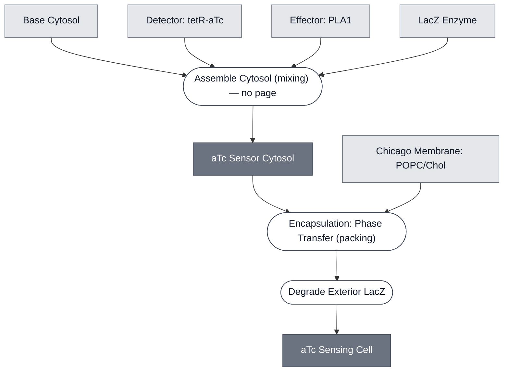

# Overview

The aTc Sensing Cell combines the [Chicago Chassis](../chicago-chassis/spec.md) with a `TetO-PLA1` sensing circuit and encapsulated LacZ, giving a synthetic cell that reports anhydrotetracycline (aTc) dose as a colorimetric (absorbance) signal. The [aTc Sensing Module](../detector-tetr-atc/spec.md) supplies the `TetO-PLA1` sensing construct and the [PLA1 Lysis Module](../effector-pla1/spec.md) the lysis trigger, both inside the cell along with LacZ from the [LacZ Reporter Module](../reporter-lacz/spec.md). That Module's CPRG substrate stays outside, so the cell starts colorless and lysis is what produces the signal.

:::{attention} 🚧 Draft
This page is a work in progress and not yet ready for use.
:::

:::{figure} mechanism-schematic.png
:name: fig-atc-sensing-cell-schematic
:align: center
:width: 75%

Schematic representation of the aTc Sensing Cell mechanism. Inside the synthetic cell, the `TetO-PLA1` construct is transcribed and translated to produce PLA1; LacZ is co-encapsulated as purified enzyme, with its CPRG substrate outside the cell. Membrane-permeable aTc (ATC) enters the synthetic cell and (via TetR, not shown) de-represses `TetO-PLA1` expression. PLA1 then ruptures the membrane, releasing LacZ to the CPRG outside. Figure by Mary Kelly (Chicago Node, Kamat Lab); the data panels of the original are omitted.
:::

# Reference Composition

:::::{tab-set}
<!-- gen:composition-diagram -->
::::{tab-item} Module Dependencies

::::
<!-- /gen:composition-diagram -->

::::{tab-item} DNA

:::{table}
| **Name** | **Length (bp)** | **File** | **Supply route** |
| --- | --- | --- | --- |
| `TetO-PLA1` | 1202 | [pT7-tetO-PLA1-linear.gb](https://github.com/nucleus-eng/DNA/blob/main/effectors/detector-tetr-atc/pT7-tetO-PLA1-linear.gb) | Cassette form; expressed in the synthetic cell. Distinct from `pT7-tetO-plamGFP` |
| `pOpen-T7-tetO-PLA1` | 3140 | pending — see below | Circular form, preferred by the Chicago Node |
:::

:::{attention} The circular forms are not on `main` yet
@Editor(chicago): `pOpen-T7-tetO-PLA1.gb` and `pOpen-T7-tetO-C23DO.gb` are on [`nucleus-eng/DNA` PR #10](https://github.com/nucleus-eng/DNA/pull/10) and not yet merged. Add the file links when it lands.

Chicago prefers the circular form and both are expected to work. They are **not sequence-identical** — the linear entry is the expression cassette, the circular one is that cassette in a pOpen backbone — so the row a page cites follows the route it documents.
:::

See [Detector: tetR-aTc](../detector-tetr-atc/spec.md) for the sensing construct.

::::

::::{tab-item} Cytosol

The inner solution follows the [Chicago Chassis](../chicago-chassis/spec.md) cytosol at reaction concentration, with the `TetO-PLA1` construct from the [aTc Sensing Module](../detector-tetr-atc/spec.md), and LacZ protein from the [LacZ Reporter Module](../reporter-lacz/spec.md).

:::{table} Combined synthetic cell reaction, one level deep.
| Module | Working concentration | Notes |
| --- | --- | --- |
| [Chicago Chassis](../chicago-chassis/spec.md) | Base Cytosol at reaction concentration, in a 9:1 POPC:cholesterol synthetic cell membrane | Transcription, translation, and encapsulation. |
| [aTc Sensing Module](../detector-tetr-atc/spec.md) | 1 nM `TetO-PLA1` DNA + 50 nM TetR | Two other DNA/TetR ratios have been characterized — see [Expected Behavior](#atc-sensing-cell-expected-behavior). |
| [PLA1 Lysis Module](../effector-pla1/spec.md) | covered by 1 nM `TetO-PLA1` DNA | |
| [LacZ Reporter Module](../reporter-lacz/spec.md) | LacZ: 20 U/mL | Enzyme only. CPRG stays in the outer solution — co-encapsulating the two makes the readout constitutive. |
:::

:::{attention} Reference DNA/TetR ratio not canonical in the source
@Editor(chicago): the source records three DNA/TetR combinations as tested and singles out none as canonical. The table above takes the headline condition as the reference. Confirm with the Chicago Node which ratio the Module should specify.
:::

::::

::::{tab-item} Membrane

:::{table} Synthetic cell membrane — [Chicago Membrane: POPC/Chol](../membrane-popc-chol-chicago/spec.md).
:label: comp-atc-sensing-cell-membrane

| Component | Target percentage (%) |
| --- | --- |
| POPC | 89.9 |
| Cholesterol | 10 |
| Liss-Rhod PE | 0.1 |
:::

::::

::::{tab-item} Outer Solution

:::{table} Outer solution.
:label: comp-atc-sensing-cell-outer

| Component | Working concentration |
| --- | --- |
| aTc | 1 µM — the response saturates at or below this |
| CPRG substrate | 0.5 mM — kept out of the cell that carries its enzyme |
:::

::::

:::::

(atc-sensing-cell-expected-behavior)=
# Expected Behavior

This configuration detects aTc in synthetic cells, but the response is **not graded**. Fold change in absorbance at 5 h (n = 3) separates dosed from undosed at roughly 1.15× to 1.33×, across three DNA/TetR combinations — 1 nM DNA with 50 nM TetR, 0.5 nM DNA with 50 nM TetR, and 1 nM DNA with 100 nM TetR — each dosed at 0, 1, 5, and 10 µM aTc. The response is non-monotonic in two of the three combinations, and the error bars across the 1, 5, and 10 µM points overlap in all three. Treat it as saturating at or below 1 µM, with no resolvable dose-dependence from 1 to 10 µM.

Full detail, including the reading of the source figure and why the 0 µM point is a normalization baseline rather than a negative control, is documented in the [aTc Sensing Module](../detector-tetr-atc/spec.md#teto-pla1-encapsulated-with-lacz) spec and is not duplicated here.

:::{caution} Gel integration not yet complete.
This result is confirmed in synthetic cells only.
:::

# Requirements

Requires pT7 transcription and translation (e.g. [Base Cytosol](../base-cytosol/spec.md)), supplied here by the [Chicago Chassis](../chicago-chassis/spec.md).

Requires TetR, and aTc as the analyte — see the [aTc Sensing Module](../detector-tetr-atc/spec.md).

Requires that no LacZ protein share a compartment with CPRG until the reporter module is turned on (see [LacZ Reporter Module](../reporter-lacz/spec.md)).

# Implementations

- [Chicago DevCell](../../implementations/chicago-devcell/main.md): this Cell is the aTc sensing element of the Chicago demo.

# Constituent Modules

- [aTc Sensor Cytosol](../atc-sensor-cytosol/spec.md) — [Base Cytosol](../base-cytosol/spec.md) carrying the aTc sensing construct, the PLA1 effector it gates, and the LacZ enzyme
- [Chicago Membrane](../membrane-popc-chol-chicago/spec.md) — 9:1 POPC:cholesterol synthetic cell membrane

# Processes

- [Encapsulation: Phase Transfer](../../processes/assemble-base-cell/main.md) — the shared phase-transfer method, with the Chicago-specific lipid composition on [Chicago Membrane](../membrane-popc-chol-chicago/spec.md).

- [Colorimetric Readout](../../processes/colorimetric-readout/main.md) — the CPRG conversion that produces the visible signal

# Credits

Developed by Mary Kelly (Chicago Node, Kamat Lab).

:::{attention} Credits are draft
Contributor attribution on this page has not been confirmed with the Node. Assign each credit explicitly before this page is merged to `main`.
:::
