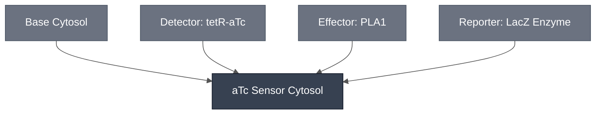

# Overview

The aTc Sensor Cytosol is the aqueous phase of the [aTc Sensing Cell](../atc-sensing-cell/spec.md): [Base Cytosol](../base-cytosol/spec.md) carrying the [aTc Sensing Module](../detector-tetr-atc/spec.md), the [PLA1 Lysis Module](../effector-pla1/spec.md) it gates, and the LacZ enzyme that reports the result. It is mixed before encapsulation, not added to a closed compartment.

Compare the [pH Sensor Cytosol](../ph-sensor-cytosol/spec.md), which shares the Base Cytosol background and swaps the detector, and the [AHL Sensor Cytosol](../ahl-sensor-cytosol/spec.md), which is built on S30 Lysate instead.

:::{attention} 🚧 Draft
This page is a work in progress and not yet ready for use.
:::

# Reference Composition

:::::{tab-set}

<!-- gen:composition-diagram -->
::::{tab-item} Module Dependencies

::::
<!-- /gen:composition-diagram -->

::::{tab-item} DNA

:::{table} Constructs in the aTc Sensor Cytosol.
| **Name** | **Length (bp)** | **File** | **Supply route** |
| --- | --- | --- | --- |
| `TetO-PLA1` | 1202 | [pT7-tetO-PLA1-linear.gb](https://github.com/nucleus-eng/DNA/blob/main/effectors/detector-tetr-atc/pT7-tetO-PLA1-linear.gb) | Cassette form. Base Cytosol does not require circular DNA |
| `pOpen-T7-tetO-PLA1` | 3140 | pending — [PR #10](https://github.com/nucleus-eng/DNA/pull/10) | Circular form, preferred by the Chicago Node |
| TetR | not documented | — | Supplied as purified protein at 50 nM, not expressed |
| LacZ | not documented | — | Supplied as purified enzyme at 20 U/mL, not expressed |
:::

One molecule carries the operator and the effector, so [PLA1](../effector-pla1/spec.md) has no construct of its own here.

::::

::::{tab-item} Cytosol

:::{table} Cytosolic components of the aTc Sensor Cytosol, at reaction concentration.
| Module | Working concentration | Notes |
| --- | --- | --- |
| [Base Cytosol](../base-cytosol/spec.md) | At reaction concentration | Transcription and translation |
| [aTc Sensing Module](../detector-tetr-atc/spec.md) | 1 nM `TetO-PLA1` DNA + 50 nM TetR | Two other DNA/TetR ratios have been characterized — see [aTc Sensing Cell](../atc-sensing-cell/spec.md) |
| [PLA1 Lysis Module](../effector-pla1/spec.md) | Covered by 1 nM `TetO-PLA1` DNA | The operator and the effector are on one molecule |
| [LacZ Enzyme](../reporter-lacz-enzyme/spec.md) | 20 U/mL | Enzyme only. CPRG stays in the outer solution — co-encapsulating the two makes the readout constitutive |
:::

::::

:::::

:::{attention} Which DNA form this reaction receives
@Editor(chicago): the Chicago Node prefers the circular `pOpen-T7-tetO-PLA1` (3140 bp) and both forms are expected to work. Base Cytosol does not require circular DNA, so the cassette form is also valid here — but the two are **not sequence-identical**, so confirm which the reference reaction used before treating this row as a supply instruction. See [aTc Sensing Module](../detector-tetr-atc/spec.md).
:::

**The analyte is not part of this composition.** aTc reaches the sensing cell from outside after encapsulation.

# Constituent Modules

- [Base Cytosol](../base-cytosol/spec.md) — transcription and translation
- [aTc Sensing Module](../detector-tetr-atc/spec.md) — the gated sensing construct
- [PLA1 Lysis Module](../effector-pla1/spec.md) — carried on the same molecule as the detector
- [LacZ Enzyme](../reporter-lacz-enzyme/spec.md) — encapsulated with the reaction

# Process

- [Assemble Base Cytosol](../../processes/assemble-base-cytosol/main.md) — produces the Base Cytosol background.
- Assemble Cytosol — the mixing step that adds the detector, effector and enzyme. Every constituent above enters the same compartment.

This cytosol is consumed by [Encapsulation: Phase Transfer](../../processes/assemble-base-cell/main.md), which combines it with the [Chicago Membrane](../membrane-popc-chol-chicago/spec.md) to form the [aTc Sensing Cell](../atc-sensing-cell/spec.md).

:::{attention} No process page for the general mixing step
@Editor(chicago): `Assemble Base Cytosol` documents the Base case, where the added component is water. No page documents the abstract mixing step that adds arbitrary aqueous components. Every combination step needs a Process page.
:::

# Credits

Developed by the Chicago Node (Kamat Lab and Liu Lab).

:::{attention} Credits are draft
Contributor attribution on this page has not been confirmed with the Node. Assign each credit explicitly before this page is merged to `main`.
:::
