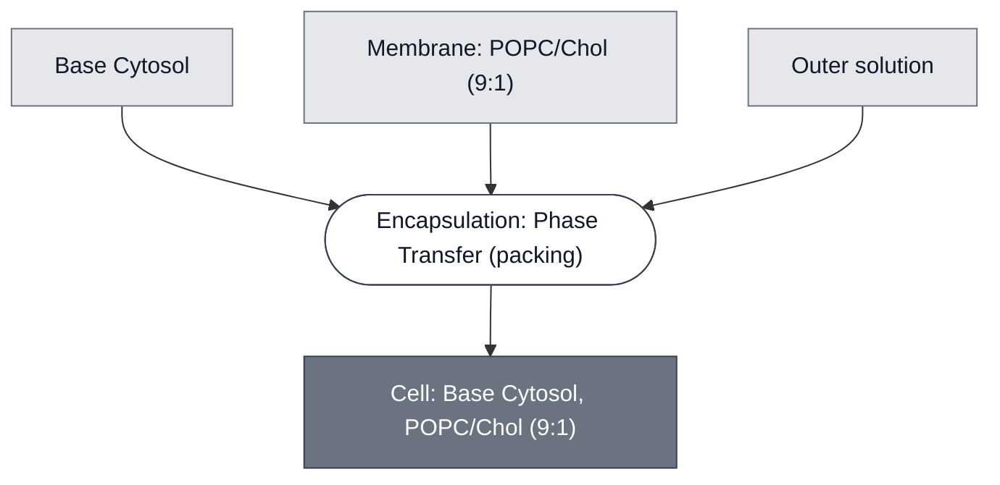

# Overview

<!-- gen:position -->
**Position.** Refines [`cell`](../cell/spec.md) and [`guv`](../guv/spec.md). Refined by [`atc-sensing-cell`](../atc-sensing-cell/spec.md), [`ph-sensing-cell`](../ph-sensing-cell/spec.md), [`theophylline-sensing-cell`](../theophylline-sensing-cell/spec.md).
<!-- /gen:position -->

The Cell: Base Cytosol, POPC/Chol (9:1) combines [Base Cytosol](../base-cytosol/spec.md) with the [Membrane: POPC/Chol (9:1)](../membrane-popc-chol-9-1/spec.md) (9:1 POPC:cholesterol). This cell is extended in downstream demo variants by adding sensing and reporter modules (e.g., the [Theophylline Sensing Module](../detector-theophylline/spec.md) driving [LacZ](../reporter-lacz/spec.md), giving the [SensorCell[theophylline ⟶ LacZ]](../theophylline-sensing-cell/spec.md)).

:::{attention} 🚧 Draft
This page is a work in progress and not yet ready for use.
:::

(cell-base-cytosol-popc-chol-reference-composition)=
# Reference Composition

:::::{tab-set}

<!-- gen:composition-diagram -->
::::{tab-item} Module Dependencies

::::
<!-- /gen:composition-diagram -->

::::{tab-item} Cytosol

:::{warning} Cytosol Composition is not verified!
Below is an approximate composition table for the cytosolic components in the Cell: Base Cytosol, POPC/Chol (9:1), based on the composition of [Base Cytosol](../base-cytosol/spec.md) and have not been verified by the module developers. 
:::

| Component         | Input concentration | Final concentration | Volume for one reaction (µL) |
| ----------------- | ------------------- | ------------------- | ---------------------------- |
| SMix              | 3.33x               | 1x                  | 12                           |
| PMix              | 15 mg/mL            | 1.80 mg/mL          | 4.8                          |
| Ribosomes         | 10 µM               | 1.8 µM              | 7.2                          |
| tRNA              | 35 mg/mL            | 3.5 mg/ml           | 4                            |
| RNase Inhibitor   | 40 000 U/mL         | 2000 U/mL           | 2                            |
| Optiprep          | 1.32 mg/µL          | 0.043 mg/µL         | 1.33                         |
| template DNA      | X nM                | Y nM                | -                            |
| Water             |                     |                     | to 40 µL final volume        |
:::

::::

::::{tab-item} Membrane

:::{table}
:label: comp-popc-chol-membrane

| Component               | Target Percentage (%) | Molecular Weight (g/mol) | Stock concentration (mg/mL) | Volume to add (µL) |
| ----------------------- | --------------------- | ------------------------ | --------------------------- | ------------------ |
| POPC                    | 89.9                  | 760.076                  | 25                          | 41                 |
| Cholesterol             | 10                    | 386.7                   | 50                          | 1.16               |
| (Optional) Liss-Rhod PE | 0.1                   | 1301.71                  | 1                           | 1.952              |

:::

Volumes are the synthetic-cell preparation at 0.5 mM total lipid. See [Membrane: POPC/Chol (9:1)](../membrane-popc-chol-9-1/spec.md) for the full membrane spec and the SUV preparation.

::::

::::{tab-item} Outer Solution

:::{table} Outer solution.
:label: comp-cell-base-cytosol-popc-chol-outer

| Component | Working concentration |
| --- | --- |
| Tris-HEPES buffer stock (0.5 M Tris base, 1.7 M HEPES; pH ≈ 7.4, ≈ 2700 mOsm) | 42.5% (v/v) in water, giving ≈ 1180 mOsm |
| Energy solution | Supplemented into the outer solution |
:::

Match outer and inner solution osmolarities empirically with a vapor-pressure osmometer where possible.

:::{attention} Recorded for the SensorCell[pH ⟶ PLA1], assumed for the chassis
@Editor(chicago): the buffer above is the outer solution recorded for the pH sensor. Confirm it is the chassis default rather than specific to that cell, and confirm what the energy solution supplement contains.
:::

::::

:::::

# Expected Behavior

- **Yield and morphology.** Count round, intact cells ≥5 µm per imaging field by fluorescence or brightfield microscopy. Counts should stay stable through incubation at the reaction's working temperature (e.g. 37 °C); a drop over time points to membrane instability rather than an expression problem.
- **Functional encapsulation.** Confirm reporter expression (e.g., [deGFP](../reporter-degfp/spec.md)) by fluorescence microscopy. Expect cell brightness to not be uniform.

# Processes

The chassis is formed by encapsulating [Base Cytosol](../base-cytosol/spec.md) in a [9:1 POPC:cholesterol membrane](../membrane-popc-chol-9-1/spec.md) using [emulsion phase transfer](../../processes/assemble-base-cell/main.md).

# Constituent Modules

- [Base Cytosol](../base-cytosol/spec.md)
- [Membrane: POPC/Chol (9:1)](../membrane-popc-chol-9-1/spec.md)

# Credits

Developed by the Chicago Node (Kamat Lab and Liu Lab).

:::{attention} Credits are draft
Contributor attribution on this page has not been confirmed with the Node. Assign each credit explicitly before this page is merged to `main`.
:::
