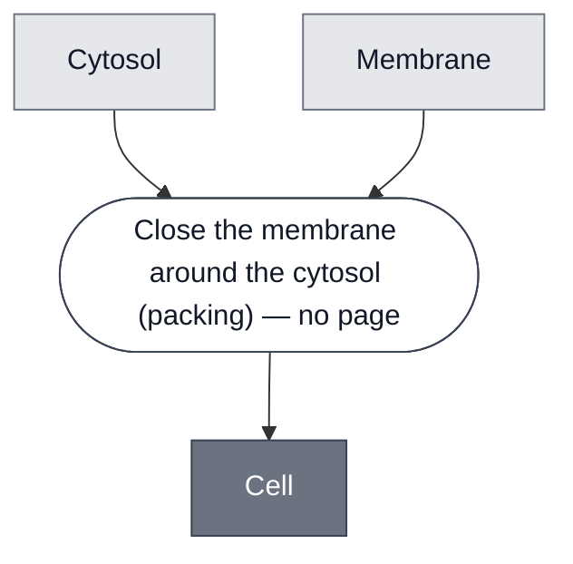

# Overview

<!-- gen:position -->
**Position.** Refines nothing declared. Refined by [`base-cell`](../base-cell/spec.md), [`chicago-chassis`](../chicago-chassis/spec.md), [`london-chassis`](../london-chassis/spec.md), [`sensing-cell`](../sensing-cell/spec.md).
<!-- /gen:position -->

A class: a [Cytosol](../cytosol/spec.md) closed inside a [Membrane](../membrane/spec.md).
Five members.

**It refines nothing here, and that is flagged rather than settled.** [Container](../container/spec.md)
is the obvious candidate and a cell is not a kind of container. It is a container with something
in it. That is the `hold` question at `open.md#O8` in the theory corpus and it is not settled
there, so this class is left a root on the [Pore](../pore/spec.md) precedent.

:::{attention} 🚧 Draft
This page is a work in progress and not yet ready for use.
:::

# Reference Composition

:::::{tab-set}

<!-- gen:composition-diagram -->
::::{tab-item} Module Dependencies

::::
<!-- /gen:composition-diagram -->

::::{tab-item} Membrane

**The membrane slot is untouched by the refinement below it**, which is what makes [Sensing Cell](../sensing-cell/spec.md) a narrowing of the cytosol slot alone.

:::{table} What the five members put in this slot.
| Member | Membrane |
| --- | --- |
| [Base Cell](../base-cell/spec.md) | [POPC/Chol](../membrane-popc-chol/spec.md), 70:30 |
| [London Chassis](../london-chassis/spec.md) | [POPC](../membrane-popc/spec.md) |
| [Chicago Chassis](../chicago-chassis/spec.md) | [Chicago POPC/Chol](../membrane-popc-chol-chicago/spec.md), 9:1 |
| [AHSL Sensing Cell](../ahsl-sensing-cell/spec.md) | [POPC](../membrane-popc/spec.md) |
| the other three sensing cells | [Chicago POPC/Chol](../membrane-popc-chol-chicago/spec.md) |
:::

**All of them refine [Membrane](../membrane/spec.md)**, so the slot holds across every member.

::::

:::::

**Members are a different relation from constituents.** In `compositional-biology-theory`,
`glossary.md#T34` makes Constituent a containment relation and `glossary.md#T13` makes
membership a matter of what a sort classifies.

**`Cell = Cytosol ⊗ Membrane`, `packing` over exactly two operands, five of five.** No
member has an exception and no member has a third operand.

:::{table} Every member ends in the same step.
| Member | Cytosol | Membrane |
| --- | --- | --- |
| [Base Cell](../base-cell/spec.md) | Base Cytosol | Base Membrane |
| [AHSL Sensing Cell](../ahsl-sensing-cell/spec.md) | AHSL Sensor Cytosol | POPC |
| [aTc Sensing Cell](../atc-sensing-cell/spec.md) | aTc Sensor Cytosol | Chicago |
| [pH Sensing Cell](../ph-sensing-cell/spec.md) | pH Sensor Cytosol | Chicago |
| [Theophylline Sensing Cell](../theophylline-sensing-cell/spec.md) | Theophylline Sensor Cytosol | Chicago |
:::

**`packing` and never `mixing`.** The cytosol and the membrane keep separate compartments, which
is what a boundary is for.

**[Base Cell](../base-cell/spec.md) is the control.** It sits directly under this class rather
than under [Sensing Cell](../sensing-cell/spec.md), because its cytosol carries no detector.
That is what makes the Sensing Cell refinement a real narrowing of one slot rather than a
second name for this one.

# Requirements

Requires that the membrane close around the cytosol rather than be filled afterwards.
Every member composes its cytosol before encapsulation.

# Constituent Modules

- [Cytosol](../cytosol/spec.md) — what the membrane closes around
- [Membrane](../membrane/spec.md) — the boundary

# Processes

See the composition source. The step this class runs is stated there, and it has no page
because no process in this corpus performs it at this grain.

# Credits

:::{attention} Credits are draft
Contributor attribution on this page has not been confirmed with the Node. Assign each credit
explicitly before this page is merged to `main`.
:::
