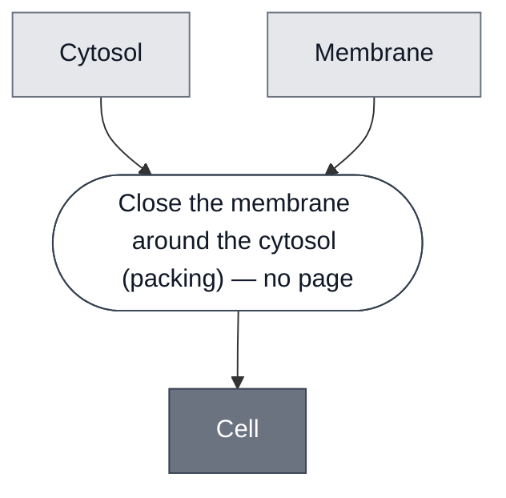

# Overview

<!-- gen:position -->
**Position.** Refines nothing declared. Refined by [`base-cell`](../base-cell/spec.md), [`cell-base-cytosol-popc-chol`](../cell-base-cytosol-popc-chol/spec.md), [`cell-s30-popc`](../cell-s30-popc/spec.md), [`sensing-cell`](../sensing-cell/spec.md).
<!-- /gen:position -->

A class: a [Cytosol](../cytosol/spec.md) closed inside a [Membrane](../membrane/spec.md).

Every member packs a cytosol and a membrane and nothing else. The membrane closes around the cytosol, and the two keep separate compartments.

:::{attention} 🚧 Draft
This page is a work in progress and not yet ready for use.
:::

# Reference Composition

:::::{tab-set}

<!-- gen:composition-diagram -->
::::{tab-item} Module Dependencies

```mermaid
flowchart TD
    CYTOSOL["Cytosol"]
    MEMBRANE["Membrane"]

    P1_ENCAPSULATE_0(["Close the membrane around the cytosol (packing) — no page"])
    CELL["Cell"]

    CYTOSOL --> P1_ENCAPSULATE_0
    MEMBRANE --> P1_ENCAPSULATE_0
    P1_ENCAPSULATE_0 --> CELL


    classDef leaf     fill:#e5e7eb,stroke:#6b7280,color:#111827;
    classDef composed fill:#6b7280,stroke:#374151,color:#ffffff;
    classDef process  fill:#ffffff,stroke:#374151,color:#111827;
    class CYTOSOL,MEMBRANE leaf;
    class CELL composed;
    class P1_ENCAPSULATE_0 process;

    click CYTOSOL "/docs/modules/cytosol/spec"
    click MEMBRANE "/docs/modules/membrane/spec"
    click CELL "/docs/modules/cell/spec"
```

::::
<!-- /gen:composition-diagram -->

::::{tab-item} Cytosol

Base Cell and the two chassis carry no detector. [Sensing Cell](../sensing-cell/spec.md) narrows this slot to a [Sensor Cytosol](../sensor-cytosol/spec.md).

:::{table} What each member puts in the cytosol slot.
| Member | Cytosol |
| --- | --- |
| [Base Cell](../base-cell/spec.md) | [Base Cytosol](../base-cytosol/spec.md) |
| [Cell: S30 Lysate, POPC](../cell-s30-popc/spec.md) | [S30 Lysate](../s30-lysate/spec.md) |
| [Cell: Base Cytosol, POPC/Chol (9:1)](../cell-base-cytosol-popc-chol/spec.md) | [Base Cytosol](../base-cytosol/spec.md) |
| [Sensing Cell](../sensing-cell/spec.md) | [Sensor Cytosol](../sensor-cytosol/spec.md) |
:::

::::

::::{tab-item} Membrane

:::{table} What each member puts in the membrane slot.
| Member | Membrane |
| --- | --- |
| [Base Cell](../base-cell/spec.md) | [POPC/Chol](../membrane-popc-chol/spec.md), 70:30 |
| [Cell: S30 Lysate, POPC](../cell-s30-popc/spec.md) | [POPC](../membrane-popc/spec.md) |
| [Cell: Base Cytosol, POPC/Chol (9:1)](../cell-base-cytosol-popc-chol/spec.md) | [Membrane: POPC/Chol (9:1)](../membrane-popc-chol-9-1/spec.md) |
| [Sensing Cell](../sensing-cell/spec.md) | [Membrane](../membrane/spec.md), unchanged: [POPC](../membrane-popc/spec.md) in one member and [Membrane: POPC/Chol (9:1)](../membrane-popc-chol-9-1/spec.md) in the other three |
:::

::::

:::::

# Expected Behavior

A Cell is expected to have an inside, a boundary and an outside. The cytosol reaction runs inside the membrane, and the outer solution is on the other side of it. The cytosol and the membrane keep separate compartments, so a cell is packed and never mixed.

# Requirements

Requires that the cytosol be complete before the membrane closes around it. A closed cell cannot be filled afterwards.

# Processes

[Encapsulation](../../processes/encapsulate/main.md) closes the membrane around the cytosol. Every member uses the [Phase Transfer](../../processes/assemble-base-cell/main.md) route.

# Constituent Modules

- [Cytosol](../cytosol/spec.md) — what the membrane closes around
- [Membrane](../membrane/spec.md) — the boundary

# Credits

:::{attention} Credits are draft
Contributor attribution on this page has not been confirmed with the Node. Assign each credit
explicitly before this page is merged to `main`.
:::
