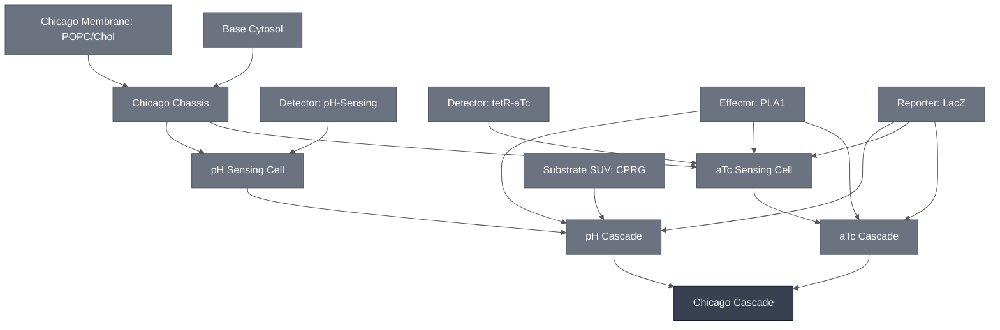

# Overview

The Chicago Cascade is the top-level, multiplexed Chicago demo node: two integration paths running side by side in one system, each detecting a different analyte, both reporting through a shared colorimetric readout. The two integration paths are the [aTc Cascade](../atc-cascade/spec.md) and the [pH Cascade](../ph-cascade/spec.md).

The goal is multiplexed detection — aTc and pH sensed in the same reaction, with a visible color change that reflects the combination of the two inputs.

:::{attention} 🚧 Draft
This page is a work in progress and not yet ready for use.
:::

:::{attention} Rewritten 2026-08-19 — the integration paths have changed
Theophylline interferes with the LacZ/CPRG readout, so the theophylline path is not part of this cascade.

That is superseded. Chicago is now focused on the aTc and pH sensors (14 Aug 2026 deck, slides 2 and 34, which lists "Two sensors (aTC/pH)"), and the theophylline sensor has been removed from the demo — its riboswitch drives the reporter with no analyte present, so it does not discriminate. See [Theophylline Sensing Module](../detector-theophylline/spec.md).

The theophylline/aTc co-encapsulation constraint remains true and is still documented on the affected Modules. It is simply no longer this cascade's blocker, because theophylline is no longer one of its integration paths.
:::

# Reference Composition

No combined reference composition exists, and none is given here — not even a hypothetical one. The combination has never been assembled, so there are no working concentrations to report.

Each integration path's own composition is documented on its own page. 

:::::{tab-set}

<!-- gen:composition-diagram -->
::::{tab-item} Module Dependencies

::::
<!-- /gen:composition-diagram -->

::::{tab-item} DNA

@Claude: standard DNA callout for missing sequences
The constructs are those of the two integration paths; no construct is specific to the merge.

:::{table}
| **Name** | **Length (bp)** | **File** | **Supply route** |
| --- | --- | --- | --- |
| `TetO-PLA1` | not documented | — | Expressed; see [aTc Cascade](../atc-cascade/spec.md) |
| Toehold-switch-gated PLA1 template | not documented | — | Expressed; see [pH Cascade](../ph-cascade/spec.md) |
| pH-responsive ssDNA : trigger ssDNA | not applicable | — | Synthesized oligonucleotides |
| β-galactosidase (LacZ) | not applicable | — | Purified enzyme, not expressed |
:::

::::

::::{tab-item} Cytosol 

:::{table} Cytosol of the merged cascade.
:label: comp-chicago-cascade-cytosol

| Component | Working concentration |
| --- | --- |
| aTc path components | As on [aTc Cascade](../atc-cascade/spec.md#reference-composition) |
| pH path components | As on [pH Cascade](../ph-cascade/spec.md#reference-composition) |
| Base Cytosol components | At reaction concentration |
:::

:::{attention} Merged recipe not documented
@Editor: no combined recipe exists for the two paths together, and the pH path's own combined-recipe concentrations are undocumented. Confirm with the Chicago Node.
:::

::::

::::{tab-item} Substrate SUV

A second liposome population carrying the chromogenic substrate, entering this cascade through the [pH Cascade](../ph-cascade/spec.md). See [Substrate SUV: CPRG](../substrate-cprg-suv/spec.md).

:::{table} Substrate SUV lumen.
:label: comp-chicago-cascade-suv

| Component | Working concentration |
| --- | --- |
| CPRG substrate | Not documented at a reaction concentration for the multiplexed cascade |
:::

The SUV membrane follows [Chicago Membrane: POPC/Chol](../membrane-popc-chol-chicago/spec.md), as specified on [pH Cascade](../ph-cascade/spec.md#reference-composition). The aTc integration path co-encapsulates free CPRG instead, so it contributes no SUV population.

::::

::::{tab-item} Membrane

Both integration paths are built on the [Chicago Chassis](../chicago-chassis/spec.md), so the membrane carries over unchanged.

:::{table} Synthetic cell membrane — [Chicago Membrane: POPC/Chol](../membrane-popc-chol-chicago/spec.md).
:label: comp-chicago-cascade-membrane

| Component | Target percentage (%) |
| --- | --- |
| POPC | 89.9 |
| Cholesterol | 10 |
| Liss-Rhod PE | 0.1 |
:::

::::

:::::

# Expected Behavior

**Status: not attempted.** No experiment has run the two integration paths together. The merge is not blocked; it has not been tried.

There is, however, a known design question standing in front of it, described below.

## Cells

:::{warning} Not yet validated
This Module has not been validated in synthetic cells.
:::

# Requirements

Requires both integration paths in one system — [aTc Cascade](../atc-cascade/spec.md) and [pH Cascade](../ph-cascade/spec.md) — on a shared [Chicago Chassis](../chicago-chassis/spec.md) membrane, reporting through one shared [LacZ Reporter](../reporter-lacz/spec.md).

Requires each integration path's own requirements to hold unchanged. Neither path has a bulk-cytosol route, so this cascade does not either.

**Something has to decide what the readout does when both paths fire.** Both the aTc and pH integration paths end at the same LacZ/CPRG chemistry. Two inputs arriving at one output is not, by itself, a design — it needs a stated rule for how the two signals combine. Should the color change when *either* analyte is present, only when *both* are, or only when exactly one is? Each of those is a different device, and each needs a different mechanism.

That rule has not been chosen. Until it is, "multiplexed detection" describes an intent rather than a specification.

:::{attention} This is the cascade's central open question
Two things follow from it, and both are worth stating plainly.

**First, a shared readout with no combining rule is not neutral.** If both paths simply drive the same enzyme reaction, the result is whatever the chemistry does when both are active — which is closer to an uncontrolled "either" than to a designed behavior. Getting a specified behavior means adding a mechanism, not just co-locating the two paths.

**Second, the three candidate rules are not equally easy to build.** "Either analyte" is close to what co-locating the paths already gives, so the work is making it controlled and reproducible rather than incidental. "Both analytes" needs a coincidence mechanism — some step that only proceeds when two inputs are present at once. "Exactly one" is harder still, because it needs the system to suppress output when a signal *is* present, and inhibition is a mechanism this cascade does not currently have anywhere.

So the choice of rule is not a labeling decision to make at write-up time. It determines what has to be built.
:::

**A second, separate question.** The pH path's readout adds a neutralization buffer step before the color develops, while the aTc path reads out directly. @Editor: whether one shared readout can serve both paths when one requires a pH adjustment is unresolved. Confirm with the Chicago Node.

# Implementations

This cascade is the sensing core of the [Chicago DevCell](../../implementations/chicago-devcell/main.md), which places it in a hydrogel and adds spatial patterning. That page carries the demo-level status.

# Processes

No combined assembly process exists. Both integration paths are formed by the same method — see [Encapsulation: Phase Transfer](../../processes/assemble-base-cell/main.md) — and both are embedded and read out through the processes listed on their own pages. What is missing is not a technique for making either path, but the step that brings them together and the mechanism that combines their outputs.

# Constituent Modules

- [aTc Cascade](../atc-cascade/spec.md) — the aTc integration path, confirmed in synthetic cytosols and in synthetic cells; hydrogel embedding still in progress
- [pH Cascade](../ph-cascade/spec.md) — the pH integration path; its individual results are confirmed but the three-part chain has not been run end to end

Both integration paths terminate at the [LacZ Reporter Module](../reporter-lacz/spec.md), which is shared rather than duplicated. That sharing is the subject of the Requirements section above.

# Credits

Developed by the Chicago Node (Kamat Lab and Liu Lab).
