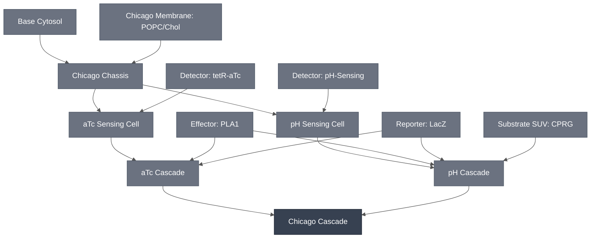

# Overview

The Chicago Cascade is the top-level, multiplexed demo from the Chicago Node of DevCells: two integrated synthetic cell detectors embedded in parallel in one system, each detecting a different analyte, both reporting through a shared colorimetric readout. The two module integration paths are the [aTc Cascade](../atc-cascade/spec.md) and the [pH Cascade](../ph-cascade/spec.md).

:::{attention} 🚧 Draft
This page is a work in progress and not yet ready for use.
:::

:::{attention} Rewritten 2026-08-19 — the integration paths have changed
Theophylline interferes with the LacZ/CPRG readout, so the theophylline path is not part of this cascade.

That is superseded. Chicago is now focused on the aTc and pH sensors (14 Aug 2026 deck, slides 2 and 34, which lists "Two sensors (aTC/pH)"), and the theophylline sensor has been removed from the demo — its riboswitch drives the reporter with no analyte present, so it does not discriminate. See [Theophylline Sensing Module](../detector-theophylline/spec.md).

The theophylline/aTc colocalization constraint remains plausible but requires testing and is still documented on the affected Modules. 
:::

# Reference Composition
:::{attention} Merged recipe not documented
@Editor(chicago): no combined recipe exists for the two paths together. The per-population tables below are each path's own composition, carried over unchanged; nothing records what changes when they share one reaction. Confirm with the Chicago Node.
:::

:::::{tab-set}

<!-- gen:composition-diagram -->
::::{tab-item} Module Dependencies

::::
<!-- /gen:composition-diagram -->

::::{tab-item} DNA

The constructs are those of the two integration paths; no construct is specific to the merge.

:::{attention} Constructs not yet in `nucleus-eng/DNA`
Neither PLA1-expressing construct below is confirmed in [`nucleus-eng/DNA`](https://github.com/nucleus-eng/DNA), and neither has a recorded length. `TetO-PLA1` carries the same gap where it is specified, on [aTc Sensing Cell](../atc-sensing-cell/spec.md). The toehold-switch-gated template is not separately recorded, and whether it is one of the two constructs listed on [Effector: PLA1](../effector-pla1/spec.md) or a third design is not established — do not assume it from the name. Do not add a length or file entry here until each construct is confirmed and its length verified against the source file.
:::

:::{table}
| **Name** | **Length (bp)** | **File** | **Supply route** |
| --- | --- | --- | --- |
| `TetO-PLA1` | not documented | — | Expressed; see [aTc Cascade](../atc-cascade/spec.md) |
| Toehold-switch-gated PLA1 template | not documented | — | Expressed; see [pH Cascade](../ph-cascade/spec.md) |
| pH-responsive ssDNA : trigger ssDNA | not documented | — | Synthesized oligonucleotides |
:::

::::

::::{tab-item} Membrane

**All three populations carry the same membrane.** Both integration paths are built on the [Chicago Chassis](../chicago-chassis/spec.md), and the Substrate SUV uses the same lipid composition, so one table covers the aTc Sensing Cell, the pH Sensing Cell and the Substrate SUV alike. That identity is load-bearing — see [Requirements](#chicago-cascade-requirements).

:::{table} Synthetic cell and SUV membrane — [Chicago Membrane: POPC/Chol](../membrane-popc-chol-chicago/spec.md).
:label: comp-chicago-cascade-membrane

| Component | Target percentage (%) |
| --- | --- |
| POPC | 89.9 |
| Cholesterol | 10 |
| Liss-Rhod PE | 0.1 |
:::

::::

::::{tab-item} aTc Sensing Cell

The aTc integration path uses one liposome population. It carries its own LacZ, but not the CPRG that LacZ acts on — that stays in the outer solution, so lysis is what produces color.

:::{table} aTc Sensing Cell cytosol — as on [aTc Cascade](../atc-cascade/spec.md#atc-cascade-reference-composition).
:label: comp-chicago-cascade-atc-cell

| Component | Working concentration |
| --- | --- |
| `TetO-PLA1` DNA | 1 nM |
| TetR | 50 nM |
| LacZ enzyme | 20 U/mL |
| Base Cytosol components | At reaction concentration |
:::

::::

::::{tab-item} pH Sensing Cell

The pH integration path is two compartments. This population carries sensing and lysis only; its substrate is in the Substrate SUV and its LacZ is in the outer solution.

:::{table} pH Sensing Cell cytosol — as on [pH Cascade](../ph-cascade/spec.md#ph-cascade-reference-composition).
:label: comp-chicago-cascade-ph-cell

| Component | Working concentration |
| --- | --- |
| pH-responsive ssDNA : trigger ssDNA (3:1, annealed) | 4.625 µM trigger ssDNA, final |
| Toehold-switch-gated PLA1 DNA template | 2 nM, final |
| Base Cytosol components | At reaction concentration |
:::

::::

::::{tab-item} Substrate SUV

A second liposome population carrying the chromogenic substrate, entering this cascade through the [pH Cascade](../ph-cascade/spec.md). See [Substrate SUV: CPRG](../substrate-cprg-suv/spec.md).

:::{table} Substrate SUV lumen.
:label: comp-chicago-cascade-suv

| Component | Working concentration |
| --- | --- |
| CPRG substrate | 50 mM at hydration, approx. 30 mg/mL — per [Substrate SUV: CPRG](../substrate-cprg-suv/spec.md) |
:::

The aTc integration path keeps its CPRG free in the outer solution instead, so it contributes no SUV population.

::::

::::{tab-item} Outer Solution

The medium all three populations sit in, the only compartment with no membrane of its own, and where both analytes are presented. Both paths depend on it, in opposite directions: the pH path keeps its LacZ out here and its CPRG in an SUV, while the aTc path keeps its LacZ in the cell and its CPRG out here. Each arrangement is OFF until lysis.

The hydrogel format keeps one enzyme and sequesters every substrate. Commercial LacZ is dispersed through the matrix; CPRG is loaded into SUVs and the preparation is SEC-purified twice specifically to remove unencapsulated CPRG, so no free substrate meets the enzyme before lysis. A second sensing path is intended to bring its own output SUVs carrying an orthogonal substrate — X-gal or catechol rather than CPRG — so that two analytes give two distinguishable colors rather than competing for one.

:::{table} Outer solution.
:label: comp-chicago-cascade-outer

| Component | Working concentration |
| --- | --- |
| aTc | 1 µM — the aTc path's analyte, per [aTc Cascade](../atc-cascade/spec.md#atc-cascade-reference-composition) |
| H⁺ | pH 7.4 at rest; a drop to ≈ 6.5 opens the pH path's toehold switch |
| β-galactosidase (LacZ) | Commercial enzyme dispersed through the matrix; not documented at a working concentration for the multiplexed cascade. One enzyme pool serves the whole gel. |
| Osmotic balance | Matched to the inner solutions, per [Chicago Chassis](../chicago-chassis/spec.md#chicago-chassis-reference-composition) |
:::

::::

:::::

# Expected Behavior

:::{warning} Not attempted!
No experiment has run the two integration paths together. The merge is not blocked; it has not been tried.
:::

(chicago-cascade-requirements)=
# Requirements

Requires both integration paths in one system — [aTc Cascade](../atc-cascade/spec.md) and [pH Cascade](../ph-cascade/spec.md) — on a shared [Chicago Chassis](../chicago-chassis/spec.md) membrane, reporting through one shared [LacZ Reporter](../reporter-lacz/spec.md).

Requires spatial separation between the two integration paths. PLA1 lyses any phospholipid membrane it reaches, not only the membrane of the cell that expressed it — see [PLA1 Lysis Module](../effector-pla1/spec.md#effector-pla1-requirements) — and all three populations here carry the same membrane. Co-locating the paths in one region therefore lets either analyte lyse every compartment in that region. Spatial patterning of the hydrogel supplies the separation; the pattern itself is an Implementation-level choice, documented on [Chicago DevCell](../../implementations/chicago-devcell/main.md).

:::{note} The paths are multiplexed in space, not combined in logic
The two integration paths are not wired into one signal. They are separate populations of
synthetic cells embedded at different places in one gel — one sensing aTc, one sensing pH —
and what distinguishes one analyte from both from neither is **the geometry of the color
signal**, not a rule for combining them. There is no coincidence mechanism to build, because
there is no combining step.

That makes spatial separation the whole design, rather than a workaround. It is also what the
Requirement above is protecting: PLA1 lyses any membrane it reaches, so two populations sharing
a region would destroy each other regardless of which analyte fired.

**Whether the demo shows one color or two is not yet settled.** Both paths can read out through
LacZ on CPRG, giving one color in two places. The [XylE / C23DO](../reporter-xyle/spec.md)
reporter converts catechol to a different colored product, which would give two distinguishable
colors — still spatially separated, since the populations are separate either way. These are
different demos and want separate specifications.
:::

# Implementations

This cascade is the sensing core of the [Chicago DevCell](../../implementations/chicago-devcell/main.md), which places it in a hydrogel and adds spatial patterning. That page carries the demo-level status.

# Processes

Every step below has a Process page. They are listed in the order they are performed.

**Shared**

1. [Assemble Base Cytosol](../../processes/assemble-base-cytosol/main.md) — the cell-free reaction both integration paths run on.

**aTc integration path**

2. [Encapsulation: Phase Transfer](../../processes/assemble-base-cell/main.md) — forms the aTc Sensing Cell, carrying `TetO-PLA1`, TetR and LacZ in one compartment.

**pH integration path**

3. [Anneal pH-Responsive Trigger Duplex](../../processes/anneal-ph-trigger-duplex/main.md) — anneals the sensing and trigger strands into the single duplex reagent, before encapsulation.
4. [Encapsulation: Phase Transfer](../../processes/assemble-base-cell/main.md) — the same method as the aTc cell, with a different inner solution: the duplex and the toehold-gated PLA1 template, and no LacZ.
5. [SUV Encapsulation](../../processes/encapsulate-suv/main.md) — prepares the [Substrate SUVs](../substrate-cprg-suv/spec.md) by film hydration and extrusion, then purifies away unencapsulated CPRG.

**Shared, once the populations exist**

6. [Degrade Exterior LacZ](../../processes/degrade-exterior-lacz/main.md) — digests LacZ that escaped the aTc cells, which would otherwise meet CPRG with no lysis and add background color. Proteinase K does not distinguish one LacZ from another, so this step suits a format where the enzyme is encapsulated. It cannot be applied to the hydrogel format described above, which disperses commercial LacZ through the matrix on purpose.
7. Embedding — either [Alginate Hydrogel Embedding](../../processes/embed-alginate-hydrogel/main.md), the format the current demo uses, or [Photodevelopment, PEGDA](../../processes/photodevelop-pegda/main.md), which supplies the spatial separation the Requirements section calls for. Which one is an Implementation choice; see [Chicago DevCell](../../implementations/chicago-devcell/main.md).
8. [Colorimetric Readout](../../processes/colorimetric-readout/main.md) — the CPRG conversion, read at 575 nm and by eye.

The photodeveloped route reorders the last two steps: CPRG goes into the gel after crosslinking rather than being embedded with everything else, because the UV that crosslinks the gel bleaches it. This holds for both photodevelopment routes.

:::{attention} Spatial separation and this readout are in tension
The Requirements section above calls for spatial separation between the two integration paths, and photodevelopment is the only route to it. But both photodevelopment routes impose UV on the payload, and the reordering that avoids the bleaching adds CPRG as a free dye — which does not use the [Substrate SUV: CPRG](../substrate-cprg-suv/spec.md) module at all.

So this cascade cannot currently have both its spatial separation and its two-liposome readout as specified. @Editor(chicago): confirm which one gives.
:::

No process covers the step that would make this cascade one system rather than two — bringing both integration paths into a single gel. Every technique above is documented for one path or the other. What is absent is the merge, and the mechanism that resolves two outputs into one readout.

# Constituent Modules

- [aTc Cascade](../atc-cascade/spec.md) — the aTc integration path, confirmed in synthetic cells; hydrogel embedding still in progress. The detector alone is separately replicated in bulk Nucleus Cytosol with a deGFP reporter standing in for the lysis and colorimetric steps, so that result does not extend to the chain.
- [pH Cascade](../ph-cascade/spec.md) — the pH integration path; its individual results are confirmed but the three-part chain has not been run end to end

Both integration paths terminate at the [LacZ Reporter Module](../reporter-lacz/spec.md), which is shared rather than duplicated. That sharing is the subject of the Requirements section above.

# Credits

Developed by the Chicago Node (Kamat Lab and Liu Lab).

:::{attention} Credits are draft
Contributor attribution on this page has not been confirmed with the Node. Assign each credit explicitly before this page is merged to `main`.
:::
