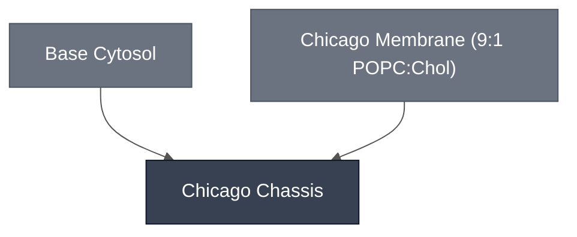

# Overview

The Chicago Chassis is used for the Chicago Node's DevStudio Demo and combines [Base Cytosol](../base-cytosol/spec.md) with the [Chicago Membrane](../membrane-popc-chol-chicago/spec.md) (9:1 POPC:cholesterol). This cell is extended in downstream demo variants by adding sensing and reporter modules (e.g., the [Theophylline Sensing Module](../detector-theophylline/spec.md) driving the [PLA1 Lysis Module](../effector-pla1/spec.md), giving the [Theophylline Sensing Cell](../theophylline-sensing-cell/spec.md)).

:::{attention} 🚧 Draft
This page is a work in progress and not yet ready for use.
:::

# Reference Composition

:::::{tab-set}

<!-- gen:composition-diagram -->
::::{tab-item} Module Dependencies

What this Module is composed of. Arrows point from a constituent to the Module that contains it; the darker node is this page. Click any node to open its spec.

This diagram shows composition only — it does not assert that any integration is confirmed.

Generated from the `# Constituent Modules` section of each page by the `mermaid-diagrams` skill. Edit the composition, not this block.

::::
<!-- /gen:composition-diagram -->

::::{tab-item} Cytosol

The inner solution encapsulated into the Chicago Chassis is [Base Cytosol](../base-cytosol/spec.md), a PURE-based aqueous solution supplying transcription and translation. Demo variants add DNA encoding sensing/reporter logic.

:::{attention} Stock and final concentrations not documented
Base Cytosol is listed here as a single aggregated line item. The working concentrations and per-reaction volumes of the Chicago Chassis inner solution, and any encapsulation additive equivalent to London's sucrose and RNase inhibitor, are not recorded in the source material. Raise on the Chicago questionnaire.
:::

::::

::::{tab-item} Membrane

The membrane is the [Chicago Membrane](../membrane-popc-chol-chicago/spec.md), a 9:1 POPC:cholesterol phospholipid bilayer that provides encapsulation, optionally functionalized with red fluorescent Liss-Rhod PE.

:::{table}
:label: comp-chicago-membrane

| Component               | Target Percentage (%) | Molecular Weight (g/mol) | Stock concentration (mg/mL) | Volume to add (µL) |
| ----------------------- | --------------------- | ------------------------ | --------------------------- | ------------------ |
| POPC                    | 89.9                  | 760.076                  | 25                          | 41                 |
| Cholesterol             | 10                    | 386.66                   | 50                          | 1.16               |
| (Optional) Liss-Rhod PE | 0.1                   | 1301.71                  | 1                           | 1.952              |

:::

Volumes are the synthetic-cell preparation at 0.5 mM total lipid. See [Chicago Membrane: POPC/Chol](../membrane-popc-chol-chicago/spec.md) for the full membrane spec and the SUV preparation.

::::

::::{tab-item} Outer Solution

Use this cell in outer solution at 1180 mOsm, or empirically match your outer and inner solution osmolarities by measuring with a vapor-pressure osmometer.

:::{attention} Outer solution composition not documented
Only the osmolarity target is recorded. The solutes and their concentrations, equivalent to London's potassium L-glutamate / HEPES / glucose table, are not in the source material. Raise on the Chicago questionnaire.
:::

::::

:::::

# Expected Behavior

- **Yield and morphology.** Count round, intact cells ≥5 µm per imaging field by fluorescence or brightfield microscopy. Counts should stay stable through incubation at the reaction's working temperature (e.g. 37 °C); a drop over time points to membrane instability rather than an expression problem.
- **Functional encapsulation.** Confirm reporter expression (e.g., [deGFP](../reporter-degfp/spec.md)) by fluorescence microscopy. Expect cell brightness to not be uniform.

# Process

The chassis is formed by encapsulating [Base Cytosol](../base-cytosol/spec.md) in a [9:1 POPC:cholesterol membrane](../membrane-popc-chol-chicago/spec.md) using [emulsion phase transfer](../../processes/assemble-base-cell/main.md).

# Constituent Modules

- [Base Cytosol](../base-cytosol/spec.md)
- [Chicago Membrane: POPC/Chol](../membrane-popc-chol-chicago/spec.md)

# Credits

Developed by the Chicago Node (Kamat Lab and Liu Lab).
