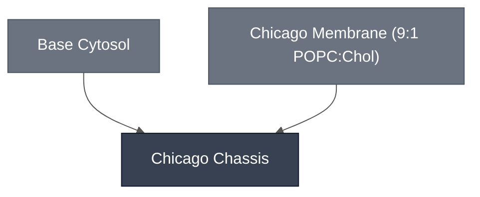

# Overview

The Chicago Chassis is used for the Chicago Node's DevStudio Demo and combines [Base Cytosol](../base-cytosol/spec.md) with the [Chicago Membrane](../membrane-popc-chol-chicago/spec.md) (9:1 POPC:cholesterol). This cell is extended in downstream demo variants by adding sensing and reporter modules (e.g., theophylline-riboswitch-driven PLA1 lysis module (@Claude: link to explicit docs page)).

:::{attention} 🚧 Draft
This page is a work in progress and not yet ready for use.
:::

# Reference Composition

:::{table} Chicago Chassis composition — aggregated from constituent Modules
:label: comp-chicago-chassis

@Claude: this table below is less good than the composition table at [./london-chassis/spec](./london-chassis/spec). Note their tabset with cytosol, membrane composition, and outer solution(describes explicit concentrations and volumes to assemble into the reaction mixture). Make it like the London page. Flag to update Chicago questionnaire for any missing info.

| Submodule                                                            | Description                                 | Function                   | Notes                                                  |
| -------------------------------------------------------------------- | ------------------------------------------- | -------------------------- | ------------------------------------------------------ |
| [Base Cytosol](../base-cytosol/spec.md)                              | Inner (aqueous) solution based on PURE.     | Transcription, Translation | Demo variants add DNA encoding sensing/reporter logic. |
| [Chicago Membrane: POPC/Chol](../membrane-popc-chol-chicago/spec.md) | Phospholipid bilayer (9:1 POPC:cholesterol) | Encapsulation              | --                                                     |

:::

# Process

The chassis is formed by encapsulating [Base Cytosol](../base-cytosol/spec.md) in a [9:1 POPC:cholesterol membrane](../../modumembrane-popc-chol/spec.md) using [emulsion phase transfer](../../processes/assemble-base-cell/main.md). Use this cell in outer solution at 1180 mOsm, or empirically match your outer and inner solution osmolarities by measuring with a vapor-pressure osmometer. 

#  Expected Behavior

- **Yield and morphology.** Count round, intact cells ≥5 µm per imaging field by fluorescence or brightfield microscopy. Counts should stay stable through incubation at the reaction's working temperature (e.g. 37 °C); a drop over time points to membrane instability rather than an expression problem.
- **Functional encapsulation.** Confirm reporter expression (e.g., [deGFP](../reporter-degfp/spec)) by fluorescence microscopy. Expect cell brightness to not be uniform.

# Submodules

- [Base Cytosol](../base-cytosol/spec.md)
- [Chicago Membrane: POPC/Chol](../membrane-popc-chol-chicago/spec.md)

# Credits

Developed by the Chicago node (Kamat Lab and Liu Lab).
