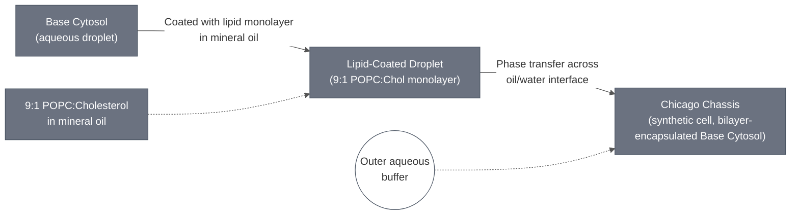

# Overview

The Chicago Chassis combines [Base Cytosol](../base-cytosol/spec.md) with the [Chicago Membrane](../membrane-popc-chol-chicago/spec.md), a 9:1 POPC:cholesterol formulation, encapsulated by the same mineral-oil phase-transfer method used for the general-purpose Base Cell. This chassis is not the general-purpose Base Cell: it uses a different membrane Module than the default [Base Membrane](../membrane-popc-chol/spec.md) (9:1 POPC:cholesterol here vs. 70:30 for Base Cell) — the encapsulation method itself is the same. On its own the chassis is an empty encapsulation shell — downstream demo variants add sensing and reporter DNA to this cytosol before encapsulation (for example the theophylline-riboswitch-driven PLA1 construct used in the current demo).

:::{attention} 🚧 Draft
This page is a work in progress and not yet ready for use.
:::

## Schematic

:::::{tab-set}

::::{tab-item} Mechanism

The inverted-emulsion (lipid-in-oil) mechanism used to form the chassis: an aqueous droplet of Base Cytosol picks up a lipid monolayer from the surrounding 9:1 POPC:cholesterol lipid-in-oil mixture, then transfers across the oil/outer-aqueous interface, acquiring a second leaflet to complete the bilayer and yield the synthetic cell. No published schematic exists for this mechanism; the diagram is a simplified summary, not a reproduction of a lab figure.

::::

<!-- gen:composition-diagram -->
::::{tab-item} Module Dependencies

What this Module is composed of. Arrows point from a constituent to the Module that contains it; the darker node is this page. Click any node to open its spec.

This diagram shows composition only — it does not assert that any integration is confirmed.

Generated from the `# Constituent Modules` section of each page by the `mermaid-diagrams` skill. Edit the composition, not this block.

::::
<!-- /gen:composition-diagram -->

:::::

## Reference Composition

The table below is a one-level-deep aggregate: it states what each constituent contributes to the synthetic-cell formation recipe, without re-expanding either constituent's own internal composition (see each linked spec for that detail — notably, Base Cytosol's own PMix/SMix breakdown runs to ~100 individual PURE-system components and stays on its own page).

:::{table} Chicago Chassis composition — aggregated from constituent Modules
:label: comp-chicago-chassis

| Constituent | Contributes | Working concentration / fraction in this recipe |
| --- | --- | --- |
| [Base Cytosol](../base-cytosol/spec.md) | Inner (aqueous) solution — the cell-free PURE-system reaction mix | 1x reaction concentration. Demo variants add DNA encoding the sensing/reporter circuit for that variant (out of scope for this page — see the corresponding sensing-module spec) |
| [Chicago Membrane: POPC/Chol](../membrane-popc-chol-chicago/spec.md) | Bilayer membrane — 9:1 POPC:cholesterol | 0.5 mM lipid-in-oil, prepared at a 3 mL lipid-in-oil scale (see that page for the full stock-concentration/per-lipid-volume breakdown) |

:::

:::{attention} Gap: cytosol-to-membrane ratio not documented
The volume ratio at which the Base Cytosol inner solution is actually combined with the 9:1 POPC:cholesterol lipid-in-oil during the inverted-emulsion synthetic-cell formation step (e.g. µL of inner solution per mL of lipid-in-oil, or the resulting final synthetic cell composition/size) is not documented in the available sourcing (`chicago.md`, from `Demo Status - Chicago.docx`). That source documents each constituent's own recipe (Base Cytosol's reaction-mix volumes; the membrane's 3 mL lipid-in-oil prep) but not the combination step itself. Do not invent a ratio — this ratio is not documented in available source material (see Process below).
:::

## Process

The chassis is formed by encapsulating Base Cytosol in the 9:1 POPC:cholesterol membrane, following the same mineral-oil phase-transfer method documented in [Encapsulation: Phase Transfer](../../processes/assemble-base-cell/main.md). The membrane recipe, including the optional fluorescent label, is on [Chicago Membrane](../membrane-popc-chol-chicago/spec.md).

### Osmolarity

Match the inner and outer solution osmolarity, or the cells sediment and drift, which complicates imaging. This chassis recipe targets **~1180 mOsm** (the London chassis targets ~920). Measure with a vapor-pressure osmometer and match the outer solution to your actual inner solution rather than assuming either value.

### Quality control

- **Yield and morphology.** Count round, intact cells ≥5 µm per imaging field by fluorescence or brightfield microscopy. Counts should stay stable through incubation at the reaction's working temperature (e.g. 37 °C); a drop over time points to membrane instability rather than an expression problem.
- **Functional encapsulation.** Confirm reporter expression on induction. Expect a reporter-positive subpopulation, not uniform signal — encapsulation is stochastic, so not every cell captures an active reaction.

:::{note} Optiprep and BSA are documented for the London chassis, not this one
An additive tradeoff — Optiprep raising encapsulation yield but suppressing cell-free expression above ~5% of the inner solution, with BSA raising yield further — is documented for the [London Chassis](../london-chassis/spec.md). It comes entirely from London's S30 lysate work; `Demo Status - Chicago.docx` never mentions Optiprep, BSA, the Elani protocol, or the Schroeder protocol. Do not assume it transfers to Base Cytosol in this membrane without testing.
:::

# Constituent Modules

- [Base Cytosol](../base-cytosol/spec.md)
- [Chicago Membrane: POPC/Chol](../membrane-popc-chol-chicago/spec.md)

# Credits

Developed by the Chicago node (Kamat Lab and Liu Lab).

The Chicago status document leaves the contributor field blank for the sections covering this chassis, so no individual attribution can be sourced for the recipe itself. Results built on it are credited on their own pages.

:::{attention} Attribution needs confirmation
Contributor names are taken from the 14 Aug 2026 status deck, where they appear printed on the slides, and from the module sections of the Chicago and London status documents. Mappings from person to result have not been confirmed by the teams themselves.
:::
