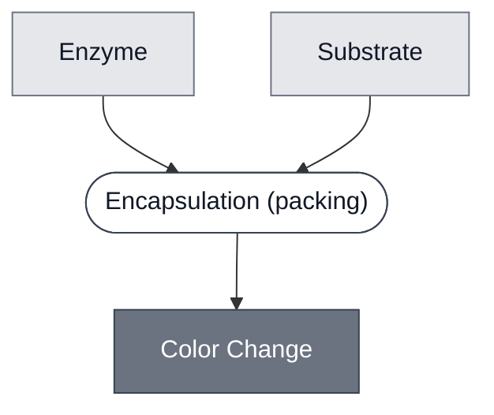

# Overview

<!-- gen:position -->
**Position.** Refines [`reporter`](../reporter/spec.md). Refined by [`reporter-lacz`](../reporter-lacz/spec.md), [`reporter-xyle`](../reporter-xyle/spec.md).
<!-- /gen:position -->

A class: a [Reporter](../reporter/spec.md) that holds an enzyme and its substrate apart until a trigger brings them together.

Every member keeps the enzyme and the substrate in separate compartments. In one compartment they react at once, which gives a readout with no off state. The two are packed, never mixed. Members differ in which component is enclosed.

:::{attention} 🚧 Draft
This page is a work in progress and not yet ready for use.
:::

# Reference Composition

:::::{tab-set}

<!-- gen:composition-diagram -->
::::{tab-item} Module Dependencies

::::
<!-- /gen:composition-diagram -->

::::{tab-item} Enzyme

:::{table} What each member puts in the enzyme slot.
| Member | Enzyme |
| --- | --- |
| [LacZ Reporter](../reporter-lacz/spec.md) | [LacZ](../lacz/spec.md): β-galactosidase, expressed from a DNA template or added as purified protein |
| [XylE Reporter](../reporter-xyle/spec.md) | XylE: catechol 2,3-dioxygenase, expressed from a DNA template |
:::

::::

::::{tab-item} Substrate

:::{table} What each member puts in the substrate slot.
| Member | Substrate |
| --- | --- |
| [LacZ Reporter](../reporter-lacz/spec.md) | [CPRG](../substrate-cprg/spec.md), held apart |
| [XylE Reporter](../reporter-xyle/spec.md) | catechol, held apart |
:::

LacZ also acts on [X-Gal](../substrate-xgal/spec.md), which no member uses.

::::

:::::

What varies across members is which component is enclosed. A third arrangement, a membrane around each, would also keep the pair apart.

:::{table} Ways to hold the pair apart.
| Arrangement | Enzyme | Substrate |
| --- | --- | --- |
| Enclose the substrate | free in the gel | inside a liposome, as in a [Substrate Carrier](../substrate-carrier/spec.md) |
| Enclose the enzyme | inside a cell, as in a [Cell](../cell/spec.md) | free in the gel |
| Enclose both | inside a membrane of its own | inside a membrane of its own |
:::

# Expected Behavior

A member shows no signal until its trigger brings the enzyme and the substrate together. The enzyme then converts the substrate and a color appears. [LacZ Reporter](../reporter-lacz/spec.md) turns CPRG from yellow to red, and [XylE Reporter](../reporter-xyle/spec.md) turns catechol from colorless to yellow. [Colorimetric Readout](../../processes/colorimetric-readout/main.md) describes how the color is read.

# Requirements

Requires a trigger that breaks the separation. The built members use [Lysis: PLA1](../effector-pla1/spec.md), so they inherit its requirement for a low noise floor in whatever drives it. A member triggered another way would not.

Requires that the enzyme act on the substrate. The valid pairs are LacZ with CPRG, LacZ with X-Gal, and XylE with catechol. A cross pair such as LacZ with catechol is wrong chemistry. See [LacZ Enzyme](../reporter-lacz-enzyme/spec.md).

# Constituent Modules

- Enzyme — LacZ in one member, XylE in the other
- Substrate — CPRG or catechol, paired to the enzyme

# Processes

A member holds its enzyme and substrate apart by [Encapsulation](../../processes/encapsulate/main.md), which closes a membrane around the component that is enclosed.

# Credits

:::{attention} Credits are draft
Contributor attribution on this page has not been confirmed with the Node. Assign each credit
explicitly before this page is merged to `main`.
:::
