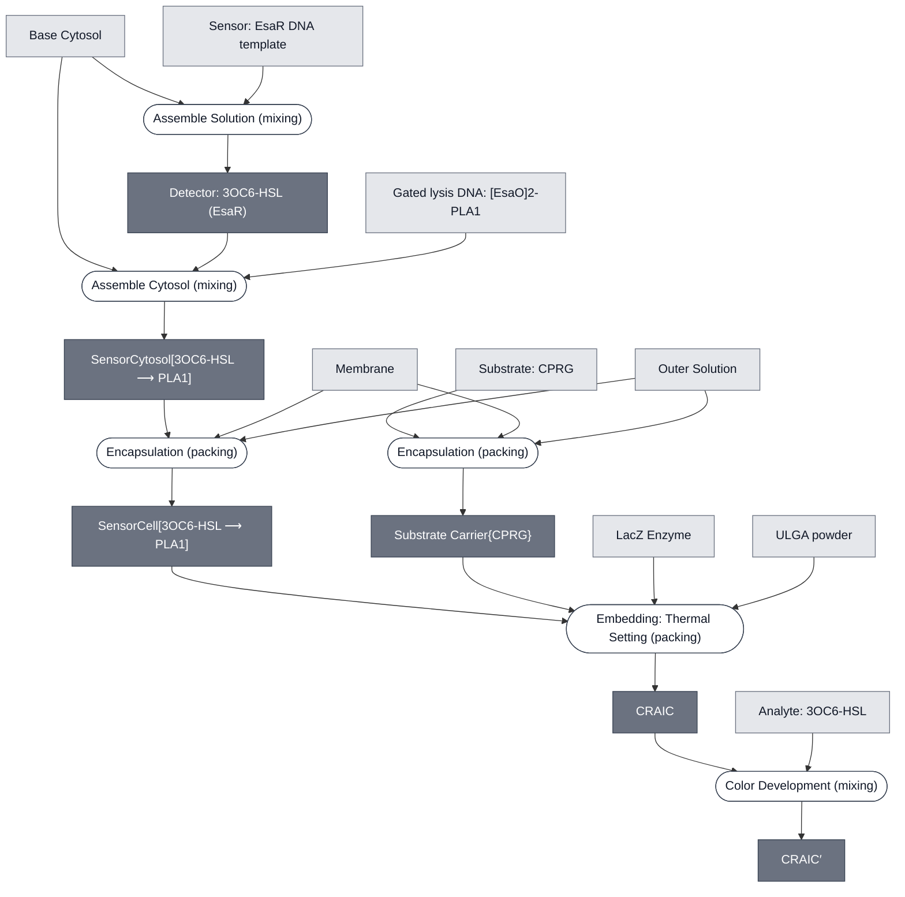

# Overview

<!-- gen:position -->
**Position.** Refines nothing declared. Refined by nothing on this branch.
<!-- /gen:position -->

A sensing cascade that detects 3OC6-HSL in [Base Cytosol](../base-cytosol/spec.md) and reports a color change. EsaR relieves repression of PLA1, PLA1 lyses the compartments, and LacZ reaches CPRG to produce chlorophenol red.

**CRAIC expands to "Colorimetric Reporter for AHL In Cytosol".** The "AHL" in the name stands for the analyte, 3OC6-HSL.

**This is one of two 3OC6-HSL demos.** The other is [LuxR-GFP Sensor Cascade](../luxr-gfp-cascade/spec.md), which senses the same analyte in S30 lysate and reports fluorescence.

**This is the only demo that builds two bounded compartments and merges them.** One branch makes the sensing cell and the other makes the substrate carrier. Both reach one gel embed, which is the separation invariant of [Color Change](../color-change/spec.md) drawn concretely: the enzyme and its substrate arrive in one gel in two compartments.

:::{attention} 🚧 Draft
This page is a work in progress and not yet ready for use.
:::

# Reference Composition

:::::{tab-set}

<!-- gen:composition-diagram -->
::::{tab-item} Module Dependencies

::::
<!-- /gen:composition-diagram -->

::::{tab-item} Constituent Modules

- [Base Cytosol](../base-cytosol/spec.md)
- Sensor: EsaR DNA template
- [Lysis: PLA1](../effector-pla1/spec.md)
- Membrane — formulation not specified
- [Outer Solution](../outer-solution/spec.md)
- [Substrate: CPRG](../substrate-cprg/spec.md)
- [LacZ Enzyme](../reporter-lacz-enzyme/spec.md)
- [Gel: ULGA](../gel-ulga/spec.md)
- [Analyte: 3OC6-HSL](../analyte-3oc6-hsl/spec.md)

::::

:::::

# Expected Behavior

3OC6-HSL relieves EsaR repression, PLA1 is expressed and lyses the compartments, and LacZ meets CPRG in the gel. The readout is the yellow-to-red change of chlorophenol red.

# Requirements

Requires EsaR as the 3OC6-HSL-responsive repressor (see [Detector: 3OC6-HSL (EsaR)](../detector-esar/spec.md)).

Requires an observation step to read the color change.

:::{attention} Gaps in this cascade's specification
@Editor: name the membrane formulation, add a Module page for the EsaR DNA template, and add a Process page for the observation step.
:::

# Processes

- [Assemble Cytosol](../../processes/assemble-cytosol/assemble-cytosol-main.md)
- [Encapsulation](../../processes/encapsulate/main.md)
- [Embedding: Thermal Setting](../../processes/embed-thermal-setting/main.md)
- [Color Development](../../processes/color-development/main.md)

# Implementations

- [CRAIC Demo](../../implementations/devstudio-craic-demo/main.md): the cascade that demo builds.

# Credits

:::{attention} Credits missing
@Editor: name the developers of this cascade, with their Node and Lab.
:::
