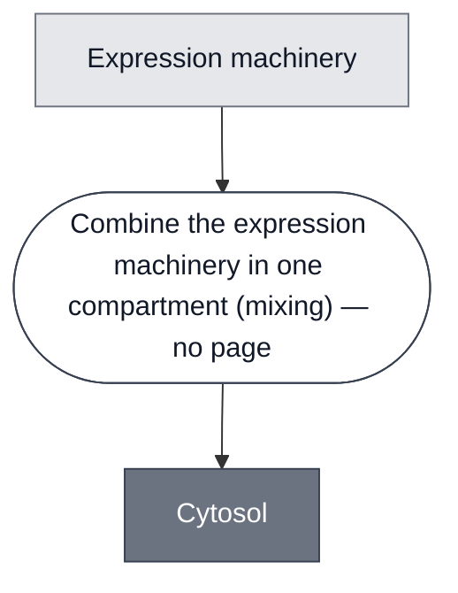

# Overview

<!-- gen:position -->
**Position.** Refines [Solution](../solution/spec.md). Refined by [Base Cytosol](../base-cytosol/spec.md), [S30 Lysate](../s30-lysate/spec.md), [Sensor Cytosol](../sensor-cytosol/spec.md).
<!-- /gen:position -->

A class: a cell-free expression mix that holds everything a transcription and translation reaction needs.

What the members share is what the mix does, not what it is made of. They differ in their parts and share the function.

:::{attention} 🚧 Draft
This page is a work in progress and not yet ready for use.
:::

# Reference Composition

:::::{tab-set}

<!-- gen:composition-diagram -->
::::{tab-item} Module Dependencies

::::
<!-- /gen:composition-diagram -->
::::{tab-item} Expression Machinery

:::{table} What each member puts in the expression machinery.
| Member | Constituents |
| --- | --- |
| [Base Cytosol](../base-cytosol/spec.md) | SMix, tRNA, PMix, ribosomes, RNase inhibitor |
| [S30 Lysate](../s30-lysate/spec.md) | S30 premix, S30 extract, amino acid mix, RNase inhibitor |
| [Sensor Cytosol](../sensor-cytosol/spec.md) | a Cytosol with a [Detector](../detector/spec.md) mixed in |
:::

::::

:::::

# Expected Behavior

A member transcribes the DNA added to it and translates the transcript into protein.

# Processes

A member is made by mixing its expression machinery in one compartment, as in [Assemble Cytosol](../../processes/assemble-cytosol/assemble-cytosol-main.md). The machinery has to share the compartment: a reaction that kept its machinery in separate compartments would not run.

# Constituent Modules

- Expression machinery — what a transcription and translation reaction needs, supplied as a defined mix or as a cell extract

# Credits

:::{attention} Credits are draft
Contributor attribution on this page has not been confirmed with the Node. Assign each credit explicitly before this page is merged to `main`.
:::
