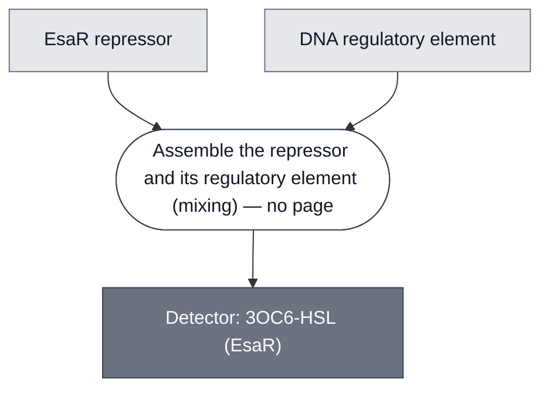

# Overview

<!-- gen:position -->
**Position.** Refines [Repressor Detector](../repressor-detector/spec.md). Refined by nothing on this branch.
<!-- /gen:position -->

A 3OC6-HSL detector built on a repressor rather than an activator. EsaR is a LuxR homolog that represses where LuxR activates, so the logic is inverted: analyte relieves repression instead of switching a promoter on.

The [CRAIC](../craic-cascade/spec.md) cascade composes it, as design intent.

:::{attention} 🚧 Draft
This page is a work in progress and not yet ready for use. The composition below is design intent. Expected Behavior reports measured results.

@Editor(london): supply a working concentration for the pre-expressed repressor. The construct and the titration are now on this page; the concentration is the one thing still missing.
:::

**Identity.** [UniProt P54293](https://www.uniprot.org/uniprotkb/P54293/entry) — Transcriptional activator protein EsaR, *Pantoea stewartii subsp. stewartii*, 249 residues. **The entry names it an activator; it is a repressor**, which is how every page here and the CRAIC design treat it.

# Reference Composition

The operator is `[EsaO]2`, two EsaO sites in tandem, one base apart. Each site is the same 19 bp box, `CCTGTACTATAGTGCAGGT`. **`[EsaO]2` is the default for every EsaO template from here on.** A single-site version carries one copy of that box. It ran beside the dual-site construct in two titrations, and is kept as a comparison rather than as a design.

The repressor is supplied in two steps, which is one more than every other detector has: the [CRAIC](../craic-cascade/spec.md) cascade expresses EsaR from a DNA template in one Base Cytosol and titrates the resulting protein into a second reaction carrying the operator construct. Two donor incubations have been run — 3 h at 37 °C and 17 h at 30 °C — and they do not give the same result. See Expected Behavior.

:::{attention} Open question
@Editor(london): state whether the two-step expression belongs to this Module or to the cascade that uses it.
:::

:::::{tab-set}

<!-- gen:composition-diagram -->
::::{tab-item} Module Dependencies

::::
<!-- /gen:composition-diagram -->

::::{tab-item} DNA

:::{table} Linear templates. A length is given only where a sequence exists to read it from.
:label: comp-detector-esar-constructs

| Construct | Role |
| --- | --- |
| `T7-EsaR(D91G)-T7term` | 1118 bp. The repressor template. **The repressor is a point mutant, D91G.** Expressed in its own reaction and titrated in as protein |
| `T7-[EsaO]2-mNG-T7term` | 1118 bp. Characterization: two operator sites driving mNeonGreen, read as fluorescence |
| `T7-[EsaO]-mNG-T7term` | 1098 bp. Single operator site. Run beside the dual-site construct in two titrations, then dropped |
| `T7-[EsaO]2-PLA1-T7term` | The cascade's own construct: the operator driving PLA1 |
| `T7-[EsaO]-PLA1-T7term` | Single operator site driving PLA1. Prepared with the batch above and not yet run |
| `T7-mNG-T7term` | The unrepressed control, with no operator |
:::

Both reporters carry the same mNeonGreen coding sequence, base for base, so they differ only in the operator region. The 20 bp between them is one extra operator plus the base that separates the pair.

:::{attention} The sequence files are not in `nucleus-eng/DNA` yet
The lengths above were read from the sequences themselves. No file for any of these templates is in [nucleus-eng/DNA](https://github.com/nucleus-eng/DNA). @Editor(london): land the batch of seven there and check each length against its `LOCUS` line.

Four of the seven have no sequence at all. One is the unrepressed control `T7-mNG-T7term` above, which the titrations below are read against. Two are the gated lysis templates `T7-[EsaO]-PLA1-T7term` and `T7-[EsaO]2-PLA1-T7term`, prepared with the batch and not yet run. The fourth carries no operator and belongs to [Lysis: PLA1](../effector-pla1/spec.md).
:::

::::

:::::

# Expected Behavior

3OC6-HSL binds EsaR and relieves repression of the downstream coding sequence. **Repressors give lower noise floors than activators**.

**Characterized on a fluorescent reporter, not on the cascade's own output.** `[EsaO]2-mNG` and `[EsaO]-mNG` were titrated against template at (0.1, 0.5, 1, 3, 6 and 9) nM, with and without 5 µM 3OC6-HSL, against a [fluorescein ladder](../standard-fluorescein/spec.md) at (0, 0.5, 1 and 2) µM. **Fold change is reported at the three lowest doses only.** **What the titration moves is the ratio of repressor to template, and only the template end of it is known.** The repressor was held at about a fifth of the reaction by volume, 14 µL of a pre-expressed reaction in 65 µL. That reaction has no measured protein concentration. So each step down in template raises the ratio, by an amount nothing here can state. **This is the same split the aTc detector uses** — characterized on a reporter, built with PLA1 — so the measurement does not make the demonstration fluorescent.

:::{table} Repression against template concentration, at a held repressor dose and 15 min of contact between repressor and template before the reaction starts. Each row is a different repressor-to-template ratio.
:label: comp-detector-esar-repression

| Template | Repressor | Fold change, minus against plus 3OC6-HSL |
| --- | --- | --- |
| 0.1 nM | fixed, concentration not known | ~1.5 |
| 0.5 nM | fixed, concentration not known | ~2 |
| 1 nM | fixed, concentration not known | ~1, the readout gone |

:::

**Repression fails by template excess, not by a dead repressor.** A first titration moved the repressor against a held template and found no difference in output at either operator count. **That first template dose survives only as a range, 12 to 15 nM**, and the two operator counts did not receive the same amount inside it, so the ratio the two arms were compared at is not one number. Reversing the titration — moving the template against a fixed repressor — gives the table above, so the repressor works and the earlier template dose was too high for it.

**The ratio that governs this has no measured value.** No build sheet records a stock or working concentration for the pre-expressed repressor, so the molar ratio cannot be computed from recorded numbers. The only figure anywhere is an estimate of **37.5:1** repressor to template, which assumes a repressor concentration of 576 nM that nothing measured. A target of **100:1** is named against it, and b.next works at **1000:1** purified TetR to tetO DNA.

**Contact time between repressor and template is the parameter that moved the number.** The fold changes above follow 15 min at 37 °C of repressor with template before the reaction starts. Extending that to 1 h raises fold change to about 5 at every template dose tested, against about 2 before.

**The magnesium sweep is the control that isolates it.** Magnesium at 0, 5 and 10 mM in that mix has very little effect on the dynamic range. So the gain comes from when the repressor meets the template, not from the salt around it.

:::{warning} The top magnesium arm gives no usable signal
The 20 mM arm was run and read nothing. Too much magnesium stops a [Base Cytosol](../base-cytosol/spec.md) reaction, which carries 7.5 mM magnesium acetate of its own before anything is added.

**How much is too much rests on a basis the run does not state, and the arithmetic points one way.** Each arm adds 0.15 µL of an 86.6, 173.3 or 346.7 mM stock. Into the 2.6 µL of repressor, template and magnesium held together before the reaction starts, that gives 5.00, 10.00 and 20.00 mM. Into the 10 µL reaction it gives 1.30, 2.60 and 5.20 mM. Only the first basis lands on the three round numbers the arms are named by. So "20 mM" reads as the level in the pre-incubation mix, and the reaction itself receives about 5.2 mM on top of its own 7.5 mM. @Editor(london): confirm this reading or correct it.
:::

**The volume that carries the repressor is not inert, and its age cuts both ways.** Each dose brings about a fifth of the working reaction in spent cytosol. At a held template dose it raises yield: a reaction at a tenth of the control's template reaches the control's yield, which points at unspent energy arriving with the protein. Running the donor for 17 h at 30 °C instead of 3 h at 37 °C holds the fold change and lowers the yield, which points at byproducts — inorganic phosphate among them — arriving instead.

:::{attention} The governing number is the one with no measurement behind it
The molar ratio of repressor to template decides whether this Module works, and it rests on an assumed repressor concentration. @Editor(london): measure the pre-expressed repressor, so the ratio stops being an estimate.
:::

:::{attention} No figure yet
@Editor(london): the titration above has no plot on this page. Add it, with the dose that was fixed.
:::

# Requirements

Requires the analyte to reach the repressor.

# Implementations

- [CRAIC Demo](../../implementations/devstudio-craic-demo/main.md): its detector — expressed from its own template, then gating PLA1.

# Credits

:::{attention} Credits are draft
Contributor attribution on this page has not been confirmed with the Node. Assign each credit explicitly before this page is merged to `main`.
:::
