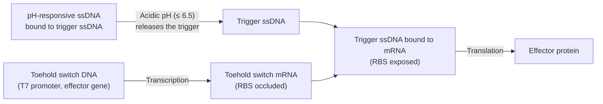

# Overview

The pH-Sensing Module drives expression of an effector gene in acidic conditions (pH ≤ 6.5). The module has three parts: (1) a pH-responsive single-strand DNA (ssDNA), (2) a trigger ssDNA, and (3) a linear toehold-switch DNA construct. At neutral pH, the trigger ssDNA stays bound to the pH-responsive ssDNA and the toehold switch remains off, preventing expression of the effector gene. At acidic pH, the pH responsive ssDNA releases the trigger ssDNA, which then binds the toehold switch, activating expression of the effector gene. The design follows [Chen, Hwang, et al., 2025](https://doi.org/10.1101/2025.11.16.688650).

:::{attention} Not yet validated
This Module has not been validated in Nucleus Cytosol. The performance data below was measured in agarose gel.
:::

:::{figure} schematic.png
:name: fig-schematic
:align: center
:width: 75%

Schematic of the pH-Sensing Module. At neutral pH, trigger ssDNA is bound to pH-responsive ssDNA and the toehold switch stays closed. At acidic pH, trigger ssDNA releases and opens the toehold switch, allowing translation of the effector gene (e.g., a colorimetric reporter). Reproduced from the `chicago-ph-sensor-plan` DevNote, where it appears as `general/pH sensor schematic.png`.
:::

# Reference Composition

:::::{tab-set}

::::{tab-item} Schematic

At neutral pH the trigger ssDNA is held by the pH-responsive ssDNA, so the toehold switch mRNA keeps its ribosome binding site occluded and nothing is translated. Dropping the pH to 6.5 or below releases the trigger ssDNA, which binds the toehold and exposes the RBS, turning on translation of the effector gene.

::::

::::{tab-item} DNA

| **Name**                 | **Expected Concentration** | **Status**  | **File** |
| ------------------------ | -------------------------- | ----------- | -------- |
| `T7-toehold-LacZ-T7term` | 2 nM                       | Designed    | —        |
| `T7-toehold-XylE-T7term` | 2 nM                       | Designed    | —        |
| Trigger ssDNA            | 4.8 µM                     | Synthesized | —        |
| pH-responsive ssDNA      | 14.4 µM                    | Synthesized | —        |

:::{attention} Constructs not yet in `nucleus-eng/DNA`
None of the four constructs above have a corresponding file in [`nucleus-eng/DNA`](https://github.com/nucleus-eng/DNA) yet (checked `detectors/` and the repo root; none found). The DevNote lists them as "Designed" or "Synthesized" but does not link sequence files. Do not treat the names above as identity claims against any existing DNA-repo file — flag for follow-up so these constructs can be submitted to `nucleus-eng/DNA` before this page is used at the bench.
:::
::::

::::{tab-item} Cytosol

:::{table} Composition of the toehold-switch component in Base Cytosol at reaction concentration, as run in the `chicago-toehold-switch` DevNote. Volumes are master mix for three 10 µL replicates.
:label: comp-ph-sensor

| Component                | Stock Concentration | Final Concentration | Positive control (µL) | Toehold + trigger ssDNA (µL) | Toehold alone (µL) |
| ------------------------ | ------------------- | ------------------- | --------------------- | ---------------------------- | ------------------ |
| SMix                     | 3.33x               | 1x                  | 10.5                  | 10.5                         | 10.5               |
| PMix                     | 15 mg/mL            | 1.80 mg/mL          | 4.2                   | 4.2                          | 4.2                |
| Ribosomes                | 10 µM               | 1.8 µM              | 6.3                   | 6.3                          | 6.3                |
| tRNA                     | 35 mg/mL            | 3.5 mg/mL           | 3.5                   | 3.5                          | 3.5                |
| `pOpen-deGFP` DNA template | 124 nM            | 3 nM                | 0.85                  | 0                            | 0                  |
| Toehold switch DNA template | 40 nM            | 2 nM                | 0                     | 1.75                         | 1.75               |
| Trigger ssDNA            | 100 nM              | 4.8 nM              | 0                     | 1.68                         | 0                  |
| RNase Inhibitor          | 40 000 U/mL         | 2000 U/mL           | 1.75                  | 1.75                         | 1.75               |
| Water                    | —                   | —                   | 7.9                   | 5.32                         | 7                  |
| **Total master mix**     |                     |                     | **35**                | **35**                       | **35**             |

:::

SMix supplies Mg-acetate at 8 mM final. This reaction has no pH condition and no pH-responsive ssDNA: it gates the toehold switch with trigger ssDNA directly, at neutral pH, using pHtdGFP as the effector rather than LacZ or XylE. The full three-component module has no reaction table yet.

:::{warning} Trigger ssDNA concentration differs by three orders of magnitude between sources
The DNA tab above gives the trigger ssDNA at **4.8 µM** and the pH-responsive ssDNA at **14.4 µM**, following the `chicago-ph-sensor-plan` DevNote. The reaction actually run in the `chicago-toehold-switch` DevNote used trigger ssDNA at **4.8 nM** final. The two figures differ by 1000×. Confirm which applies to the assembled module before bench use.
:::

::::

:::::

# Expected Behavior

Target pH sensing is 6.5 ± 0.1, with effector gene expression expected within 1 h.

## Cytosols

The toehold-switch component of this module has been run in Base Cytosol. The `chicago-toehold-switch` DevNote reports that a linear toehold-pHtdGFP DNA template produced pHtdGFP only when trigger ssDNA was present, across three 10 µL replicates incubated 6 h at 37 °C — see the Cytosol tab above for the reaction. That result establishes that the toehold switch works in Base Cytosol; it was run at neutral pH, with no pH-responsive ssDNA, so it says nothing about pH gating.

:::{warning} Not yet validated
The assembled three-component Module — pH-responsive ssDNA, trigger ssDNA, and toehold switch together — has not been validated in synthetic cytosols. No pH-dependent expression data in a synthetic cytosol was found in the DevNote repository, the status documents, or the meeting transcripts.
:::

## Cells

:::{warning} Not yet validated
This Module has not been validated in synthetic cells. No synthetic-cell data was found in the DevNote repository, the status documents, or the meeting transcripts.
:::

## Gels

Embed the reaction in 0.7% low-gelling agarose in place of Cytosol. Add β-galactosidase (LacZ) reporter DNA with a neutralization buffer to set the target pH, then incubate at 37 °C for 5 h. Measure absorbance at 570 nm.

| Condition                   | Abs₅₇₀ (5 h) |
| --------------------------- | ------------ |
| Positive control (Triton X) | ~0.46        |
| Negative control            | ~0.31        |
| pH 7.4                      | ~0.31        |
| pH 6.5                      | ~0.39        |

# Requirements

Requires pT7 transcription and translation (e.g., [Base Cytosol](../base-cytosol/spec.md)).

Requires direct exposure to pH source. Either do not encapsulate OR include H⁺ ion transport across the membrane (e.g., Gramicidin A).

:::{attention}
**Trigger ssDNA purity and formulation strongly affects signal.** IDT-desalted ssDNA in water gave about 25 000 RFU, while HPLC-purified ssDNA in duplex buffer gave about 800 000 RFU (>30×). The composition of the duplex buffer is not recorded in any source available here; raised with the Chicago Node (Chicago questionnaire, Q8).
:::

# Implementations

No Implementations exist yet.

# Materials

:::{table} Critical materials for the pH-Sensing Module.
:label: critical-materials

| Material                                            | Description                                            | Manufacturer                       | Item #                                             | Notes                                                               |
| --------------------------------------------------- | ------------------------------------------------------ | ---------------------------------- | -------------------------------------------------- | ------------------------------------------------------------------- |
| DNA template (e.g., `T7-toehold-LacZ`)              | Effector gene under a T7 promoter with toehold switch. | —                                  | —                                                  | See the DNA tab above                                               |
| CPRG                                                | Colorimetric substrate for LacZ                        | Roche                              | 10884308001                                        | —                                                                   |
| Catechol                                            | Colorimetric substrate for XylE                        | TCI America                        | P031725G                                           | Phenolic compound                                                   |
| POPC                                                | Membrane component for synthetic cell production       | Avanti Polar Lipids                | 850457                                             | —                                                                   |
| Cholesterol                                         | Membrane component for synthetic cell production       | Sigma-Aldrich                      | C3045-5G                                           | —                                                                   |
| Gramicidin A                                        | Proton channel for membrane pH equilibration           | Sigma-Aldrich                      | 50845-5MG                                          | Stock in DMSO, stored at -80 °C. Needed for use in synthetic cells. |
| [Base Cytosol](../base-cytosol/spec.md)             | Cell-free expression system                            | —                                  | —                                                  | —                                                                   |

:::

# Credits

Developed by [Samuel J. Chen](https://orcid.org/0000-0001-8501-7175), Sung-Won Hwang, and Allen Liu (Chicago Node, Liu Lab). Sung-Won Hwang ran the gel embedding.

Design adapted from [Chen, Hwang, et al., 2025](https://doi.org/10.1101/2025.11.16.688650).
