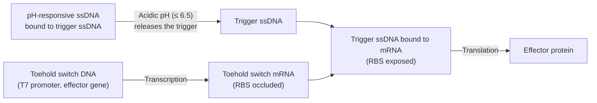

# Overview

The pH-Sensing Module drives expression of an effector gene in acidic conditions (pH ≤ 6.5). Three sequences make up the Module, added to a reaction as two reagents: a pH-responsive single-strand DNA (ssDNA) and a trigger ssDNA, pre-annealed together into one duplex at a 3:1 ratio, plus a linear toehold-switch DNA template. At neutral pH the trigger ssDNA stays bound in the duplex and the toehold switch remains off, preventing expression of the effector gene. At acidic pH the pH-responsive ssDNA folds into a triplex, releasing the trigger ssDNA, which then binds the toehold switch and activates expression of the effector gene. The design follows [Chen, Hwang, et al., 2025](https://doi.org/10.1101/2025.11.16.688650).

:::{attention} Not yet validated
This Module has not been validated in Nucleus Cytosol. The performance data below was measured in agarose gel.
:::

:::{figure} schematic.png
:name: fig-schematic
:align: center
:width: 75%

Schematic of the pH-Sensing Module. At neutral pH, trigger ssDNA is bound to pH-responsive ssDNA and the toehold switch stays closed. At acidic pH, trigger ssDNA releases and opens the toehold switch, allowing translation of the effector gene (e.g., a colorimetric reporter). Reproduced from the [`chicago-ph-sensor-plan`](https://devnotes.nucleus.engineering/articles/019b1403-d9f6-7e25-9f77-21bbc4bd2998) DevNote, where it appears as `general/pH sensor schematic.png`.
:::

# Reference Composition

:::::{tab-set}

::::{tab-item} Schematic

At neutral pH the trigger ssDNA is held by the pH-responsive ssDNA, so the toehold switch mRNA keeps its ribosome binding site occluded and nothing is translated. Dropping the pH to 6.5 or below releases the trigger ssDNA, which binds the toehold and exposes the RBS, turning on translation of the effector gene.

::::

::::{tab-item} DNA

| **Name**                 | **Expected Concentration** | **Status**  | **File** |
| ------------------------ | -------------------------- | ----------- | -------- |
| `T7-toehold-LacZ-T7term` | 2 nM                       | Designed    | —        |
| `T7-toehold-XylE-T7term` | 2 nM                       | Designed    | —        |
| Trigger ssDNA            | 4.8 nM                     | Synthesized | —        |
| pH-responsive ssDNA      | 14.4 nM                    | Synthesized | —        |

Four sequences, two additions. The trigger and pH-responsive strands are annealed into a single duplex at a 3:1 ratio before use — see [Anneal pH-Responsive Trigger Duplex](../../processes/anneal-ph-trigger-duplex/main.md) — so a working reaction receives that duplex and one toehold-switch template, and never the strands independently.

:::{attention} Sequences not yet in `nucleus-eng/DNA`
Neither toehold construct above, nor either strand of the annealed duplex, has a corresponding file in [`nucleus-eng/DNA`](https://github.com/nucleus-eng/DNA) yet (checked `detectors/` and the repo root; none found). The DevNote lists them as "Designed" or "Synthesized" but does not link sequence files. Do not treat the names above as identity claims against any existing DNA-repo file — flag for follow-up so these sequences can be submitted to `nucleus-eng/DNA` before this page is used at the bench.
:::
::::

::::{tab-item} Cytosol

:::{table} Composition of the pH-Sensing Module in Base Cytosol at reaction concentration.
:label: comp-ph-sensor

| Component                                                                | Final Concentration  |
| ------------------------------------------------------------------------ | -------------------- |
| [Base Cytosol](../base-cytosol/spec.md)                                    | 1×                   |
| Toehold-switch DNA template (`T7-toehold-LacZ-T7term` or `T7-toehold-XylE-T7term`) | 2 nM         |
| pH-responsive ssDNA : trigger ssDNA (3:1, annealed)                        | 4.8 nM trigger ssDNA |
| RNase inhibitor                                                            | 2000 U/mL            |

:::

Two additions to Base Cytosol: the annealed duplex and one toehold-switch template. Which template is used sets the effector and so the readout — LacZ with CPRG, or XylE/C23DO with catechol.

:::{caution} Composition inferred, but not yet experimentally verified!
@Editor: no reaction assembling all four sequences at once is on record. The concentrations above are the design values from the [`chicago-ph-sensor-plan`](https://devnotes.nucleus.engineering/articles/019b1403-d9f6-7e25-9f77-21bbc4bd2998) DevNote; the [pH Cascade](../ph-cascade/spec.md) spec quotes 4.625 nM trigger ssDNA for its own encapsulated variant. Confirm the working duplex concentration with the Chicago Node.
:::

::::

:::::

# Expected Behavior

Target pH sensing is 6.5 ± 0.1, with effector gene expression expected within 1 h.

## Cytosols

The toehold-switch component of this module has been run in Base Cytosol. The [`chicago-toehold-switch`](https://devnotes.nucleus.engineering/articles/019bdd1d-8bf9-77e1-abaf-44b5b0f7a9d5) DevNote reports that a linear toehold-pHtdGFP DNA template produced pHtdGFP only when trigger ssDNA was present, across three 10 µL replicates incubated 6 h at 37 °C. That result establishes that the toehold switch works in Base Cytosol; it was run at neutral pH, with no pH-responsive ssDNA, so it says nothing about pH gating.
:::{warning} Not yet validated
The assembled three-component Module — pH-responsive ssDNA, trigger ssDNA, and toehold switch together — has not been validated in synthetic cytosols. No pH-dependent expression data in a synthetic cytosol was found in the DevNote repository, the status documents, or the meeting transcripts.
:::

## Cells

:::{warning} Not yet validated
Two demonstrations exist in liposomes in solution: pH-responsive GFP expression, and a two-liposome system giving a visible yellow-to-purple color change at pH 6.5. Both used Base Cytosol in a Chicago Membrane — the [pH Sensing Cell](../ph-sensing-cell/spec.md) format — so the Module is demonstrated in a synthetic cell. Neither has been run in a hydrogel.
:::

## Gels

Embed the reaction in 0.7% low-gelling agarose in place of Cytosol. Add β-galactosidase (LacZ) reporter DNA with a neutralization buffer to set the target pH, then incubate at 37 °C for 5 h. Measure absorbance at 570 nm.

| Condition                   | Abs₅₇₀ (5 h) |
| --------------------------- | ------------ |
| Positive control (Triton X) | ~0.46        |
| Negative control            | ~0.31        |
| pH 7.4                      | ~0.31        |
| pH 6.5                      | ~0.39        |

# Requirements

Requires pT7 transcription and translation (e.g., [Base Cytosol](../base-cytosol/spec.md)).

Requires direct exposure to pH source. Either do not encapsulate OR include H⁺ ion transport across the membrane (e.g., Gramicidin A).

:::{attention}
**Trigger ssDNA purity and formulation strongly affects signal.** IDT-desalted ssDNA in water gave about 25 000 RFU, while HPLC-purified ssDNA in duplex buffer gave about 800 000 RFU (>30×). @Editor: the duplex buffer composition is not recorded. Confirm with the Chicago Node.
:::

# Implementations

- [Chicago DevCell](../../implementations/chicago-devcell/main.md): supplies one of the device's two sensing paths, reaching the shared LacZ/CPRG colorimetric readout.

# Processes

[Anneal pH-Responsive Trigger Duplex](../../processes/anneal-ph-trigger-duplex/main.md) prepares the pH-responsive : trigger ssDNA duplex. No process page covers assembling the full Module into a reaction.

- [Colorimetric Readout](../../processes/colorimetric-readout/main.md) — the CPRG conversion that produces the visible signal
- [Alginate Hydrogel Embedding](../../processes/embed-alginate-hydrogel/main.md) — the Chicago hydrogel format

# Materials

:::{table} Critical materials for the pH-Sensing Module.
:label: critical-materials

| Material                                            | Description                                            | Manufacturer                       | Item #                                             | Notes                                                               |
| --------------------------------------------------- | ------------------------------------------------------ | ---------------------------------- | -------------------------------------------------- | ------------------------------------------------------------------- |
| DNA template (e.g., `T7-toehold-LacZ`)              | Effector gene under a T7 promoter with toehold switch. | —                                  | —                                                  | See the DNA tab above                                               |
| CPRG                                                | Colorimetric substrate for LacZ                        | Roche                              | 10884308001                                        | —                                                                   |
| Catechol                                            | Colorimetric substrate for XylE                        | TCI America                        | P031725G                                           | Phenolic compound                                                   |
| POPC                                                | Membrane component for synthetic cell production       | Avanti Polar Lipids                | 850457                                             | —                                                                   |
| Cholesterol                                         | Membrane component for synthetic cell production       | Sigma-Aldrich                      | C3045-5G                                           | —                                                                   |
| Gramicidin A                                        | Proton channel for membrane pH equilibration           | Sigma-Aldrich                      | 50845-5MG                                          | Stock in DMSO, stored at -80 °C. Needed for use in synthetic cells. |
| [Base Cytosol](../base-cytosol/spec.md)             | Cell-free expression system                            | —                                  | —                                                  | —                                                                   |

:::

# Credits

Developed by [Samuel J. Chen](https://orcid.org/0000-0001-8501-7175), Sung-Won Hwang, and Allen Liu (Chicago Node, Liu Lab), adapted from [Chen, Hwang, et al., 2025](https://doi.org/10.1101/2025.11.16.688650).
