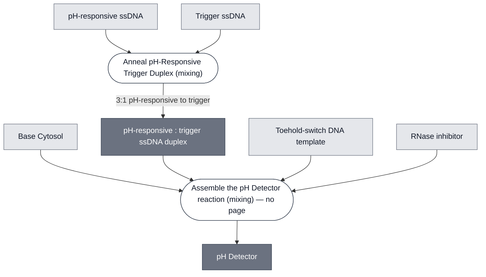
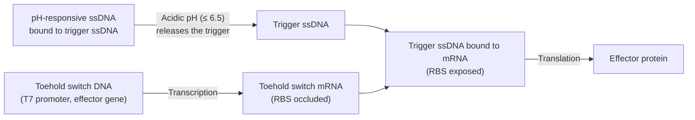

# Overview

<!-- gen:position -->
**Position.** Refines [`detector`](../detector/spec.md). Refined by nothing on this branch.
<!-- /gen:position -->

The pH-Sensing Module drives expression of an effector gene in acidic conditions (pH ≤ 6.5). Three sequences make up a build of the Module, added to a reaction as two reagents: a pH-responsive single-strand DNA (ssDNA) and a trigger ssDNA, pre-annealed together into one duplex at a 3:1 ratio, plus a linear toehold-switch DNA template. At neutral pH the trigger ssDNA stays bound in the duplex and the toehold switch remains off, preventing expression of the effector gene. At acidic pH the pH-responsive ssDNA folds into a triplex, releasing the trigger ssDNA, which then binds the toehold switch and activates expression of the effector gene. The design follows [Chen, Hwang, et al., 2025](https://doi.org/10.1101/2025.11.16.688650).

:::{attention} Not yet validated
This Module has not been validated in Nucleus Cytosol. The performance data below was measured in agarose gel.
:::

:::{figure} schematic.png
:name: fig-schematic
:align: center
:width: 75%

Schematic of the pH-Sensing Module, drawn inside the cell that carries it. **The bilayer, Gramicidin A, the colorimetric enzyme and the color change belong to that cell and are shown for context; this Module is the pH-responsive ssDNA, the trigger ssDNA and the toehold switch.** At neutral pH, trigger ssDNA is bound to pH-responsive ssDNA and the toehold switch stays closed. At acidic pH, trigger ssDNA releases and opens the toehold switch, allowing translation of the effector gene (e.g., a colorimetric reporter). Reproduced from the [`chicago-ph-sensor-plan`](https://devnotes.nucleus.engineering/articles/019b1403-d9f6-7e25-9f77-21bbc4bd2998) DevNote, where it appears as `general/pH sensor schematic.png`.
:::

(detector-ph-reference-composition)=
# Reference Composition

:::::{tab-set}

<!-- gen:composition-diagram -->
::::{tab-item} Module Dependencies

::::
<!-- /gen:composition-diagram -->

::::{tab-item} Schematic

At neutral pH the trigger ssDNA is held by the pH-responsive ssDNA, so the toehold switch mRNA keeps its ribosome binding site occluded and nothing is translated. Dropping the pH to 6.5 or below releases the trigger ssDNA, which binds the toehold and exposes the RBS, turning on translation of the effector gene.

::::

::::{tab-item} DNA

**This Module requires the toehold component. The toehold-switch rows below are what can be stitched behind it, not a list of parts the Module is made from.** Each template is a T7 promoter, then `toehold 9`, then the gene it actuates, in that order. Which gene is used is set by what the detector is composed with downstream, so the three templates are one family rather than three alternatives. Verified against [`nucleus-eng/DNA`](https://github.com/nucleus-eng/DNA) at `f06e12c`: `pT7-toehold9-PLA1-linear.gb` carries `T7 promoter`, `toehold 9`, `PLA1`, then `T7hyb6 Terminator`.

| **Name**                 | **Expected Concentration** | **Status**  | **File** |
| ------------------------ | -------------------------- | ----------- | -------- |
| `pT7-toehold9-PLA1`      | 2 nM                       | **In use**  | [pT7-toehold9-PLA1-linear.gb](https://github.com/nucleus-eng/DNA/blob/devcells/devstudio-constructs/effectors/detector-ph/pT7-toehold9-PLA1-linear.gb) |
| `pT7-toehold9-deGFP`     | —                          | Built       | [pT7-toehold9-deGFP-linear.gb](https://github.com/nucleus-eng/DNA/blob/devcells/devstudio-constructs/reporters/detector-ph/pT7-toehold9-deGFP-linear.gb) |
| `T7-toehold-LacZ-T7term` | 2 nM                       | Designed    | —        |
| `T7-toehold-XylE-T7term` | 2 nM                       | Designed    | —        |
| Trigger ssDNA            | 4.8 µM                     | Synthesized | —        |
| pH-responsive ssDNA      | 14.4 µM                    | Synthesized | —        |

**A build uses three sequences and the table lists six.** Three of the six are alternative toehold templates and a reaction takes one. So the three-per-build count and the design count are different numbers, and both are right. The trigger and pH-responsive strands are annealed into a single duplex at a 3:1 ratio before use — see [Anneal pH-Responsive Trigger Duplex](../../processes/anneal-ph-trigger-duplex/main.md) — so a working reaction receives that duplex and one toehold-switch template, and never the strands independently.

:::{attention} All four sequences exist, and none of them is on `main`
**This block previously said none of these sequences had a file in `nucleus-eng/DNA`, and that was wrong twice over.** It recorded the search as *"checked `detectors/` and the repo root; none found"*. All four files exist and the manifest marks all four **built**:

| File | Where |
| --- | --- |
| [`pT7-toehold9-PLA1-linear.gb`](https://github.com/nucleus-eng/DNA/blob/devcells/devstudio-constructs/effectors/detector-ph/pT7-toehold9-PLA1-linear.gb) | `effectors/detector-ph/` |
| [`pT7-toehold9-deGFP-linear.gb`](https://github.com/nucleus-eng/DNA/blob/devcells/devstudio-constructs/reporters/detector-ph/pT7-toehold9-deGFP-linear.gb) | `reporters/detector-ph/` |
| [`trigger-ssDNA-3.gb`](https://github.com/nucleus-eng/DNA/blob/devcells/devstudio-constructs/detectors/detector-ph/trigger-ssDNA-3.gb) | `detectors/detector-ph/` |
| [`pH-responsive-ssDNA-2.gb`](https://github.com/nucleus-eng/DNA/blob/devcells/devstudio-constructs/detectors/detector-ph/pH-responsive-ssDNA-2.gb) | `detectors/detector-ph/` |

**Two were missed because the search was not recursive and two because it was in the wrong place.** The ssDNA strands are in `detectors/detector-ph/`, a subdirectory of the directory that was searched. The toehold templates are under `effectors/` and `reporters/`, which were not searched at all.

**What was right is the part that matters at the bench: none of the four is on `main`.** They sit on the branch `devcells/devstudio-constructs`, pushed at `f06e12c`, with no open pull request. **Every link above points at that branch and will keep working only until it is rebased or deleted.** @Editor(chicago): open a PR for these four, and the links here become `main` links.
:::
::::

::::{tab-item} Cytosol

:::{table} Composition of the pH-Sensing Module in Base Cytosol at reaction concentration.
:label: comp-ph-sensor

| Component                                                                | Final Concentration  |
| ------------------------------------------------------------------------ | -------------------- |
| [Base Cytosol](../base-cytosol/spec.md)                                    | 1×                   |
| Toehold-switch DNA template (`pT7-toehold9-PLA1`; also designed with LacZ and XylE effectors) | 2 nM         |
| pH-responsive ssDNA : trigger ssDNA (3:1, annealed)                        | 4.8 µM trigger ssDNA |
| RNase inhibitor                                                            | 2000 U/mL            |

:::

Two additions to Base Cytosol: the annealed duplex and one toehold-switch template. Which template is used sets the effector and so the readout. The DevCells demo uses `pT7-toehold9-PLA1`, so the switch drives lysis and the color comes from a neighboring substrate liposome. The LacZ and XylE templates were designed and are not used for the demo.

:::{note} These are design values; the assembled reaction is on the Sensing Cell
The concentrations above are the design values from the [`chicago-ph-sensor-plan`](https://devnotes.nucleus.engineering/articles/019b1403-d9f6-7e25-9f77-21bbc4bd2998) DevNote. The reaction as actually assembled — with Optiprep, and at encapsulation scale — is on [pH Sensing Cell](../ph-sensing-cell/spec.md).

The 4.8 µM here and the 4.625 µM there are not in conflict: that reaction was assembled above its specified volume, which dilutes every component in proportion. The relative molarities match.
:::

::::

:::::

# Expected Behavior

Target pH sensing is 6.5 ± 0.1, with effector gene expression expected within 1 h.

## Cytosols

The toehold-switch component of this module has been run in Base Cytosol. The [`chicago-toehold-switch`](https://devnotes.nucleus.engineering/articles/019bdd1d-8bf9-77e1-abaf-44b5b0f7a9d5) DevNote reports that a linear toehold-pHtdGFP DNA template produced pHtdGFP only when trigger ssDNA was present, across three 10 µL replicates incubated 6 h at 37 °C. That result establishes that the toehold switch works in Base Cytosol; it was run at neutral pH, with no pH-responsive ssDNA, so it says nothing about pH gating.
:::{warning} Not yet validated
The assembled three-component Module — pH-responsive ssDNA, trigger ssDNA, and toehold switch together — has not been validated in synthetic cytosols. No pH-dependent expression data in a synthetic cytosol was found in the DevNote repository, the status documents, or the meeting transcripts.
:::

## Cells

:::{warning} Not yet validated
Two demonstrations exist in liposomes in solution: pH-responsive GFP expression, and a two-liposome system giving a visible yellow-to-purple color change at pH 6.5. Both used Base Cytosol in a Chicago Membrane — the [pH Sensing Cell](../ph-sensing-cell/spec.md) format — so the Module is demonstrated in a synthetic cell. Neither has been run in a hydrogel.
:::

## Gels

Embed the reaction in 0.7% low-gelling agarose in place of Cytosol. Add β-galactosidase (LacZ) reporter DNA with a neutralization buffer to set the target pH, then incubate at 37 °C for 5 h. Measure absorbance at 570 nm.

| Condition                   | Abs₅₇₀ (5 h) |
| --------------------------- | ------------ |
| Positive control (Triton X) | ~0.46        |
| Negative control            | ~0.31        |
| pH 7.4                      | ~0.31        |
| pH 6.5                      | ~0.39        |

# Requirements

Requires pT7 transcription and translation (e.g., [Base Cytosol](../base-cytosol/spec.md)).

Requires direct exposure to pH source. Either do not encapsulate OR include H⁺ ion transport across the membrane (e.g., Gramicidin A).

:::{attention}
**Trigger ssDNA purity and formulation strongly affects signal.** IDT-desalted ssDNA in water gave about 25 000 RFU, while HPLC-purified ssDNA in duplex buffer gave about 800 000 RFU (>30×). The buffer is IDT Nuclease Free Duplex Buffer (cat. 11-01-03-01); use the HPLC-purified oligo in it rather than a desalted oligo in water.
:::

# Implementations

- [Chicago DevCell](../../implementations/chicago-devcell/main.md): supplies one of the device's two sensing paths, reaching the shared LacZ/CPRG colorimetric readout.

# Processes

[Anneal pH-Responsive Trigger Duplex](../../processes/anneal-ph-trigger-duplex/main.md) prepares the pH-responsive : trigger ssDNA duplex. No process page covers assembling the full Module into a reaction.

- [Colorimetric Readout](../../processes/colorimetric-readout/main.md) — the CPRG conversion that produces the visible signal
- [Hydrogel Embedding: Alginate](../../processes/embed-alginate-hydrogel/main.md) — the Chicago hydrogel format

# Materials

:::{table} Critical materials for the pH-Sensing Module.
:label: critical-materials

| Material                                            | Description                                            | Manufacturer                       | Item #                                             | Notes                                                               |
| --------------------------------------------------- | ------------------------------------------------------ | ---------------------------------- | -------------------------------------------------- | ------------------------------------------------------------------- |
| DNA template (`pT7-toehold9-PLA1` in the demo; any toehold template serves) | Effector gene under a T7 promoter with toehold switch. | —                                  | —                                                  | See the DNA tab above                                               |
| CPRG                                                | Colorimetric substrate for LacZ                        | Roche                              | 10884308001                                        | —                                                                   |
| Catechol                                            | Colorimetric substrate for XylE                        | TCI America                        | P031725G                                           | Phenolic compound                                                   |
| POPC                                                | Membrane component for synthetic cell production       | Avanti Polar Lipids                | 850457                                             | —                                                                   |
| Cholesterol                                         | Membrane component for synthetic cell production       | Sigma-Aldrich                      | C3045-5G                                           | —                                                                   |
| Gramicidin A                                        | Proton channel for membrane pH equilibration           | Sigma-Aldrich                      | 50845-5MG                                          | Stock in DMSO, stored at -80 °C. Needed for use in synthetic cells. |
| [Base Cytosol](../base-cytosol/spec.md)             | Cell-free expression system                            | —                                  | —                                                  | —                                                                   |

:::

# Constituent Modules

- [Base Cytosol](../base-cytosol/spec.md) — transcription and translation, at 1×

# Credits

Developed by [Samuel J. Chen](https://orcid.org/0000-0001-8501-7175), Sung-Won Hwang, and Allen Liu (Chicago Node, Liu Lab), adapted from [Chen, Hwang, et al., 2025](https://doi.org/10.1101/2025.11.16.688650).

:::{attention} Credits are draft
Contributor attribution on this page has not been confirmed with the Node. Assign each credit explicitly before this page is merged to `main`.
:::
