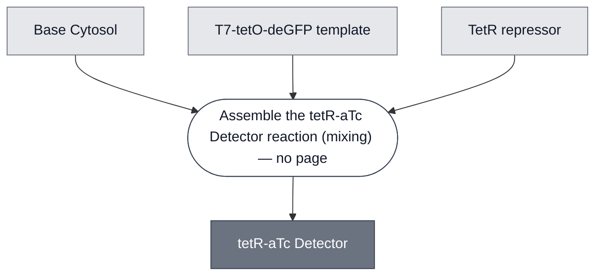

# Overview

<!-- gen:position -->
**Position.** Refines [`repressor-detector`](../repressor-detector/spec.md). Refined by nothing on this branch.
<!-- /gen:position -->

The TetR inducible expression module is a set of two genetic constructs that encode tetracycline-inducible gene expression: `pT7-tetR`, encoding the TetR repressor protein, and `pT7-tetO-plamGFP`, encoding a reporter gene under an inducible T7 promoter.

`pT7-tetO-plamGFP` constitutively expresses the open reporter plamGFP in the absence of repressor protein. The inducible promoter is also a MoClo Level 0 'P' part and may be assembled into a Level 1 transcription unit with other MoClo-compatible genes. Addition of TetR protein — either as a purified protein or via constitutive expression of `pT7-tetR` — inhibits expression through steric occlusion of the tetO operator site. Addition of anhydrotetracycline (aTc) causes allosteric release of TetR from tetO, recovering expression. aTc is membrane-permeable, so the alpha-hemolysin membrane pore is not required for induction.

:::{figure} mechanism-schematic.png
Schematic of the TetR inducible expression module. TetR represses expression from `pT7-tetO-plamGFP`; aTc relieves repression by binding TetR and causing its release from the tetO operator.
:::

# Reference Composition

:::::{tab-set}

<!-- gen:composition-diagram -->
::::{tab-item} Module Dependencies

::::
<!-- /gen:composition-diagram -->

::::{tab-item} DNA

:::{table}
| **Name** | **Length (bp)** | **File** |
| --- | --- | --- |
| `pT7-tetR` | 2877 | [pOpen-tetR.gb](https://github.com/nucleus-eng/DNA/blob/main/detectors/pOpen-tetR.gb) |
| `pT7-tetO-plamGFP` | 2954 | [pOpen-pT7-tetO.gb](https://github.com/nucleus-eng/DNA/blob/main/detectors/pOpen-pT7-tetO.gb) |
| `T7-tetO-deGFP` | 917 | [pT7-tetO-deGFP-linear.gb](https://github.com/nucleus-eng/DNA/blob/devcells/devstudio-constructs/reporters/detector-tetr-atc/pT7-tetO-deGFP-linear.gb) |
| `TetO-PLA1` | 1202 | [pT7-tetO-PLA1-linear.gb](https://github.com/nucleus-eng/DNA/blob/devcells/devstudio-constructs/effectors/detector-tetr-atc/pT7-tetO-PLA1-linear.gb) |
| `pOpen-T7-tetO-PLA1` | 3140 | pending — see below |
| `pOpen-T7-tetO-C23DO` | 3101 | pending — see below |
:::

:::{attention} The circular forms are not on `main` yet
@Editor(chicago): `pOpen-T7-tetO-PLA1.gb` and `pOpen-T7-tetO-C23DO.gb` are on [`nucleus-eng/DNA` PR #10](https://github.com/nucleus-eng/DNA/pull/10) and not yet merged. Add the file links when it lands.

Chicago prefers the circular form and both are expected to work. They are **not sequence-identical** — the linear entry is the expression cassette, the circular one is that cassette in a pOpen backbone — so the row a page cites follows the route it documents.
:::

The first two constructs are this Module's Reference Composition. The other two swap the reporter out and appear only in results: deGFP under [Replicated in Nucleus Cytosol](#replicated-in-nucleus-cytosol), and PLA1 driving a colorimetric readout under [TetO-PLA1 encapsulated with LacZ](#teto-pla1-encapsulated-with-lacz).

::::

::::{tab-item} Cytosol

Assemble `pT7-tetO-plamGFP` into a standard PURE reaction. Add TetR — see the three formats below — and aTc inducer. See [aTc](../analyte-atc/spec.md) for the dose, which depends on the cytosol.

:::{table} Cytosolic components of the tetR-aTc Detector in Base Cytosol, at reaction concentration.
:label: comp-detector-tetr-atc-base-cytosol

| Module | Working concentration | Notes |
| --- | --- | --- |
| [Base Cytosol](../base-cytosol/spec.md) | At reaction concentration | Transcription and translation |
| `T7-tetO-deGFP` template | 0.5 nM | The reporter re-run in Base Cytosol. `pT7-tetO-plamGFP` is the PURExpress reference |
| TetR repressor | 500 nM | Saturates repression; improvable to 2000 nM. Three formats are not interchangeable — see Expected Behavior |
| aTc inducer | 0.1 µM to 0.5 µM, optimum ~0.25–0.35 µM | **The Node's working window in this cytosol, not the dose used in the figures below, which is unrecorded.** Lysate wants 2.5 µM to 5 µM. See [aTc](../analyte-atc/spec.md) |
:::

The PURExpress master mix that produced the reference figures is in Expected Behavior, below.

::::

:::::

# Expected Behavior

## Cytosols

The TetR module was validated in NEB PURExpress reactions. Purified repressor protein (MedChemExpress, HY-P71520A) and anhydrotetracycline inducer (Cayman Chemical, 10009542) were added at the final concentrations indicated. `pT7-tetO-plamGFP` plasmid DNA was added at 0.5 nM.

Repression follows a roughly linear trend between 125 and 750 nM TetR and saturates around 500 nM, though it can be further improved up to 2000 nM. An inducer concentration of 2.5 µM to 5 µM provides effective induction well below saturating or toxic aTc levels. Note that aTc's yellow color overwhelms GFP fluorescence at concentrations greater than 50 µM to 100 µM, and high concentrations may negatively affect expression generally.

(tetr-atc-purexpress-reference)=

:::{table} PURExpress reference build, per 10 µL reaction. Volumes in µL.
:label: comp-detector-tetr-atc-purexpress

| **Component** | **Master Mix (µL)** |
| --- | --- |
| PURExpress Solution A | 4 |
| PURExpress Solution B | 3 |
| RNase Inhibitor | 0.5 |
| `pT7-tetO-plamGFP` (10 nM) | 0.5 |
| TetR (10 µM) | 0.5 |
| **Master Mix Total** | **9** |

| **Component** | **Per Reaction (µL)** |
| --- | --- |
| Master Mix | 9 |
| Inducer | 1 |
| **Total** | **10** |
:::

***In vitro* repression with TetR**

:::::{tab-set}

::::{tab-item} Kinetics
:::{figure} cytosol-repression-kinetics.png
Repression kinetics of `pT7-tetO-plamGFP` by TetR at varying repressor concentrations.
:::
::::

::::{tab-item} Endpoint
:::{figure} cytosol-repression-endpoint.png
Repression of `pT7-tetO-plamGFP` by TetR at steady state.
:::
::::

:::::

***In vitro* induction with aTc**

:::::{tab-set}

::::{tab-item} Kinetics
:::{figure} cytosol-induction-kinetics.png
Induction kinetics of `pT7-tetO-plamGFP` by aTc. TetR repressor protein is present at 500 nM. Positive control is `pT7-tetO-plamGFP` without TetR repressor protein.
:::
::::

::::{tab-item} Endpoint
:::{figure} cytosol-induction-endpoint.png
Induction of `pT7-tetO-plamGFP` by aTc at steady state. TetR repressor protein is present at 500 nM. Positive control is `pT7-tetO-plamGFP` without TetR repressor protein.
:::
::::

:::::

### Replicated in Nucleus Cytosol

The results above are from NEB PURExpress. The Module has since been re-run in [Base Cytosol](../base-cytosol/spec.md), swapping the plamGFP reporter for deGFP, and both repression and aTc induction carry over.

Every condition plateaus within about 2 h. TetR at 500 nM holds the unregulated reporter to under a tenth of its plateau, and adding aTc recovers about two thirds of it — so repression is close to complete at this TetR concentration, while induction is substantial but partial.

:::{figure} cytosol-nucleus-degfp-kinetics.png
:name: fig-tetr-atc-nucleus-degfp
:align: center

`T7-tetO-deGFP` in Nucleus Cytosol: unregulated, repressed with 500 nM TetR, and induced with 500 nM TetR plus aTc, alongside a cytosol control reaction. Fluorescence is normalized to 1 µM fluorescein, and shaded bands are the spread across replicates.
:::

The same replication was also read out through catechol instead of fluorescence, using a TetR-gated catechol 2,3-dioxygenase construct. That result, and how it reconciles with the reference XylE reaction run at a lower TetR concentration, is on the [XylE / C23DO Reporter Module](../reporter-xyle/spec.md#reporter-xyle-expected-behavior) spec.

:::{attention} Inducer concentration not recorded
@Editor(chicago): the aTc concentration used for this particular induced condition is not recorded. The Node's current working window is in the [Reference Composition](#comp-detector-tetr-atc-base-cytosol) table above, and does **not** answer this — it was established after this result. What is missing is the dose actually used here. The construct gap is noted in the DNA tab under Reference Composition.

:::{attention} TetR arrives in three formats, and they are not interchangeable
The corpus offered two — purified protein, or `pT7-tetR` DNA expressed in situ. A third is in use, and as of 2026-09-11 it is **the only one that has demonstrated induction** in Nucleus Cytosol.

**The three rows below are routes, not the three arms of the comparison described under them.**

| Format | Amount | State |
| --- | --- | --- |
| Purified protein | 500 nM | Works at b.next with a His-tagged TetR carrying no SUMO tag — stable a week at 4 °C and three weeks at −20 °C |
| Expressed in situ from `pT7-tetR` | — | A b.next practice; dose aTc after the repressor has accumulated |
| **Expressed overnight, then combined with a fresh reaction** | **2.5 µL of an 18 h, 30 °C reaction. Concentration unknown** | Chicago Node. The only format that has induced |

**Three preparations were compared and all three repressed; only the cell-free-expressed one induced.** The two that failed were a MedChem Express SUMO-His TetR and a foundry TetR, so the tag and the source are functional parameters rather than sourcing detail.

:::{attention} What that comparison can and cannot show
**Its three arms were two purified preparations and one cell-free one. Route two was not tested.** Expression in situ from `pT7-tetR` is a row in the table above and was not in the experiment, so nothing here says whether it induces.

**Route and outcome are perfectly confounded in it.** The only preparation that induced was also the only cell-free one, and both purified arms failed. So the comparison cannot separate *cell-free expression is the better route* from *those two preparations were bad*, and the discriminating arm was not run.

**The conclusion about the tag is reached across experiments, not inside this one.** It compares the b.next success, a His-tagged TetR with no SUMO tag in row one, against the MedChem SUMO-His failure. **Both are purified protein, so that contrast does remove the route** and it is the only place on this page where route is held fixed while outcome changes. What it does not hold fixed is the run and probably the site. So the tag conclusion is a same-route contrast across experiments rather than a controlled result inside one, which is a good inference and not a demonstration. The foundry TetR's tag is not stated anywhere on this page, so it cannot be placed on either side of it.
:::

**The third format cannot be written as a working concentration**, which is why the table above gives a volume. It specifies an amount of a reaction whose yield nobody measured, and that is a property of a process step rather than of a component.

**It also breaks its own controls, and the other two do not.** A spent reaction added as a vehicle control carries spent reagents; a sham no-DNA reaction carries fresh ones. Neither matches. The ideal — an overnight of a non-functional TetR — does not exist.

@Editor(bnext): decide how a format-3 amount is expressed at all, and whether formats 1 and 2 are ours to re-demonstrate in Nucleus Cytosol.
:::
:::

## Cells

:::{figure} detector-overview.png
The TetR-aTc Detector module in the Base Cell.
:::

TetR detector synthetic cells were induced at multiple anhydrotetracycline concentrations and imaged over 12 h with approximately 22 min per timepoint.

:::::{tab-set}

::::{tab-item} Microscopy Images
:::{figure} cell-performance-montage.png
TetR detector synthetic cells induced at multiple anhydrotetracycline concentrations. 8 timepoints displayed per condition, approximately 22 min apart, over 12 h total. **First row:** induction using 625 nM, 312.5 nM, and 0 nM (fully repressed) aTc introduced into the outer buffer. **Second row:** induction with 2500 nM aTc in the inner solution and positive control without TetR repression.
:::
::::

::::{tab-item} Fluorescence Intensity
:::{figure} cell-performance-endpoint.png
GFP expression within synthetic cells when induced with 312.5 nM anhydrotetracycline.
:::
::::

:::::

The TetR detector cell functions when induced with low-nanomolar aTc concentrations. Higher concentrations begin to inhibit expression or confound analysis due to background aTc fluorescence and membrane localization.

### TetO-PLA1 encapsulated with LacZ

A second configuration replaces the plamGFP reporter with a `TetO-PLA1` construct and co-encapsulates LacZ protein at 2.5 U/mL, leaving 0.5 mM CPRG in the outer solution. aTc de-represses `TetO-PLA1`, PLA1 ruptures the membrane, and the released LacZ reaches the CPRG outside, so the readout is the [LacZ Reporter Module](../reporter-lacz/spec.md)'s color change at 575 nm rather than fluorescence. This configuration detects aTc in synthetic cells, but the response is **not graded**.

Three DNA/TetR pairs — 1 nM DNA with 50 nM TetR, 0.5 nM DNA with 50 nM TetR, and 1 nM DNA with 100 nM TetR — were each dosed at 0, 1, 5, and 10 µM aTc, and fold change in absorbance was measured at 5 h (n = 3). Every pair separates dosed from undosed by roughly 1.15× to 1.33×. None is monotonic in dose, and the spread across the 1, 5, and 10 µM points overlaps in all three. Expect the response to saturate at or below 1 µM, with no resolvable dose-dependence from 1 to 10 µM.

:::{figure} cell-lacz-readout-endpoint.png
:name: fig-tetr-atc-lacz-endpoint
:align: center

Fold change in absorbance at 575 nm after 5 h, relative to the undosed condition, for three DNA/TetR pairs dosed at 0, 1, 5, and 10 µM aTc. Points are the three replicates. LacZ is encapsulated at 20 U/mL, with CPRG at 0.5 mM outside. Figure by Mary Kelly (Chicago Node, Kamat Lab).
:::

:::{attention} This caption's 20 U/mL is left as recorded
Every other page now states 2.5 U/mL for encapsulated LacZ, and the figure above still says 20 U/mL. That is deliberate: a caption states what an experiment did, and 2.5 U/mL is the Node's current practice rather than this run's condition.

@Editor(chicago): confirm what this experiment actually used. See [LacZ Enzyme](../reporter-lacz-enzyme/spec.md) for why the 20 U/mL figure was withdrawn elsewhere.
:::

**The 0 µM condition is the normalization baseline, not a negative control.** Fold change is taken against it, which is why every panel's 0 µM bar sits at exactly 1.0 with no spread — that bar reports the arithmetic, not a measurement. The controls that bound the assay are on the raw absorbance trace instead, where a reaction with no DNA template reaches nearly the same absorbance at 5 h as an undosed one. Most of the signal is therefore template-independent, and aTc recovers only part of the distance to a fully de-repressed reaction.

::::{hint} Most of the absorbance develops with no DNA template at all
:class: dropdown

:::{figure} cell-lacz-readout-kinetics.png
:name: fig-tetr-atc-lacz-kinetics
:align: center

Absorbance at 575 nm over 5 h, for 1 nM `TetO-PLA1` DNA with 50 nM TetR. The reaction without TetR is de-repressed throughout and reads highest; the three aTc-dosed conditions overlap one another; the undosed reaction and the no-DNA control run close together at the bottom. Figure by Mary Kelly (Chicago Node, Kamat Lab).
:::

::::

# Requirements

Requires pT7 transcription and translation (e.g. [Base Cytosol](../base-cytosol/spec.md)).

# Implementations

- [Responder: aTc → IV-HSL](../../implementations/responder-atc-ivhsl/main.md): aTc relieves TetR repression to drive BjaI expression.

# Constituent Modules

- [Base Cytosol](../base-cytosol/spec.md) — transcription and translation, at reaction concentration

# Credits

Developed by Yen-Yu Hsu (b.next), with the encapsulated LacZ/CPRG configuration by Mary Kelly (Chicago Node, Kamat Lab).

:::{attention} One credit needs confirming before this merges
This page went from 725 words to 2077 in the DevStudio pass and the new material is not all from the same hands. **Yen-Yu Hsu (b.next) developed the Module; Mary Kelly (Chicago Node, Kamat Lab) contributed the encapsulated LacZ/CPRG configuration and both figures below.** @Editor(chicago): confirm that split with the Node before this merges to `main`.

The other eleven pages in this tranche were developed before the DevStudio and their credits stand as written — Jon, 2026-09-20. This one is the exception because the data is new.
:::
