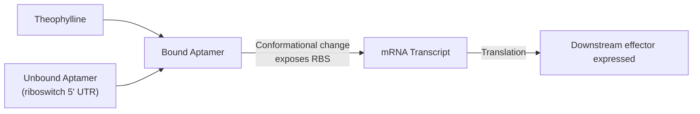

# Overview

The Theophylline Sensing Module is a translational riboswitch, designed by [Lynch and Gallivan](https://doi.org/10.1093/nar/gkn924), that controls expression of a downstream effector gene in response to theophylline, a xanthine derivative. 

:::{attention} 🚧 Draft
This page is a work in progress and not yet ready for use.
:::

# Reference Composition

:::::{tab-set}

::::{tab-item} Schematic

The theophylline riboswitch binds theophylline at its aptamer domain in the 5' UTR. This triggers a conformational change that exposes the ribosome binding site (RBS), turning on translation of the downstream effector gene.
::::

::::{tab-item} DNA

:::{attention} Not yet in `nucleus-eng/DNA`
The bulk-cytosol validation construct `pT7-theophylline-LacZ` (internally referenced as `pMN066`) is not present in `nucleus-eng/DNA` as of this writing. The Chicago Cascade's PLA1-linked riboswitch construct is a separate, not-yet-identified design and is also not represented below.
:::

| **Name**                           | **Length (bp)**                     | **File** |
| ---------------------------------- | ----------------------------------- | -------- |
| `pT7-theophylline-LacZ` (`pMN066`) | TODO — not yet in `nucleus-eng/DNA` | TODO     |
::::

::::{tab-item} Cytosol
:::{table} Composition of Module in Base Cytosol at reaction concentration
:label: comp-theophylline-sensor

| Component           | Stock Concentration | Final Concentration | − theophylline (µL) | + 1.5 mM theophylline (µL) |
| ------------------- | ------------------- | ------------------- | ------------------- | -------------------------- |
| SMix                | 3.33x               | 1x                  | 3                   | 3                          |
| PMix                | 15 mg/mL            | 1.80 mg/mL          | 1.2                 | 1.2                        |
| Ribosomes           | 10 µM               | 1.8 µM              | 1.8                 | 1.8                        |
| tRNA                | 35 mg/mL            | 3.5 mg/mL           | 1                   | 1                          |
| Sensor DNA Template | 49.55 nM            | 5 nM                | 1                   | 1                          |
| Theophylline        | 10 mM               | 1.5 mM              | 0                   | 0.95                       |
| RNase Inhibitor     | 40 000 U/mL         | 2000 U/mL           | 0.5                 | 0.5                        |
| Water               | —                   | —                   | 0.95                | 0                          |
| **Total**           |                     |                     | **10**              | **10**                     |
:::

::::

:::::

# Expected Behavior

## Cytosols

In Base Cytosol supplemented with CPRG, the riboswitch-LacZ sensor converts CPRG from yellow to red faster with theophylline present than without. The `chicago-theophylline-lacz` DevNote reports a single 10 µL reaction per condition at 5 nM sensor DNA and 0.6 mg/mL CPRG, incubated at 37 °C and read at 570 nm.

:::{figure} kinetics-cprg.png
:label: fig-theophylline-cprg-kinetics
:width: 85%

Absorbance kinetics for the colorimetric conversion of CPRG by the theophylline riboswitch-LacZ sensor in Base Cytosol, with and without 1.5 mM theophylline. Reproduced from the `chicago-theophylline-lacz` DevNote (experiment MN.08.04).
:::

Both conditions convert. With 1.5 mM theophylline the curve leaves baseline at about 0.7 h and reaches Abs₅₇₀ ≈ 3.7 by 4 h; without theophylline it lags by roughly 0.5 h and reaches ≈ 2.6 at 4 h. The uninduced curve rising this far is the leak this Module is known for, and it sets the noise floor: the two conditions differ in rate, not in whether the reporter is expressed at all.

:::{attention} Missing Details
This is a single preliminary experiment with no replicates and no positive control. Sensitivity to theophylline, dynamic range, and a signal-to-noise figure are all still missing — the DevNote reports only the two conditions shown above. No positive control (for example, a constitutive LacZ reaction) was run alongside it, and none was found in the DevNote, the meeting transcripts, or [Lynch and Gallivan](https://doi.org/10.1093/nar/gkn924).
:::

## Cells

:::{warning} Not yet validated
This Module has not been validated in synthetic cells.
:::

# Requirements

Requires pT7 transcription and translation (e.g. [Base Cytosol](../base-cytosol/spec.md)). Requires the effector gene cloned downstream of the riboswitch 5' UTR, and theophylline exposure to switch it on.

This Module must not be co-encapsulated with the [aTc Sensing Module](../detector-tetr_atc/spec.md), for example in the Chicago Cascade. The conflict is not between the two sensors: it is that both read out through the same [LacZ / CPRG](../reporter-lacz/spec.md) chemistry, and theophylline is reported to interfere with that conversion. There is no known TetR cross-talk.

:::{attention} The mechanism behind that requirement is not established
The requirement itself is settled. The explanation usually given for it — that theophylline inhibits the LacZ/CPRG conversion "even at very low amounts" — is hedged in every source and is not supported by any figure available here.

Caveats:
- **The supporting titration data has not been seen.** The 2026-08-14 meeting notes state that "titration data exists showing even very low theophylline concentrations inhibit CPRG-lacZ conversion," and that it should go into a devnote. That data is not yet in this corpus.
- **Every verbal source is hedged** ("somewhat inhibit", "kind of inhibiting"), and one literature spot-check found only weak, millimolar-range inhibition, which is inconsistent with the "very low amounts" framing.

@Editor: confirm with the Chicago Node. Until the titration data is in hand, cite the requirement, not the inhibition mechanism.
:::

# Implementations

- [Chicago DevCell](../../implementations/chicago-devcell/main.md): a queued sensing option for the Chicago demo.

# Credits

Developed by [Maram Naji](https://orcid.org/0000-0003-1409-4194) (Chicago Node).
