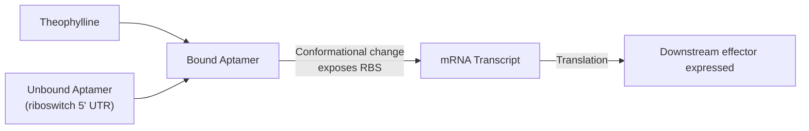

# Overview

The Theophylline Sensing Module is a translational riboswitch, designed by [Lynch and Gallivan](https://doi.org/10.1093/nar/gkn924), that controls expression of a downstream effector gene in response to theophylline, a xanthine derivative. This page covers the sensing Module itself (see Implementations for its use in an integrated system).

:::{attention} 🚧 Draft
This page is a work in progress and not yet ready for use.
:::

# Reference Composition
:::::{tab-set}

::::{tab-item} Schematic

The theophylline riboswitch binds theophylline at its aptamer domain in the 5' UTR. This triggers a conformational change that exposes the ribosome binding site (RBS), turning on translation of the downstream effector gene.
::::

::::{tab-item} Designs

**DNA**

:::{attention} Not yet in `nucleus-eng/DNA`
The bulk-cytosol validation construct `pT7-theophylline-LacZ` (internally referenced as `pMN066`) is not present in `nucleus-eng/DNA` as of this writing. The Chicago Cascade's PLA1-linked riboswitch construct is a separate, not-yet-identified design and is also not represented below.
:::

@Claude: confirm that Questionnaire covers this gap

| **Name**                           | **Length (bp)**                     | **File** |
| ---------------------------------- | ----------------------------------- | -------- |
| `pT7-theophylline-LacZ` (`pMN066`) | TODO — not yet in `nucleus-eng/DNA` | TODO     |
::::

::::{tab-item} Final Reaction
:::{table} Composition of Module in Base Cytosol at reaction concentration
:label: comp-theophylline-sensor

| Component           | Stock Concentration | Final Concentration | − theophylline (µL) | + 1.5 mM theophylline (µL) |
| ------------------- | ------------------- | ------------------- | ------------------- | -------------------------- |
| SMix                | 3.33x               | 1x                  | 3                   | 3                          |
| PMix                | 15 mg/mL            | 1.80 mg/mL          | 1.2                 | 1.2                        |
| Ribosomes           | 10 µM               | 1.8 µM              | 1.8                 | 1.8                        |
| tRNA                | 35 mg/mL            | 3.5 mg/mL           | 1                   | 1                          |
| Sensor DNA Template | 49.55 nM            | 5 nM                | 1                   | 1                          |
| Theophylline        | 10 mM               | 1.5 mM              | 0                   | 0.95                       |
| RNase Inhibitor     | 40 000 U/mL         | 2000 U/mL           | 0.5                 | 0.5                        |
| Water               | —                   | —                   | 0.95                | 0                          |
| **Total**           |                     |                     | **10**              | **10**                     |
:::

:::::

# Expected Behavior

:::{attention} Missing Details

Needs humanistic prose and characterization data. Some description of sensitivity to target molecule, dynamic range, signal and noise floor. Needs a graph showing expression. 

@Claude: graphs exist here. Likely, you can find the data somewhere for a super simple positive control, either in the devnote or in the transcripts, or original paper.
:::

# Requirements

:::{attention} Suspected Incompatibility
The Theophylline Sensing Module is expected to be incompatible with (@Claude: help verify; is theophylline sensor incompatible with aTc Sensor (i.e., because of tetR incompatibility), or with LacZ/CPRG colormetric reporter (i.e., because LacZ inhibition)? Pull from meeting transcripts and slides). 

Caveats:
- **The supporting titration data has not been seen.** The 2026-08-14 meeting notes state that "titration data exists showing even very low theophylline concentrations inhibit CPRG-lacZ conversion," and that it should go into a devnote. That data is not yet in this corpus.
- **Every verbal source is hedged** ("somewhat inhibit", "kind of inhibiting"), and one literature spot-check found only weak, millimolar-range inhibition, which is inconsistent with the "very low amounts" framing.

Flagged for Chicago rather than resolved here. Until the titration data is in hand, cite the requirement and the decision behind it — not the inhibition mechanism.
:::

# Implementations

No Implementations exists yet.

# Credits

Developed by [Maram Naji](https://orcid.org/0000-0003-1409-4194) (Chicago Node).
