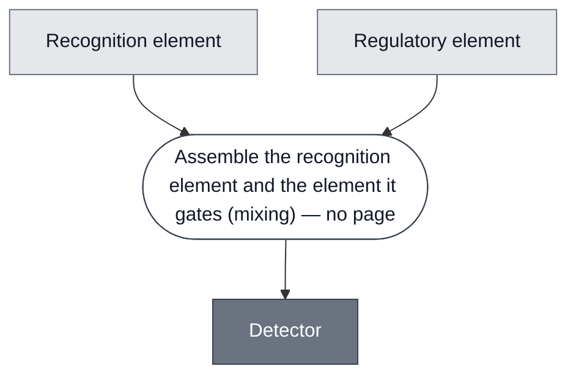

# Overview

<!-- gen:position -->
**Position.** Refines nothing declared. Refined by [`detector-3oc6-hsl`](../detector-3oc6-hsl/spec.md), [`detector-ph`](../detector-ph/spec.md), [`detector-theophylline`](../detector-theophylline/spec.md), [`repressor-detector`](../repressor-detector/spec.md).
<!-- /gen:position -->

An abstract Module: the class of Detectors, of which the paged detectors are members. An abstract Module is a Module, and its members refine it.

**The invariant is that an analyte changes the expression of a downstream gene.** Every member takes something from outside and turns it into a difference in what gets made. Nothing at this level fixes what the analyte is, what does the sensing, or what sits downstream.

**This class refines two ways at once, and the two are independent.** By analyte, and by mechanism. A named detector is where both choices have been made, so the refinement structure below is a poset and not a tree.

:::{attention} 🚧 Draft
This page is a work in progress and not yet ready for use.
:::

# Reference Composition

:::::{tab-set}

<!-- gen:composition-diagram -->
::::{tab-item} Module Dependencies



::::
<!-- /gen:composition-diagram -->

:::::

**Members are a different relation from constituents.** In `compositional-biology-theory`, `glossary.md#T34` makes Constituent a containment relation and `glossary.md#T13` makes membership a matter of what a sort classifies. **A class having members does not give it parts.** It does not give it none either: an abstract Module has constituents when its own class invariant names a composition, which is decided per class.

**At this level the invariant names no composition**, so this page states none. **One of its refinements does**, and that is the next section.

## The two axes

:::{table} Refining by analyte, and refining by mechanism.
| Analyte ↓ &nbsp;&nbsp; Mechanism → | Repressor | Activator | Other |
| --- | --- | --- | --- |
| aTc | [tetR-aTc](../detector-tetr-atc/spec.md) | — | — |
| IPTG | [LacI-IPTG](../detector-laci-iptg/spec.md) | — | — |
| 3OC6-HSL | **EsaR — in redesign, no page** | [LuxR](../detector-3oc6-hsl/spec.md) | — |
| pH | — | — | [pH-Sensing](../detector-ph/spec.md) — **no value, see below** |
| Theophylline | — | — | [Theophylline](../detector-theophylline/spec.md), cis. **Witness failed**, see below |
:::

**The third column is not a third mechanism.** It holds the two members for which the mechanism question has no single answer, for two different reasons. Treating it as a value would hide that.

**Jon's path through this, 2026-09-21**, taking the analyte first: Abstract Detector, then abstract AHL detector, which forks into an **abstract repressor AHL detector** and an **abstract activator AHL detector**. **The mechanism-first path reaches the same place**: Abstract Detector, then abstract repressor detector, then its aTc, IPTG and AHL members.

**The two paths meet, and their middles are incomparable.** Jon, 2026-09-21: *"Abstract Repressor AHL detector refines both Abstract Repressor Detector and Abstract AHL Detector, even though neither of the later refine each other."*

```
                Abstract Detector
                 /             \
   Abstract Repressor      Abstract AHL
       Detector               Detector
                 \             /
           Abstract Repressor AHL Detector
```

**Neither middle entails the other.** There are repressor detectors that sense something other than AHL, and there is an AHL detector that is not a repressor. **A tree cannot hold this**, because the bottom node has two parents and neither dominates. That is why this page is written as two axes and a table rather than as a hierarchy.

**The bottom node has no built member.** EsaR is the intended one and the London Node is redesigning around it. So the meet exists as a specification before it exists as a thing, which is the abstraction predicting a Module rather than recording one.

**The AHL row is the only one with both mechanisms**, and it is the reason the fork is worth naming. LuxR activates. EsaR is a LuxR homolog that represses, the London Node is redesigning around it, and it has no page here yet.

## The abstract repressor detector, and it does have a composition

**It has its own page now: [Repressor Detector](../repressor-detector/spec.md).** Jon ruled it a page on 2026-09-21, on the grounds that the aTc detector is a concrete implementation of it. What follows is the summary; the page carries the constituents and the members.

**Jon's specification, 2026-09-21:** a repressor detector has **a repressor element**, typically a protein but able to be encoded as DNA and expressed in situ, and **a DNA regulatory element that the repressor binds**. The analyte relieves the repression.

**Two constituents, and they are separate molecules.** That makes this class composed where its parent is not, so `Abstract Detector` has no composition and `Abstract Repressor Detector` has one. The line falls between them.

**How the repressor element is supplied is a free parameter of the class**, and [LacI-IPTG](../detector-laci-iptg/spec.md) states it outright: LacI is added *"either as a purified protein or by expressing it off of `pT7-lacI`."* EsaR is available as purified protein from Biocrest, which is why the AHL redesign can take that route and skip the energy cost of expressing a regulator.

:::{attention} That parameter decides how the two constituents compose
If the repressor element is supplied as protein, the two are mixed. If it is supplied as DNA, they can be two constructs mixed or one construct with both, which is a different operation. **So the same pair of Modules composes differently depending on a choice the class leaves open**, and the operator is not fixed by the class.

Both built members take the two-construct route. [tetR-aTc](../detector-tetr-atc/spec.md) is `pT7-tetR` with `pT7-tetO-plamGFP`; [LacI-IPTG](../detector-laci-iptg/spec.md) is `pT7-lacI` with `pT7-lacO-plamGFP`. Neither puts both on one molecule, and nothing says whether that is a design choice or an accident.
:::

## The two that do not fit either branch

**[pH-Sensing](../detector-ph/spec.md) is depth two, and it breaks the table above rather than adding a column to it.** Three sequences: a pH-responsive ssDNA and a trigger ssDNA annealed into a duplex, plus a toehold-switch template. The duplex holds the trigger. Acid folds the pH-responsive strand into a triplex, which releases the trigger, which then activates the switch.

**It is not a third mechanism.** It is repression composed with activation: the sensing element represses the **trigger**, and the trigger activates the **regulatory element**. Neither stage is new. What is new is that the sensing element never touches the regulatory element at all.

:::{attention} This is why the two axes are not coordinates
**The mechanism column has no value for this member, and not because nobody has decided.** Asking whether pH-Sensing is a repressor or an activator detector presupposes one stage, and it has two: repressing at the first and activating at the second.

**Whether that breaks the table depends on a choice nobody has made.** If the mechanism coordinate has to account for every element in the chain, then at depth two it is a sequence and a one-cell-per-member table cannot hold it. If it accounts only for the **sensing** element and ignores what downstream elements do, then pH-Sensing is simply *nucleic acid, repressing, depth two* and the table holds fine.

**The second reading costs information and nothing currently tests the cost.** Two detectors with the same coordinates could differ in what their intermediates do, and depth two has one instance in the corpus. **This is a question about the model and it is not settled here.**

**A third measure behaves the same way: how many molecules carry the sensing chain.** One for LuxR, which puts the `luxR` cassette and the payload on one molecule. Two for [tetR-aTc](../detector-tetr-atc/spec.md) and [LacI-IPTG](../detector-laci-iptg/spec.md). Three for this one. One again for the cis riboswitch, for a completely different reason: there are no separate elements to count. **The same count means three different things depending on where in the structure you take it.**

**One instance carries this.** Depth two occurs on this page and nowhere else in the corpus, so the argument rests on one member being described correctly.
:::

**[Theophylline](../detector-theophylline/spec.md) is cis, and it is the case that decides what membership means here.** A translational riboswitch binds its analyte at an aptamer in the 5' UTR and exposes the ribosome binding site, so the sensing element and the regulated element are one molecule and the two-constituent shape does not apply.

**Its built instance failed the class invariant.** The page records it as cut from the demo because *"the theophylline riboswitch expresses its effector without theophylline present, so it does not discriminate."* A thing that expresses regardless of its analyte is not a thing in which an analyte changes expression, which is the invariant at the top of this page.

:::{attention} Three membership states, and the class has all three
**It is not retirement that decides this.** A retired Module that worked is still a member. What matters is whether the invariant is satisfied and by what.

| State | Meaning | Here |
| --- | --- | --- |
| Member with a working witness | the spec is in the class and something built meets it | LuxR, tetR-aTc, LacI-IPTG, pH-Sensing |
| **Member whose witness failed** | the spec is in the class, the built instance does not meet it | **Theophylline** |
| **Slot with no member** | the class position is defined and nothing occupies it | **Abstract Repressor AHL Detector** |

**The theophylline spec stays in the fiber and its construct is not a witness.** The design is published, [Lynch and Gallivan](https://doi.org/10.1093/nar/gkn924), and it does satisfy the invariant as designed. What failed is the instance, not the classification.

**So a member count on an abstract page is ambiguous unless it says which state it counts.** This class has five member specs, four with a working witness, and one further position defined with nothing in it.
:::

**pH-Sensing's second stage is this Module's entire mechanism.** Both expose an occluded ribosome binding site. So the depth-two case is a known device with one upstream stage added, not a new primitive, and that is the independent reason for reading it as depth rather than as a new kind.

# Requirements

Requires transcription and translation. Which kind is a member's business: members here use pT7 or sigma-70, and that follows the cytosol rather than the detector.

Requires an analyte that reaches the sensing element. Whether that needs a transport route is a member-level question and is unsettled for at least one analyte. See [IPTG](../analyte-iptg/spec.md).

:::{attention} What this class requires of its Context is not settled
An abstract Module carries an abstract Context that its members refine, ruled 2026-09-17. **How much that Context term carries, and how much is left to Requirements, is `open.md#O21`** in the theory corpus, whose expressiveness half closed on Jon's ruling of 2026-09-21 and whose selection half is live.

**The gap is concrete here.** Members run in different cytosols and every Requirement above is satisfied by all of them. Nothing on this page separates a detector that works in Nucleus Cytosol from one that works only in S30 lysate, and the corpus has at least one case where that difference decided the result.
:::

# Processes

**Not stated, because this class has no `spec.yml`.** Four Modules declare `refines: detector` and the source that would say what this class composes does not exist yet. **An earlier version of this line said `None`**, which was a claim nothing backed. **Corrected 2026-09-21.** Seven class pages asserted an empty Processes section while five of their sources ran a step. A class composes abstract constituents, so composing is not what separates a class from a member. Position in the refinement order is.

# Credits

:::{attention} Credits are draft
Contributor attribution on this page has not been confirmed with the Node. Assign each credit explicitly before this page is merged to `main`.
:::
