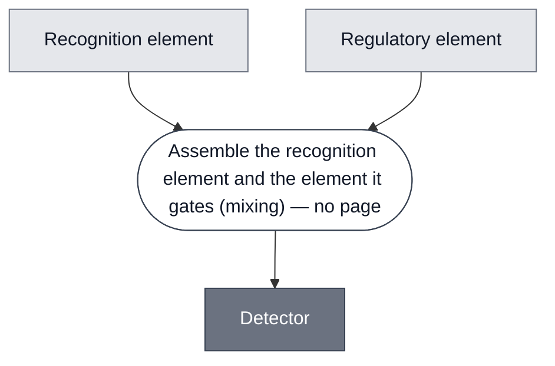

# Overview

<!-- gen:position -->
**Position.** Refines nothing declared. Refined by [`detector-3oc6-hsl`](../detector-3oc6-hsl/spec.md), [`detector-ph`](../detector-ph/spec.md), [`detector-theophylline`](../detector-theophylline/spec.md), [`repressor-detector`](../repressor-detector/spec.md).
<!-- /gen:position -->

A class: a Module that senses an analyte and changes the expression of a downstream gene.

Every member takes something from outside and turns it into a difference in what gets made. The class does not fix what the analyte is, what does the sensing, or what sits downstream. Members differ in two independent choices: the analyte they sense and the mechanism that senses it. [Detector: 3OC6-HSL (LuxR)](../detector-3oc6-hsl/spec.md) senses 3OC6-HSL with LuxR, an activator, and [Detector: 3OC6-HSL (EsaR)](../detector-esar/spec.md) is designed to sense the same analyte with EsaR, a repressor.

A bracket names the choice a Detector restricts. `α` is the analyte, `μ` is the mechanism, and `ε` is the effector the detector turns on. `Detector[aTc]` restricts by analyte, as does a bare `Detector[X]`. `Detector[repressor]` restricts by mechanism. `Detector[α ⟶ ε]` names what the detector senses and what it turns on.

:::{attention} 🚧 Draft
This page is a work in progress and not yet ready for use.
:::

# Reference Composition

:::::{tab-set}

<!-- gen:composition-diagram -->
::::{tab-item} Module Dependencies

```mermaid
flowchart TD
    RECOGNITION_ELEMENT["Recognition element"]
    REGULATORY_ELEMENT["Regulatory element"]

    P1_ASSEMBLE_THE_DETECTOR_0(["Assemble the recognition element and the element it gates (mixing) — no page"])
    DETECTOR["Detector"]

    RECOGNITION_ELEMENT --> P1_ASSEMBLE_THE_DETECTOR_0
    REGULATORY_ELEMENT --> P1_ASSEMBLE_THE_DETECTOR_0
    P1_ASSEMBLE_THE_DETECTOR_0 --> DETECTOR


    classDef leaf     fill:#e5e7eb,stroke:#6b7280,color:#111827;
    classDef composed fill:#6b7280,stroke:#374151,color:#ffffff;
    classDef process  fill:#ffffff,stroke:#374151,color:#111827;
    class RECOGNITION_ELEMENT,REGULATORY_ELEMENT leaf;
    class DETECTOR composed;
    class P1_ASSEMBLE_THE_DETECTOR_0 process;

    click DETECTOR "/docs/modules/detector/spec"
```

::::
<!-- /gen:composition-diagram -->

::::{tab-item} Recognition element

The recognition element is what responds to the analyte.

:::{table} What each member puts in the recognition element slot.
| Member | Analyte | Recognition element |
| --- | --- | --- |
| [Detector: 3OC6-HSL (LuxR)](../detector-3oc6-hsl/spec.md) | [3OC6-HSL](../analyte-3oc6-hsl/spec.md) | LuxR, an activator. Bound to 3OC6-HSL, it activates the pLux promoter. |
| [Detector: pH-Sensing](../detector-ph/spec.md) | [pH](../analyte-ph/spec.md), acidic (6.5 or below) | A pH-responsive ssDNA, annealed with a trigger ssDNA. In acid it folds into a triplex and releases the trigger. |
| [Detector: Theophylline](../detector-theophylline/spec.md) | [Theophylline](../analyte-theophylline/spec.md) | An aptamer in the 5' UTR of a translational riboswitch. Bound to theophylline, it exposes the ribosome binding site. |
| [Repressor Detector](../repressor-detector/spec.md) | [aTc](../analyte-atc/spec.md), [IPTG](../analyte-iptg/spec.md) or [3OC6-HSL](../analyte-3oc6-hsl/spec.md), by member | A repressor: TetR, LacI or EsaR. The analyte binds it and it lets go of the DNA it was holding off. |
:::

::::

::::{tab-item} Regulatory element

The regulatory element is what the recognition element gates.

:::{table} What each member puts in the regulatory element slot.
| Member | Regulatory element | What it gates |
| --- | --- | --- |
| [Detector: 3OC6-HSL (LuxR)](../detector-3oc6-hsl/spec.md) | the pLux promoter | transcription |
| [Detector: pH-Sensing](../detector-ph/spec.md) | a toehold switch | translation: the released trigger binds the toehold and exposes the ribosome binding site |
| [Detector: Theophylline](../detector-theophylline/spec.md) | the ribosome binding site, on the same RNA as the aptamer | translation |
| [Repressor Detector](../repressor-detector/spec.md) | the operator or promoter the repressor binds | transcription |
:::

::::

:::::

The three repressor members, [tetR-aTc](../detector-tetr-atc/spec.md), [LacI-IPTG](../detector-laci-iptg/spec.md) and [EsaR](../detector-esar/spec.md), are listed on [Repressor Detector](../repressor-detector/spec.md).

# Expected Behavior

A Detector is expected to change the expression of its downstream gene when its analyte is present. In every member, the analyte switches expression up.

Two members do not yet give this result. [Detector: Theophylline](../detector-theophylline/spec.md) is canceled: its riboswitch expresses its effector without theophylline present, so it does not discriminate. [Detector: 3OC6-HSL (EsaR)](../detector-esar/spec.md) is design intent only.

# Requirements

Requires transcription and translation. The polymerase follows the cytosol and not the detector: members use pT7 or sigma-70.

Requires a cytosol the member has been shown to work in. [Detector: 3OC6-HSL (LuxR)](../detector-3oc6-hsl/spec.md) has data only from S30 lysate, and it gives no GFP in Nucleus Cytosol.

Requires an analyte that reaches the recognition element. Whether that needs a transport route depends on the analyte. For [IPTG](../analyte-iptg/spec.md) it is not documented.

# Constituent Modules

- Recognition element — what responds to the analyte: a repressor, an activator, an aptamer or a pH-responsive strand
- Regulatory element — what the recognition element gates: a promoter, an operator or a ribosome binding site

# Processes

A member is made by mixing the recognition element with the regulatory element it gates in one compartment. The two share a phase, because the gate cannot act across a boundary. No Process page covers this step on its own.

# Credits

:::{attention} Credits are draft
Contributor attribution on this page has not been confirmed with the Node. Assign each credit explicitly before this page is merged to `main`.
:::
