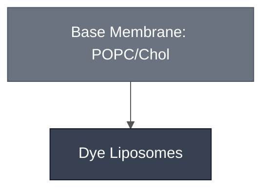

# Overview

Dye Liposomes encapsulate HPTS dye in  [Base Membrane](/docs/modules/membrane-popc-chol/spec.md) and use a simple, glucose outer solution. Dye Liposomes are a fast debugging tool and positive control for liposome encapsulation and microscopy. This protocol is adapted from the [Build a Cell liposome kit](https://github.com/BuildACell/liposome-kit) ([Fujii et al., 2014](https://doi.org/10.1038/nprot.2014.107)).

# Reference Composition

:::::{tab-set}

<!-- gen:composition-diagram -->
::::{tab-item} Module Dependencies

::::
<!-- /gen:composition-diagram -->

::::{tab-item} Inner Solution

:::{table}
:label: comp-inner-solution

| Component         | Stock concentration | Final concentration | Volume for one reaction (µL) |
| ----------------- | ------------------- | ------------------- | ---------------------------- |
| HPTS              | 4 mM                | 0.2 mM              | 5                            |
| Optiprep          | 1.32 mg/µL          | 0.043 mg/µL         | 1.33                         |
| Water             |                     |                     | 23.67                        |
| Total volume (µL) |                     |                     | 30                           |
:::

::::

::::{tab-item} Membrane

:::{table}
:label: comp-dye-liposomes-membrane

| Component    | Target Percentage (%) | Molecular Weight (g/mol) | Stock concentration (mg/mL) | Volume to add (µL) |
| ------------ | --------------------- | ------------------------ | --------------------------- | ------------------ |
| POPC         | 70                    | 760.076                  | 25                          | 162.17             |
| Cholesterol  | 29.95                 | 386.654                  | 50                          | 17.65              |
| Liss-Rhod PE | 0.05                  | 1301.71                  | 1                           | 4.96               |

:::

See [Base Membrane](../membrane-popc-chol/spec.md) for the full membrane spec.
::::

::::{tab-item} Outer Solution

:::{table}
:label: comp-outer-solution

| Component | Concentration |
| --------- | ------------- |
| Glucose   | 800 mM        |
:::

::::

:::::

# Expected Behavior

Liposomes are visible in the green channel (interior, HPTS, 480 nm ex / 520 nm em) and in the red channel (membrane, Liss-Rhodamine-PE, 540 nm ex / 580 nm em) under fluorescence microscopy.

# Processes

Dye Liposomes are assembled and encapsulated using [Encapsulation: Phase Transfer](../../processes/assemble-base-cell/main.md).

# Materials

:::{table}
:label: bom-dye-liposomes
:align: center

| Name                     | Category   | Product                                    | Manufacturer          | Part #      | Price   | Storage | Link                                                                                                    |
| ------------------------ | ---------- | ------------------------------------------- | ---------------------- | ----------- | ------- | ------- | --------------------------------------------------------------------------------------------------------- |
| HPTS                     | Reagent    | HPTS (Pyranine)                             | Thermo Scientific      | L11252-06   | $92.60  | RT      | [link](https://www.thermofisher.com/order/catalog/product/L11252-06)                                       |
| HEPES pH 7.6             | Chemical   | HEPES, Free Acid                            | Fisher BioReagents     | NC1584172   | $85.90  | RT      | [link](https://www.fishersci.com/shop/products/hepes-free-acid-fisher-bioreagents-3/NC1584172)             |
| Optiprep                 | Reagent    | OptiPrep™                                   | STEMCELL Technologies  | 07820       | $289.00 | RT      | [link](https://www.stemcell.com/products/optipreptm.html)                                                  |
| POPC                     | Lipid      | 16:0-18:1 PC 25 mg/mL                       | Avanti Lipids          | A80557      | $435.00 | -20 °C   | [link](https://www.avantiresearch.com/en-gb/products/product/850457-160-181-pc-popc)                       |
| Liss-Rhod PE             | Lipid      | 18:0 Liss Rhod PE 1 mg/mL                   | Avanti Lipids          | A81179      | $273.47 | -20 °C   | [link](https://www.avantiresearch.com/en-gb/products/product/810179-180-liss-rhod-pe)                      |
| Glucose                  | Chemical   | D-(+)-Glucose, 99%                          | Thermo Scientific      | A16828-36   | $41.65  | RT      | [link](https://www.thermofisher.com/order/catalog/product/A16828.36)                                       |
| Mineral oil              | Chemical   | Mineral oil, mixed weight                   | Thermo Scientific      | AC415080010 | $53.40  | RT      | [link](https://www.thermofisher.com/order/catalog/product/AC415080010)                                     |
| Glass syringe 250 µL     | Equipment  | Hamilton glass syringe                      | Hamilton               | 14-815-238  | $150.15 | RT      | [link](https://www.fishersci.com/shop/products/800-microliter-syringes-rn-termination/14815238)            |
| 18-well imaging slide    | Consumable | µ-Slide 18 Well glass bottom                | ibidi                  | 80826       | $178.00 | RT      | [link](https://ibidi.com/chambered-coverslips/237--slide-18-well-glass-bottom.html)                        |

:::

:::{hint} Note
:class: simple
:icon: false
Sucrose is used in the original [Build a Cell liposome kit](https://github.com/BuildACell/liposome-kit) protocol for the inner solution, but is replaced by Optiprep here to match the Base Cell inner-solution formulation. It is not included in the BOM above.
:::

# Constituent Modules

- [Base Membrane](../membrane-popc-chol/spec.md) — 70:30 POPC:cholesterol bilayer encapsulating the HPTS dye solution

# Credits

Adapted from the [Build a Cell liposome kit](https://github.com/BuildACell/liposome-kit) ([Fujii et al., 2014](https://doi.org/10.1038/nprot.2014.107)).

