# Overview

The PLA1 Lysis Module uses phospholipase A1 (PLA1) as a genetically encoded lysis trigger. Once expressed inside a liposome, PLA1 degrades the liposome's own phospholipid membrane, rupturing it. In every DevCells cascade that uses it, this self-lysis also breaches a neighboring, dye-loaded liposome, releasing a chromogenic substrate (chlorophenol red-β-D-galactopyranoside, CPRG, or catechol) into an external reporter-enzyme solution and starting a colorimetric readout. PLA1 supplies the lysis step only — it is not itself a sensor or a reporter. It sits downstream of a sensing circuit (a theophylline riboswitch, a pH-responsive toehold switch, a TetO/aTc promoter, or a LuxR/pLux quorum-sensing promoter) that controls when it is expressed, and upstream of a reporter enzyme (typically LacZ, occasionally XylE/C23DO) that produces the visible signal.

:::{attention} 🚧 Draft
This page is a work in progress and not yet ready for use.
:::

:::{attention} No PLA1-specific experimental data
@Editor: no experiment characterizes PLA1 on its own. Every result below comes from a cascade that uses it, so no PLA1 concentration, timing or efficiency figure exists independent of a sensing circuit. Confirm whether such data exists.
:::

```mermaid
%%{init: {'theme': 'base', 'themeVariables': {'lineColor': '#555555', 'edgeLabelBackground': '#ffffff'}}}%%
flowchart LR
    A["Inducer<br/>(theophylline / pH / aTc / AHL)"] --> B["Sensing circuit<br/>(riboswitch, toehold switch,<br/>TetO/aTc, or LuxR/pLux)"]
    B --> C["PLA1 expressed<br/>inside its own liposome"]
    C --> D["PLA1 degrades that liposome's<br/>own phospholipid membrane"]
    D --> E["Liposome ruptures, breaching a<br/>neighboring substrate-loaded liposome"]
    E --> F["Chromogenic substrate released<br/>(CPRG or catechol)"]
    F --> G["External reporter enzyme<br/>(LacZ or XylE/C23DO)"]
    G --> H["Colorimetric readout"]
```

Schematic representation of the PLA1 lysis cascade.

# Reference Composition

:::::{tab-set}

::::{tab-item} DNA

:::{table}
| **Name** | **Length (bp)** | **File** | **Supply route** |
| --- | --- | --- | --- |
| `T7pro-PLA1-T7term` | not yet determined | — | pT7; Chicago theophylline and pH cascades |
| `P70lux-PLA1-term` | not yet determined | — | *E. coli* P70/pLux; London AHL cascade |
:::

:::{attention} Neither construct is in `nucleus-eng/DNA`
Neither has a confirmed sequence file in [nucleus-eng/DNA](https://github.com/nucleus-eng/DNA). Do not add a length or file entry until one lands there and its identity is confirmed against the construct name.
:::

::::

::::{tab-item} Cytosol

PLA1 is expressed from one of the constructs above rather than added as a reagent, so it has no working concentration of its own.

:::{table} PLA1 DNA dose, by cascade.
:label: comp-pla1-cytosol

| Cascade | Construct | Working concentration |
| --- | --- | --- |
| Chicago aTc | `TetO-PLA1` | 1 nM (also tested at 0.5 nM) |
| London AHL | `P70lux-PLA1-term` | 15 ng/µL |
| Chicago pH | Toehold-switch-gated PLA1 template | 2 nM |
| Chicago theophylline | `T7pro-PLA1-T7term` | Not documented |
:::

The cytosol itself is whichever the host cascade uses — [Base Cytosol](../base-cytosol/spec.md) for the Chicago cascades, [S30 Lysate](../s30-lysate/spec.md) for London.

::::

::::{tab-item} Membrane

PLA1 lyses a membrane, so a membrane is part of every configuration that uses it. No lipid composition is specific to this Module: it takes whichever membrane the host cell has, [Chicago Membrane: POPC/Chol](../membrane-popc-chol-chicago/spec.md) or [London Membrane: POPC](../membrane-popc/spec.md).

Both a self-lysis target and, in the two-liposome cascades, a neighboring [Substrate SUV: CPRG](../substrate-cprg-suv/spec.md) membrane are required.

::::

:::::

# Expected Behavior

## Cells

PLA1 lyses a liposome in every DevCells cascade that needs a two-liposome colorimetric handoff. PLA1's role inferred from the cascade's overall behavior. Per-cascade behavior is described in [Implementations](#implementations) below.

PLA1 behaves the same way in each cascade that uses it — expression, self-lysis, then rupture of a neighboring substrate liposome. The four documented contexts:

- **Chicago theophylline cascade.** A theophylline riboswitch (Lynch & Gallivan design) gates PLA1 expression. PLA1 ruptures its own synthetic cell and a neighboring CPRG-loaded synthetic cell, releasing CPRG to an external LacZ solution and producing a visible color change after ~16 h in an alginate hydrogel. Confirmed at the synthetic cell/hydrogel level, with a known caveat: the color change currently occurs with or without theophylline present (riboswitch leak), so target specificity is not yet solved.
- **Chicago pH cascade.** A pH-responsive toehold switch gates PLA1. The same two-liposome CPRG/LacZ handoff produces a visible yellow-to-purple change at pH 6.5 in solution. Confirmed at the solution level only; not yet moved into the hydrogel-embedded chassis.
- **Chicago aTc cascade.** See the [tetR-aTc Detector Module](../detector-tetr_atc/spec.md) spec, "Chicago Cascade Encapsulation (TetO-PLA1 / LacZ-CPRG Readout)" section: a `TetO-PLA1` construct is co-encapsulated with LacZ and CPRG substrate in a synthetic cell, showing a detectable but **non-graded** absorbance response to aTc (saturating at or below 1 µM). This is currently the only PLA1 result with primary supporting data behind it.
- **London AHL cascade.** A LuxR/pLux quorum-sensing promoter gates PLA1 expression in S30 lysate. PLA1 lysis again triggers the CPRG/LacZ handoff. As of the latest report, this shows a discernible but still leaky difference in color change between +AHL and −AHL conditions; the team is optimizing DNA and AHL concentrations to widen this gap.

:::{attention} These are cascade results, not PLA1 characterization
Each summary describes PLA1 working inside a cascade. None isolates PLA1's own performance.
:::

:::{attention} Premature lysis has two independent causes
**Gramicidin A causes premature lysis; it does not prevent it.** Used as a proton channel for the pH cascade's GFP-expression result, it was left out of the colorimetric demonstration because it ruptured a portion of the CPRG-loaded liposomes, producing nonspecific color. Its absence can reduce pH-sensing efficiency, but proton diffusion into the more permeable liposomes was enough to drive PLA1 expression and initiate the lysis cascade.

**Acidic conditions alone rupture some CPRG-loaded liposomes**, independent of PLA1, which confounds attributing a color change to the sensing pathway.

Account for both routes rather than assuming a liposome stays intact until the intended trigger.
:::

# Requirements

Requires an upstream sensing circuit to gate expression (e.g. [Detector: AHL](../detector-ahl/spec.md), [Detector: tetR-aTc](../detector-tetr_atc/spec.md)), a phospholipid membrane to lyse (e.g. [London Membrane](../membrane-popc/spec.md), [Chicago Membrane](../membrane-popc-chol-chicago/spec.md)), and a downstream reporter enzyme with its chromogenic substrate in a neighboring liposome (LacZ with CPRG, or XylE/C23DO with catechol).

Using `T7pro-PLA1-T7term` requires pT7 transcription and translation (e.g. [Base Cytosol](../base-cytosol/spec.md)). Using `P70lux-PLA1-term` requires sigma-70 transcription and translation (e.g. [S30 Lysate](../s30-lysate/spec.md)).

PLA1 is a lysis effector, not a standalone module — it only produces an observable effect when paired with a sensing circuit and a downstream reporter/substrate liposome, and none at all in bulk cytosol, where there is no membrane to degrade. Premature lysis is a known failure mode, and the Chicago pH cascade shows two independent routes to it.

Do not add gramicidin A to a colorimetric cascade. See [Expected Behavior](#expected-behavior) for why.

# Implementations

- [Chicago DevCell](../../implementations/chicago-devcell/main.md): PLA1 drives the aTc, pH and theophylline colorimetric readouts.
- [London DevCell](../../implementations/london-devcell/main.md): PLA1 drives the AHL quorum-sensing colorimetric readout.

# Known Future Work

:::{attention} Separate gap — not the same issue as PLA1 documentation
This is about mitigating **exterior** LacZ leakage, not PLA1's lysis function (covered above).
:::

A proteinase K treatment (50 °C/10 min, then 40 °C/1 h, then spin down) mitigates exterior LacZ leakage in cascades that use PLA1. It is documented as its own process page: [Degrade Exterior LacZ](../../processes/degrade-exterior-lacz/main.md).

:::{attention} Treatment conditions incomplete
@Editor: proteinase K concentration, reaction volume and buffer are not recorded. Confirm with the Node that ran it.
:::

# Processes

- [Degrade Exterior LacZ](../../processes/degrade-exterior-lacz/main.md)

# Credits

Developed by Jonah McDonald and Charlie Newell (London Node) and Mary Kelly (Chicago Node, Kamat Lab).
