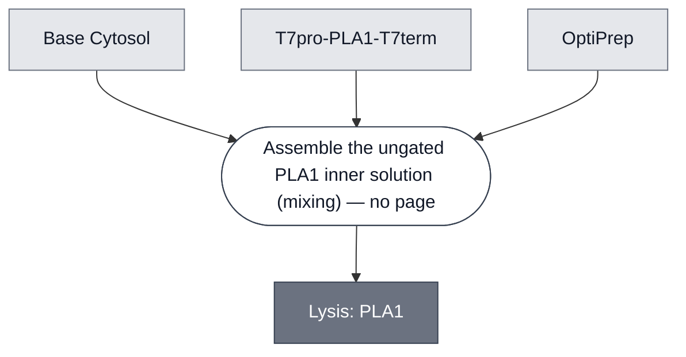

# Overview

The PLA1 Lysis Module uses phospholipase A1 (PLA1) to genetically encode lysis. Once expressed, PLA1 degrades the phospholipid membrane and lyses the cell and its neighbors. This can be used to release chemical payloads from neighboring liposomes (e.g. [CPRG-SUV cells](../substrate-cprg-suv/spec.md)) into an external solution (e.g., of [LacZ](../reporter-lacz/spec.md), triggering a [colorimetric signal](../../processes/colorimetric-readout/main.md)). PLA1 can sit downstream of a sensing circuit (e.g. a [TetO detector module](../detector-tetr-atc/spec.md)) that controls when it is expressed, and upstream of a reporter module requiring lysis (e.g., [LacZ](../reporter-lacz/spec.md)).

:::{attention} 🚧 Draft
This page is a work in progress and not yet ready for use.
:::

:::{attention} PLA1 is characterized without a sensing circuit, but never without a readout chain
One configuration removes the gate — constitutive expression in Nucleus Cytosol, described under Expected Behavior below. It supplies the only DNA dose and timing figures attributable to PLA1 alone. Every other result on this page comes from a cascade, where the sensing circuit and PLA1 cannot be separated.

No result isolates PLA1 from the CPRG/LacZ readout. Lysis is always scored by the color it releases, never by a direct measure of membrane rupture or of enzyme activity, so no efficiency figure exists for PLA1 in any configuration.
:::

# Reference Composition

:::::{tab-set}

<!-- gen:composition-diagram -->
::::{tab-item} Module Dependencies

```mermaid
flowchart TD
    BASE_CYTOSOL["Base Cytosol"]
    PLA1_DNA["T7pro-PLA1-T7term"]
    OPTIPREP["OptiPrep"]

    P1_ASSEMBLE_PLA1_INNER_SOLUTION_0(["Assemble the ungated PLA1 inner solution (mixing) — no page"])
    EFFECTOR_PLA1["Lysis: PLA1"]

    BASE_CYTOSOL --> P1_ASSEMBLE_PLA1_INNER_SOLUTION_0
    PLA1_DNA --> P1_ASSEMBLE_PLA1_INNER_SOLUTION_0
    OPTIPREP --> P1_ASSEMBLE_PLA1_INNER_SOLUTION_0
    P1_ASSEMBLE_PLA1_INNER_SOLUTION_0 --> EFFECTOR_PLA1


    classDef leaf     fill:#e5e7eb,stroke:#6b7280,color:#111827;
    classDef composed fill:#6b7280,stroke:#374151,color:#ffffff;
    classDef process  fill:#ffffff,stroke:#374151,color:#111827;
    class BASE_CYTOSOL,PLA1_DNA,OPTIPREP leaf;
    class EFFECTOR_PLA1 composed;
    class P1_ASSEMBLE_PLA1_INNER_SOLUTION_0 process;

    click BASE_CYTOSOL "/docs/modules/base-cytosol/spec"
    click EFFECTOR_PLA1 "/docs/modules/effector-pla1/spec"
```

::::
<!-- /gen:composition-diagram -->

::::{tab-item} DNA

:::{table}
| **Name** | **Length (bp)** | **File** | **Supply route** |
| --- | --- | --- | --- |
| `T7pro-PLA1-T7term` | not yet determined | — | pT7; Chicago theophylline cascade, and the ungated London run |
| `LuxR-PLA1-linear` | 2237 | [LuxR-PLA1-linear.gb](https://github.com/nucleus-eng/DNA/blob/devcells/devstudio-constructs/effectors/detector-3oc6-hsl/LuxR-PLA1-linear.gb) | Constitutive `BBa_J23101`→`luxR` with `pLux`-driven PLA1, one molecule; London 3OC6-HSL cascade. Also referred to as `P70lux-PLA1-term`. |
:::

:::{attention} `T7pro-PLA1-T7term` is not in `nucleus-eng/DNA`
@Editor: `T7pro-PLA1-T7term` has no confirmed sequence file in [nucleus-eng/DNA](https://github.com/nucleus-eng/DNA). Once one lands there and its identity is confirmed against the construct name, add its length and file to the table above.
:::

**The enzyme has two coding sequences.** Every construct carrying PLA1 carries 963 bp of it, and all of them encode the same protein — but not all from the same DNA. Chicago's two gated constructs, `pT7-tetO-PLA1` and `pT7-toehold9-PLA1`, are identical across the whole coding sequence. London's `LuxR-PLA1` agrees with them at 77.6% of nucleotides and 100% of residues, which makes it a separate codon optimization of the same enzyme.

They are interchangeable at the protein level and distinct at the DNA level. Codon usage is tuned to a host and the two Nodes use different cytosols, so substituting one for the other is a change even though the enzyme is not. Length cannot tell them apart.

::::

::::{tab-item} Cytosol

PLA1 is expressed from one of the constructs above rather than added as a reagent, so it has no working concentration of its own.

:::{table} PLA1 DNA dose, by configuration.
:label: comp-pla1-cytosol

| Configuration | Construct | Working concentration |
| --- | --- | --- |
| London constitutive, ungated | `T7pro-PLA1-T7term` | 14 ng/µL, in a 20 µL reaction with 5% Optiprep |
| Chicago aTc | `TetO-PLA1` | 1 nM (also tested at 0.5 nM) |
| London 3OC6-HSL | `LuxR-PLA1` | 15 ng/µL |
| Chicago pH | Toehold-switch-gated PLA1 template | 2 nM |
| Chicago theophylline | `T7pro-PLA1-T7term` | Not documented |
:::

The cytosol itself is whichever the host configuration uses — [Base Cytosol](../base-cytosol/spec.md) for the Chicago cascades and for the ungated London run, [S30 Lysate](../s30-lysate/spec.md) for the London 3OC6-HSL cascade.

::::

<!-- composition-tabs: no-table (PLA1 acts on any phospholipid membrane in reach, so a single lipid table would be wrong) -->
::::{tab-item} Membrane

PLA1 lyses a membrane, so a membrane is part of every configuration that uses it. No lipid composition is specific to this Module. The membranes it has been used with are [Membrane: POPC/Chol (9:1)](../membrane-popc-chol-chicago/spec.md) and [Membrane: POPC](../membrane-popc/spec.md).

Both a self-lysis target and, in the two-liposome cascades, a neighboring [Substrate SUV: CPRG](../substrate-cprg-suv/spec.md) membrane are required.

::::

:::::

(effector-pla1-expected-behavior)=
# Expected Behavior

## Cells

PLA1 lyses the synthetic cell that expresses it, and synthetic cells near it. One documented configuration reports on PLA1 rather than on a cascade, because nothing gates it:

- **London constitutive expression, ungated.** `T7pro-PLA1-T7term` at 14 ng/µL in [Base Cytosol](../base-cytosol/spec.md) liposomes, with no sensing circuit, drives the two-liposome CPRG/LacZ handoff. Color appears from about 3 h at 37 °C and is easily discernible by 16 h, against a minus-DNA control in the same run, and has been reproduced across multiple days. Expect a visible result on that timescale at this dose. The recorded outer solution is 1200 mM glucose and 0.1 mM CaCl₂ with 1.5% ULGA, so this is the hydrogel format — see [Embedding: Thermal Setting](../../processes/embed-thermal-setting/main.md).

Every other configuration on record puts a sensing circuit in front of PLA1, so PLA1 and its gate cannot be told apart: a weak result there may be either. Those are results of the cascades that produced them, and each cascade's own page carries them.

:::{attention} Premature lysis has two independent causes
**Gramicidin A causes premature lysis; it does not prevent it.** Used as a proton channel for the pH cascade's GFP-expression result, it was left out of the colorimetric demonstration because it ruptured a portion of the CPRG-loaded liposomes, producing nonspecific color. Its absence can reduce pH-sensing efficiency, but proton diffusion into the more permeable liposomes was enough to drive PLA1 expression and initiate the lysis cascade.

**Acidic conditions alone rupture some CPRG-loaded liposomes**, independent of PLA1, which confounds attributing a color change to the sensing pathway.

Account for both routes rather than assuming a liposome stays intact until the intended trigger.
:::

(effector-pla1-requirements)=
# Requirements

Requires a phospholipid membrane to lyse (e.g. [Membrane: POPC](../membrane-popc/spec.md), [Membrane: POPC/Chol (9:1)](../membrane-popc-chol-chicago/spec.md)).

**PLA1 imposes on any phospholipid membrane in reach.** It does not distinguish the membrane that expressed it from a neighbor's, and it cannot distinguish populations that share a composition. Where a sensing cell and a substrate carrier are built on one membrane formulation, PLA1 reaching the carrier is the intended path and PLA1 reaching another sensing cell is not, and nothing in the chemistry separates them. A composition that needs them separated states that requirement itself.

**PLA1 requires a low noise floor in whatever drives it**, and any color change module built on PLA1 inherits that requirement. In London, background PLA1 expression without 3OC6-HSL gives near-equivalent color to the induced state, so the dynamic range is gone. In Chicago, PLA1 takes 10 to 12 h to lyse GUVs and the GUVs leak on their own over the same window, so the negative control also colors: slightly purple against slightly more purple when induced. **One failure with two causes**: transcriptional leak in London and GUV lifetime in Chicago.

The detector is the component that currently fails this requirement. The LacZ/CPRG reaction is robust.

No numeric threshold is defined for how low the noise floor must be.

:::{attention} Sources for the noise-floor observations
@Editor(london): cite the DevNote or data for the background PLA1 expression without 3OC6-HSL.

@Editor(chicago): cite the DevNote or data for the GUV leak and the negative-control color, and for the statement that the detector, not the LacZ/CPRG reaction, fails the requirement. State whether that statement covers the GUV leak, which is not a detector failure.
:::

Requires an upstream sensing circuit (e.g. [Detector: 3OC6-HSL](../detector-3oc6-hsl/spec.md), [Detector: tetR-aTc](../detector-tetr-atc/spec.md)) only where lysis must be conditional. Expressed constitutively, PLA1 lyses on its own schedule.

Requires pT7 transcription and translation, when using `T7pro-PLA1-T7term` (e.g. [Base Cytosol](../base-cytosol/spec.md)).

Requires sigma-70 transcription and translation, when using `LuxR-PLA1` (e.g. [S30 Lysate](../s30-lysate/spec.md)).

Do not add Gramicidin A to a colorimetric cascade. See [Expected Behavior](#effector-pla1-expected-behavior) for why.

(effector-pla1-implementations)=
# Processes

- [Degrade Exterior LacZ](../../processes/degrade-exterior-lacz/main.md) — applies only where LacZ is encapsulated. Proteinase K does not distinguish one LacZ from another, so in a configuration that puts LacZ in the outer solution it digests the reporter.
- [Colorimetric Readout](../../processes/colorimetric-readout/main.md) — the CPRG conversion that produces the visible signal
- [Embedding: Ionic Crosslinking](../../processes/embed-ionic-crosslinking/main.md) — the Chicago hydrogel format
- [Embedding: Thermal Setting](../../processes/embed-thermal-setting/main.md) — the London hydrogel format

# Constituent Modules

- [Base Cytosol](../base-cytosol/spec.md) — transcription and translation, for the ungated configuration

# Credits

Developed by Jonah McDonald and Charlie Newell (London Node) and Mary Kelly (Chicago Node, Kamat Lab).

:::{attention} Credits are draft
Contributor attribution on this page has not been confirmed with the Node. Assign each credit explicitly before this page is merged to `main`.
:::
