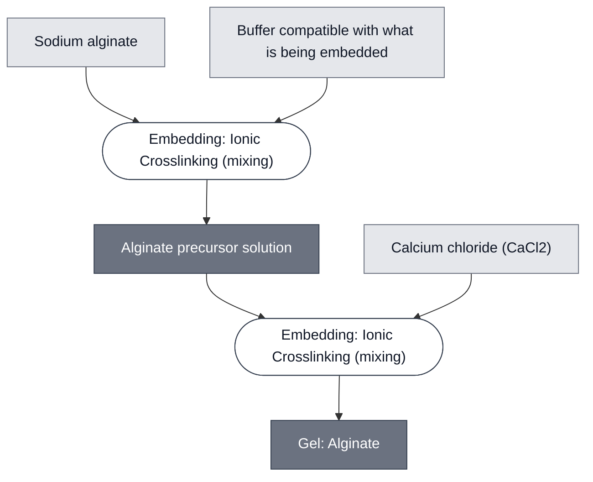

# Overview

<!-- gen:position -->
**Position.** Refines [`gel`](../gel/spec.md). Refined by nothing on this branch.
<!-- /gen:position -->

Alginate Gel is a ~1% (w/v) sodium alginate gel, crosslinked ionically by divalent calcium, used as the matrix that holds synthetic cells and reporter liposomes in fixed relation to one another. It is the format the Chicago colorimetric demo runs in. Compare to [ULGA Gel](../gel-ulga/spec.md), which reaches the same result through a thermal set rather than an ionic one, and to [PEGDA Gel](../gel-pegda/spec.md), whose geometry is set by projected light rather than by its container.

Alginate is the gentlest of the four on its contents: it sets at room temperature, in the dark, with no radicals and no heat.

:::{attention} 🚧 Draft
This page is a work in progress and not yet ready for use.
:::

(gel-alginate-reference-composition)=
# Reference Composition

:::::{tab-set}

<!-- gen:composition-diagram -->
::::{tab-item} Module Dependencies

::::
<!-- /gen:composition-diagram -->

::::{tab-item} Gel

:::{table} Alginate gel, as prepared.
:label: comp-gel-alginate

| Component | Working concentration | Notes |
| --- | --- | --- |
| Sodium alginate | ~1% (w/v) | dissolved in a buffer compatible with the liposomes being embedded — normally their own outer solution |
| Calcium chloride (CaCl₂) | 200 mM | applied as a separate crosslinking solution, not premixed |
:::

::::

:::::

The alginate is dissolved in whatever outer solution the embedded populations already sit in. Osmolarity is additive, so the gel's is the sum of that solution's and the polymer's own — and at about 1% (w/v) the polymer's term is on the order of 0.1 mOsm, negligible against the roughly 1180 mOsm of the solution. The solution sets it.

A multimaterial variant mixes 1.6 wt% alginate into a PEGDA precursor, then crosslinks each component by its own route. The mixture is the ingredient; the product is not a blended gel but **a PEGDA frame around an alginate core** — two regions with a boundary between them, demonstrated with reasonable structural integrity. The alginate step crosslinks in a **200 mM CaCl₂** bath after patterning. The PEGDA575-alginate frame is patterned for **30 s** and the PEG4Nb inset for **60 s**, both at 405 nm. See [PEGDA Gel](../gel-pegda/spec.md).

In a frame, the reporter's color bleeds into the frame and lowers spatial resolution; see [LacZ Reporter](../reporter-lacz/spec.md).

(gel-alginate-expected-behavior)=
# Expected Behavior

## Gels

Calcium bridges adjacent alginate chains into "egg-box" junctions, setting the matrix without heat or light. Expect a gel that holds dispersed populations in place for the duration of a multi-hour incubation at 37 °C.

The confirmed result at this composition is the Chicago theophylline readout: theophylline-responsive synthetic cells, CPRG-loaded SUVs and commercial LacZ co-embedded in the same gel give a yellow-to-purple color change after about 16 h, read at (570–575) nm and by eye.

:::{attention} The conditions are not optimized
That result confirms the cascade in this gel. The alginate concentration, the calcium concentration and the set time above are the one condition that has been run. No experiment varies them, so they are not an optimum.
:::

(gel-alginate-requirements)=
# Requirements

Requires 200 mM CaCl₂ as a separate crosslinking step, so anything embedded must tolerate a divalent calcium load at that concentration.

Requires a buffer that is already compatible with the populations being embedded. The alginate is dissolved into their outer solution rather than replacing it.

Imposes no heat and no illumination on its contents, which is what distinguishes it from the other three gels.

# Processes

Prepared and set by [Embedding: Ionic Crosslinking](../../processes/embed-ionic-crosslinking/main.md), which also covers co-embedding the sensing cells, SUVs and LacZ.

# Materials

:::{table} Purchased materials.

| Name | Category | Product | Manufacturer | Part # | Link |
| --- | --- | --- | --- | --- | --- |
| Sodium alginate | Chemical | Alginic acid sodium salt, low viscosity | Sigma-Aldrich | A0682 | [link](https://www.sigmaaldrich.com/US/en/product/sigma/a0682) |
| Calcium chloride | Chemical | Calcium chloride, anhydrous, ≥97% | Sigma-Aldrich | C1016 | [link](https://www.sigmaaldrich.com/US/en/product/sigma/c1016) |
:::

# Credits

Developed by [Maram Naji](https://orcid.org/0000-0003-1409-4194) (Chicago Node, Lucks Lab) and the Chicago Node (Kamat Lab and Liu Lab).
