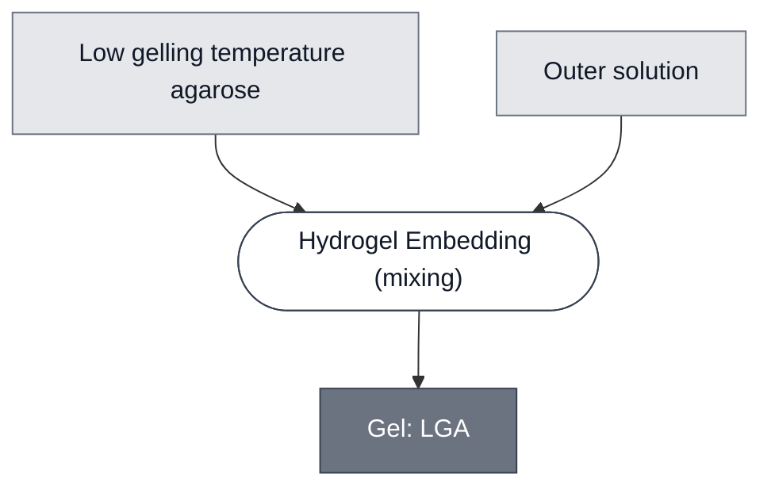

# Overview

<!-- gen:position -->
**Position.** Refines [`gel`](../gel/spec.md). Refined by nothing on this branch.
<!-- /gen:position -->

Low-gelling-temperature agarose set into an outer solution. It is the matrix the pH path embeds in, and it is a different material from [Gel: ULGA](../gel-ulga/spec.md) rather than another name for it.

**The two agaroses are ordered separately and gel at different temperatures.** This grade congeals over (26–30) °C and melts at ≤65 °C. [Gel: ULGA](../gel-ulga/spec.md) has a gel point of (8–17) °C and melts at ≤50 °C. **The gel points do not overlap**, which is what makes them non-interchangeable rather than two names for one powder.

:::{attention} 🚧 Draft
This page is a work in progress and not yet ready for use.
:::

:::{attention} Written 2026-09-24, and two existing sources disagree about it
This page exists because three separate routes arrived at the same gap in one afternoon: a DevStudio whiteboard node, its gel-embedding step, and [Chicago Cascade](../chicago-cascade/spec.md)'s open question about which agarose the pH path uses.

**The disagreement is live and this page does not settle it.** [pH Sensing Cell](../ph-sensing-cell/spec.md) says *"0.7% low-gelling agarose"*. [pH Cascade](../ph-cascade/spec.md)'s composition source names the same 0.7% operand *"ULGA powder"*. Same path, same figure, two different polymers. The board answers it — the presenter said they used the low-gelling grade — and pointing the cascade here is a decision about that page rather than this one.
:::

# Reference Composition

:::::{tab-set}

<!-- gen:composition-diagram -->
::::{tab-item} Module Dependencies

::::
<!-- /gen:composition-diagram -->

:::::

**One polymer and one solvent, in one phase.** A gel's own composition is the polymer dissolved into the solution it becomes, which is why the step mixes. Putting a compartment *into* the set gel is a different step and belongs to whatever cascade does it.

**The process names the abstract parent on purpose.** [Hydrogel Embedding](../../processes/embed-hydrogel/main.md) has two written instances, alginate and ULGA, and neither is this chemistry. Naming either would assert the wrong one.

# Constituent Modules

- [Outer Solution](../outer-solution/spec.md) — the phase the polymer dissolves into and becomes. **Which member is not recorded** for the pH path, so the class is named here and no recipe is stated.
- Low gelling temperature agarose — **no module page and no part number.**

**That the polymers have no pages is a corpus-wide finding, not a gap in this one.** The ULGA source records it in the same words for its own polymer.

# Requirements

Requires an outer solution for the polymer to dissolve into. **Which one is not recorded** for the pH path, so this page names the [class](../outer-solution/spec.md) and states no recipe.

Requires that whatever is embedded survives the temperature at which the polymer is still liquid. That figure is the payload's limit rather than the polymer's, and it belongs on the payload's page.

# Processes

- [Hydrogel Embedding](../../processes/embed-hydrogel/main.md) — the abstract parent. No instance is written for this chemistry.

# Credits

:::{attention} Credits are draft
Contributor attribution on this page has not been confirmed with the Node. Assign each credit explicitly before this page is merged to `main`.
:::
