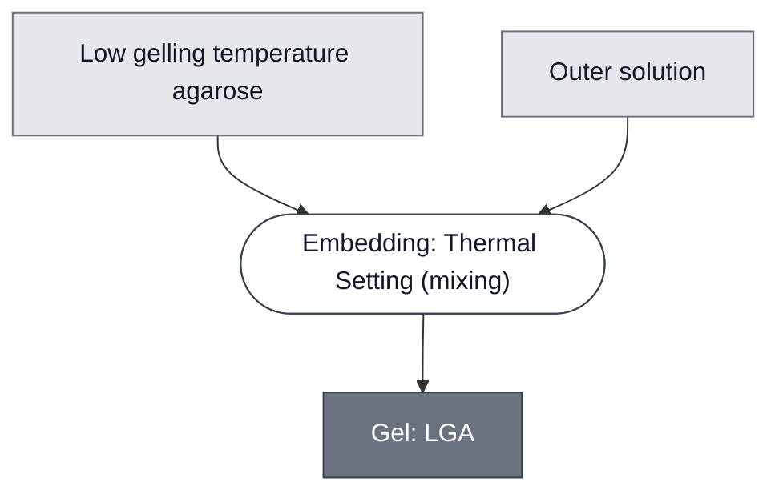

# Overview

<!-- gen:position -->
**Position.** Refines [Thermal Gel](../thermal-gel/spec.md). Refined by nothing on this branch.
<!-- /gen:position -->

Low-gelling-temperature agarose set into an outer solution. Congeals over (26–30) °C and melts at ≤ 65 °C. Distinct from [Gel: ULGA](../gel-ulga/spec.md), with a gel point of (8–17) °C and melting point at ≤50 °C. 

:::{attention} 🚧 Draft
This page is a work in progress and not yet ready for use.
:::

# Reference Composition

:::::{tab-set}

<!-- gen:composition-diagram -->
::::{tab-item} Module Dependencies

```mermaid
flowchart TD
    LGA_POWDER["Low gelling temperature agarose"]
    OUTER_SOLUTION["Outer solution"]

    P1_SET_THERMAL_0(["Embedding: Thermal Setting (mixing)"])
    GEL_LGA["Gel: LGA"]

    LGA_POWDER --> P1_SET_THERMAL_0
    OUTER_SOLUTION --> P1_SET_THERMAL_0
    P1_SET_THERMAL_0 --> GEL_LGA


    classDef leaf     fill:#e5e7eb,stroke:#6b7280,color:#111827;
    classDef composed fill:#6b7280,stroke:#374151,color:#ffffff;
    classDef process  fill:#ffffff,stroke:#374151,color:#111827;
    class LGA_POWDER,OUTER_SOLUTION leaf;
    class GEL_LGA composed;
    class P1_SET_THERMAL_0 process;

    click OUTER_SOLUTION "/docs/modules/outer-solution/spec"
    click P1_SET_THERMAL_0 "/docs/processes/embed-thermal-setting/main"
    click GEL_LGA "/docs/modules/gel-lga/spec"
```

::::
<!-- /gen:composition-diagram -->

::::{tab-item} Gel

:::{table} LGA gel, as set.
| Component | Final concentration |
| --- | --- |
| Low-gelling-temperature agarose | 0.7% (w/v) |
| [Outer Solution](../outer-solution/spec.md) | 1× |
:::

The agarose is weighed into a concentrated stock, then diluted to the working figure above. The stock on record is 2.7% (w/v) — 40.5 mg in 1500 µL of ultrapure DNase/RNase-free distilled water.

::::

:::::

# Requirements

Requires an [Outer Solution](../outer-solution/spec.md) for the polymer to dissolve into.

Requires that whatever is embedded survives the temperature at which the polymer is still liquid. That figure is the payload's limit rather than the polymer's, and it belongs on the payload's page.

# Implementations

- [pH Demo](../../implementations/devstudio-ph-demo/main.md): its gel — 0.7% (w/v) in the set gel.

# Processes

- [Embedding: Thermal Setting](../../processes/embed-thermal-setting/main.md) — sets the agarose by cooling. Hold it above its (26–30) °C congealing range while the payload goes in, then set it below that range.

# Constituent Modules

- [Outer Solution](../outer-solution/spec.md) — the phase the polymer dissolves into and becomes.
- Low-gelling-temperature agarose

:::{attention} No part number is recorded for the agarose
@Editor(chicago): record the part number of the low-gelling-temperature agarose.
:::

# Credits

:::{attention} Credits are draft
Contributor attribution on this page has not been confirmed with the Node. Assign each credit explicitly before this page is merged to `main`.
:::
