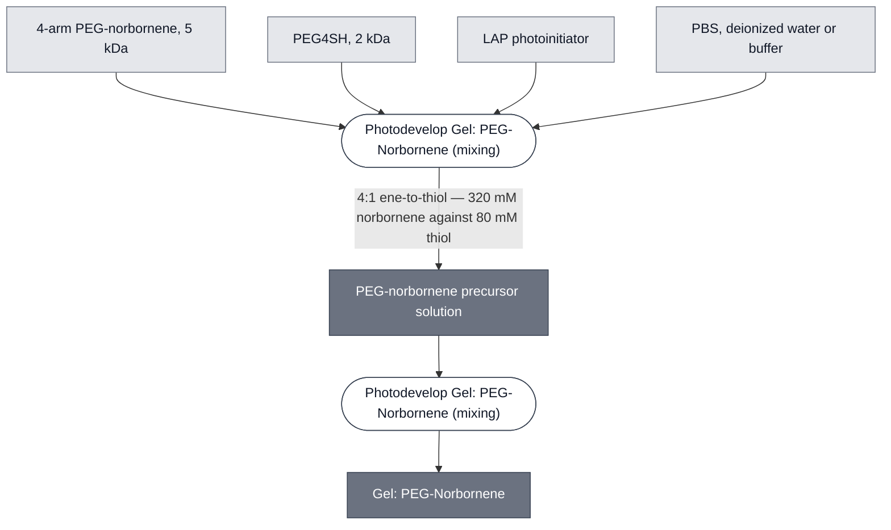

# Overview

<!-- gen:position -->
**Position.** Refines [`photopatterned-gel`](../photopatterned-gel/spec.md). Refined by nothing on this branch.
<!-- /gen:position -->

PEG-Norbornene Gel is a photocrosslinked hydrogel formed by step-growth thiol-ene chemistry: 4-arm PEG-norbornene, a PEG4SH crosslinker, and a photoinitiator. Like [PEGDA Gel](../gel-pegda/spec.md) its geometry is set by projected light, but through a different mechanism, and it is less prone to oxygen inhibition at the gel surface. Compare to [Alginate Gel](../gel-alginate/spec.md) and [ULGA Gel](../gel-ulga/spec.md), which set uniformly and never illuminate their contents.

It is the newer of the two photodevelopment chemistries. Like the PEGDA route it exposes the payload to UV, so neither can carry pre-loaded CPRG through crosslinking.

:::{attention} 🚧 Draft
This page is a work in progress and not yet ready for use.
:::

(gel-peg-norbornene-reference-composition)=
# Reference Composition

:::::{tab-set}

<!-- gen:composition-diagram -->
::::{tab-item} Module Dependencies

::::
<!-- /gen:composition-diagram -->

::::{tab-item} Precursor

:::{table} PEG-norbornene precursor solution.
:label: comp-gel-peg-norbornene

| Component | Working concentration | Notes |
| --- | --- | --- |
| 4-arm PEG-norbornene, 5 kDa | 80 mM | the backbone |
| PEG4SH, 2 kDa | 20 mM | thiol crosslinker. 4:1 ene-to-thiol against the backbone — provisional, see below |
| LAP photoinitiator | 16.9 mM | lithium phenyl-2,4,6-trimethylbenzoylphosphinate |
:::

::::

:::::

:::{note} The composition is recorded; the arm ratio is provisional
Chicago Node, Ojaswita Pant, 2026-09-14. Dissolve in 1 mL PBS, deionized water or buffer.
Vortex 2000 rpm 1 min, rest (3–5) min at room temperature, vortex (2–4) min, repeat until clear.
Prepare under red light or in the dark.

**The arm ratio is 4:1 ene-to-thiol** — 320 mM norbornene against 80 mM thiol — where
step-growth thiol-ene normally runs near 1:1. A four-fold norbornene excess gives a loosely
crosslinked network, which may be deliberate: the same protocol specifies photopatterning for
"exactly 60 s". @Editor(chicago): confirm the 4:1 ratio is intended rather than a transcription
slip.
:::

(gel-peg-norbornene-expected-behavior)=
# Expected Behavior

## Gels

Expect a gel that forms where the light falls, with a more uniform network than a chain-growth acrylate gives and less inhibition at the surface where oxygen is present.

A spatial-patterning result is confirmed: a block-pattern color change, first shown in agarose, was repeated with a PEG-norbornene outer gel and LacZ added on top, with the color change still visible after roughly 1.5 h.

:::{warning} UV exposure bleaches CPRG
[CPRG](../substrate-cprg-suv/spec.md) is UV-sensitive, and this gel's crosslinking step imposes UV on the payload. The side-by-side comparison behind the finding — exposed sample visibly bleached against an unexposed control — was run on this chemistry, but the constraint follows from the UV and applies to [PEGDA](../gel-pegda/spec.md) equally. It does not apply to alginate or ULGA, which use no UV.

The workaround inverts the order: pre-add LacZ to the gel, crosslink, then add CPRG as a free dye. That path does not use the CPRG Substrate SUV module at all, so it is a different cascade rather than the same one in a different gel.
:::

(gel-peg-norbornene-requirements)=
# Requirements

Requires UV illumination and a photoinitiator, so anything embedded must tolerate light exposure and the radical species it generates.

Requires the PEG4SH crosslinker, as the PEGDA route does.

**Requires that CPRG is not pre-loaded into liposomes.** This is the one requirement here that rules a whole cascade out rather than constraining it: the two-liposome colorimetric readout cannot be run in this gel as written.

# Processes

Formed by [Photodevelop Gel: PEG-Norbornene](../../processes/photodevelop-peg-norbornene/main.md), which is a stub — it records the chemistry and the **Conflict** its UV exposure raises with CPRG, but no precursor recipe or exposure conditions. [Photodevelop Gel](../../processes/photodevelop-gel/photodevelop-gel-main.md) carries the steps this route shares with [Photodevelop Gel: PEGDA](../../processes/photodevelop-pegda/main.md).

# Materials

<!-- vale nucleus.magnitude-unit-spacing = NO -->
:::{table} Purchased materials.
:label: bom-gel-peg-norbornene

| Name | Category | Product | Manufacturer | Part # | Price | Storage | Link |
| --- | --- | --- | --- | --- | --- | --- | --- |
| 4-arm PEG-norbornene | Chemical | 4-Arm PEG-Norbornene, MW 5k | Creative PEGWorks | PSB-4110-5g | — | — | [link](https://creativepegworks.com/product/4-arm-peg-norbornene-mw-5k) |
| PEG4SH | Chemical | 4-Arm PEG-Thiol (2k) | Creative PEGWorks | PSB-440-5g | $900 | −20 °C, dark | — |
| LAP photoinitiator | Chemical | Lithium phenyl-2,4,6-trimethylbenzoylphosphinate | Sigma-Aldrich | 900889-1G | — | — | [link](https://www.sigmaaldrich.com/US/en/product/aldrich/900889) |
:::
<!-- vale nucleus.magnitude-unit-spacing = YES -->

# Credits

Developed by the Chicago Node.
