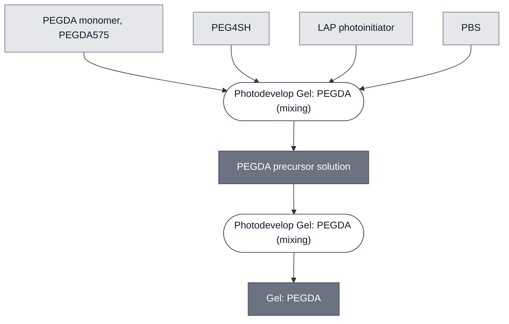

# Overview

<!-- gen:position -->
**Position.** Refines [`photopatterned-gel`](../photopatterned-gel/spec.md). Refined by nothing on this branch.
<!-- /gen:position -->

PEGDA Gel is a poly(ethylene glycol) diacrylate hydrogel crosslinked by 405 nm light in the presence of a photoinitiator. It gels only where the light falls, so its geometry is set by a projected image rather than by its container. That is what makes it a route to the spatial separation a cascade needs when two populations must be kept apart — though not the only route: a block-pattern result has also been produced in agarose, by a different method. Compare to [Alginate Gel](../gel-alginate/spec.md) and [ULGA Gel](../gel-ulga/spec.md), which set uniformly and impose no illumination, and to [PEG-Norbornene Gel](../gel-peg-norbornene/spec.md), which patterns by a different chemistry.

PEGDA crosslinks by radical polymerization of its acrylate groups, with a PEG4SH crosslinker and a LAP photoinitiator — the same crosslinker the PEG-norbornene route uses.

:::{attention} Canceled as a cell-carrying gel — PEG-DA "destroys the vesicles"
PEGDA cannot hold synthetic cells. Chicago Node, 2026-09-11: the aTc path uses
[PEG-Norbornene](../gel-peg-norbornene/spec.md) "because PEG-DA destroys the vesicles."
Radical acrylate polymerization is not compatible with the lipid membranes the cascades are
built from.

**It remains live as a structural frame.** Ojaswita Pant's 2026-09-14 protocol patterns a
PEGDA575-alginate frame and backfills a PEG4Nb inset with the DevCells in it — the cells never
enter the PEGDA. That composite has its own page.

This specification is kept for reference and is not maintained.
:::

(gel-pegda-reference-composition)=
# Reference Composition

:::::{tab-set}

<!-- gen:composition-diagram -->
::::{tab-item} Module Dependencies

::::
<!-- /gen:composition-diagram -->

::::{tab-item} Precursor

:::{table} PEGDA precursor solution.
:label: comp-gel-pegda

| Component | Working concentration | Notes |
| --- | --- | --- |
| PEGDA monomer, PEGDA575 | 20 wt% | in PBS to 100 wt% total |
| PEG4SH | 0.3 wt% | chain-transfer agent in this route, not the crosslinker — see below |
| LAP photoinitiator | 0.03 wt% | lithium phenyl-2,4,6-trimethylbenzoylphosphinate; keep the solution dark until patterning |
:::

::::

:::::

:::{note} PEG4SH does a different job here
Same reagent as the [PEG-norbornene route](../gel-peg-norbornene/spec.md), different function.
There it is the crosslinker at 20 mM of a 2 kDa four-arm polymer — roughly 4 wt%. Here it is
**0.3 wt%**, thirteen-fold lower, in a system where the acrylate self-polymerizes and needs no
thiol partner. At that loading it acts as a chain-transfer agent. "Shared with" is true of the
bottle and misleading about the chemistry.

Vortex 2000 rpm (3–5) min. Photopattern (15–30) s at 405 nm — the window already on this page is
correct.
:::

A multimaterial variant mixes 1.6 wt% alginate into this precursor and crosslinks each component by its own route. What that yields is not a blended gel: the demonstrated construct is **a PEGDA frame around an alginate core**, two regions with a boundary between them. So the mixture names the ingredients and not the product — the product is a structure. See [Alginate Gel](../gel-alginate/spec.md). The alginate step crosslinks in a **200 mM CaCl₂** bath after patterning. The PEGDA575-alginate frame is patterned for **30 s** and the PEG4Nb inset for **60 s**, both at 405 nm.

Chicago compared this against the punch-out method — gel surrounded by air — and prefers the punch-out method: the frame route shows "more color bleed into the white frame, reducing spatial resolution" (Chicago Node, 2026-09-17). Recorded, not recommended. The punch-out method has no protocol on record.

(gel-pegda-expected-behavior)=
# Expected Behavior

## Gels

Expect a gel that forms only where the light falls, so the pattern is set by the projected image rather than by the mold. Patterning runs at 405 nm for 15 s to 30 s through a digital light processing projector, adjusted for monomer concentration, layer thickness and feature size — no single exposure time covers every condition.

Chain-growth acrylate polymerization is prone to oxygen inhibition at the gel surface and produces more heterogeneous networks than a step-growth chemistry would.

:::{warning} Not yet validated with a cascade
No result embeds a working sensing cascade in this gel. It is documented as a route to the spatial separation the [Chicago Cascade](../chicago-cascade/spec.md) Requirements section calls for, but that combination has not been run.
:::

:::{attention} No feature-size or mechanical data
No quantitative feature size, imaging methodology or mechanical-integrity measurement exists for this gel.
:::

(gel-pegda-requirements)=
# Requirements

Requires 405 nm illumination and a photoinitiator, so anything embedded must tolerate light exposure and the radical species LAP generates.

Requires the precursor solution to be protected from light until patterning.

Requires a 405 nm projector, an equipment requirement neither ionically nor thermally set gels carry.

Requires that no UV-sensitive component is present during crosslinking. [CPRG](../substrate-cprg-suv/spec.md) is the known case, so it goes into the gel after crosslinking rather than pre-loaded — the same constraint the [PEG-norbornene route](../gel-peg-norbornene/spec.md) carries, since both share the UV exposure.

# Processes

Prepared and patterned by [Photodevelop Gel: PEGDA](../../processes/photodevelop-pegda/main.md). [Photodevelop Gel](../../processes/photodevelop-gel/photodevelop-gel-main.md) carries the steps this route shares with the [PEG-norbornene route](../../processes/photodevelop-peg-norbornene/main.md).

# Materials

:::{table} Purchased materials.
:label: bom-gel-pegda

| Name | Category | Product | Manufacturer | Part # | Link |
| --- | --- | --- | --- | --- | --- |
| PEGDA monomer | Chemical | Poly(ethylene glycol) diacrylate | Sigma-Aldrich | 437441-500ML | [link](https://www.sigmaaldrich.com/US/en/product/aldrich/437441) |
| LAP photoinitiator | Chemical | Lithium phenyl-2,4,6-trimethylbenzoylphosphinate | Sigma-Aldrich | 900889-1G | [link](https://www.sigmaaldrich.com/US/en/product/aldrich/900889) |
| DLP projector (405 nm) | Equipment | PRO4500-92-405 optical engine | Wintech Digital Systems Technology | PRO4500-92-405 | [link](https://wintechdigital.com/products/pro4500-wintech-production-ready-optical-engine/) |
:::

# Credits

Developed by Ojaswita Pant (Chicago Node, Truby Lab).
