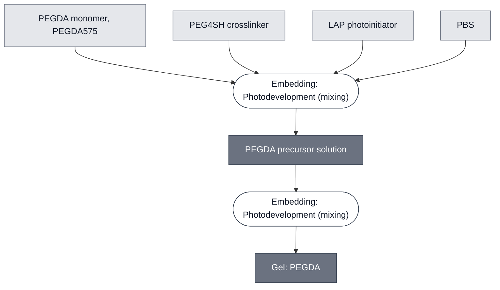

# Overview

<!-- gen:position -->
**Position.** Refines [`photopatterned-gel`](../photopatterned-gel/spec.md). Refined by nothing on this branch.
<!-- /gen:position -->

PEGDA Gel is a poly(ethylene glycol) diacrylate hydrogel crosslinked by 405 nm light in the presence of a photoinitiator. It gels only where the light falls, so its geometry is set by a projected image rather than by its container. That is what makes it a route to the spatial separation a cascade needs when two populations must be kept apart — though not the only route: a block-pattern result has also been produced in agarose, by a different method. Compare to [Alginate Gel](../gel-alginate/spec.md) and [ULGA Gel](../gel-ulga/spec.md), which set uniformly and impose no illumination, and to [PEG-Norbornene Gel](../gel-peg-norbornene/spec.md), which patterns by a different chemistry.

PEGDA crosslinks by radical polymerization of its acrylate groups, with a PEG4SH crosslinker and a LAP photoinitiator — the same crosslinker the PEG-norbornene route uses.

:::{attention} Not used to hold synthetic cells
PEGDA "destroys the vesicles" (Group Meeting, Chicago Node, 2026-09-11), so the cascades hold synthetic cells in [PEG-Norbornene](../gel-peg-norbornene/spec.md) instead. Radical acrylate polymerization is not compatible with their lipid membranes.

PEGDA is used as a structural frame. A PEGDA575-alginate frame is patterned, and a PEG4Nb inset holding the cells is backfilled into it, so the cells never enter the PEGDA. See the multimaterial variant on [Gel: Alginate](../gel-alginate/spec.md).
:::

(gel-pegda-reference-composition)=
# Reference Composition

:::::{tab-set}

<!-- gen:composition-diagram -->
::::{tab-item} Module Dependencies

```mermaid
flowchart TD
    PEGDA575["PEGDA monomer, PEGDA575"]
    PEG4SH["PEG4SH crosslinker"]
    LAP["LAP photoinitiator"]
    PBS["PBS"]

    P1_ASSEMBLE_PRECURSOR_0(["Embedding: Photodevelopment (mixing)"])
    PEGDA_PRECURSOR["PEGDA precursor solution"]
    P2_PHOTOPATTERN_0(["Embedding: Photodevelopment (mixing)"])
    GEL_PEGDA["Gel: PEGDA"]

    PEGDA575 --> P1_ASSEMBLE_PRECURSOR_0
    PEG4SH --> P1_ASSEMBLE_PRECURSOR_0
    LAP --> P1_ASSEMBLE_PRECURSOR_0
    PBS --> P1_ASSEMBLE_PRECURSOR_0
    P1_ASSEMBLE_PRECURSOR_0 --> PEGDA_PRECURSOR

    PEGDA_PRECURSOR --> P2_PHOTOPATTERN_0
    P2_PHOTOPATTERN_0 --> GEL_PEGDA


    classDef leaf     fill:#e5e7eb,stroke:#6b7280,color:#111827;
    classDef composed fill:#6b7280,stroke:#374151,color:#ffffff;
    classDef process  fill:#ffffff,stroke:#374151,color:#111827;
    class PEGDA575,PEG4SH,LAP,PBS leaf;
    class PEGDA_PRECURSOR,GEL_PEGDA composed;
    class P1_ASSEMBLE_PRECURSOR_0,P2_PHOTOPATTERN_0 process;

    click P1_ASSEMBLE_PRECURSOR_0 "/docs/processes/embed-photodevelopment/main"
    click P2_PHOTOPATTERN_0 "/docs/processes/embed-photodevelopment/main"
    click GEL_PEGDA "/docs/modules/gel-pegda/spec"
```

::::
<!-- /gen:composition-diagram -->

::::{tab-item} Precursor

:::{table} PEGDA precursor solution.
:label: comp-gel-pegda

| Component | Working concentration | Notes |
| --- | --- | --- |
| PEGDA monomer, PEGDA575 | 20 wt% | in PBS to 100 wt% total |
| PEG4SH | 0.3 wt% | chain-transfer agent in this route, not the crosslinker — see below |
| LAP photoinitiator | 0.03 wt% | lithium phenyl-2,4,6-trimethylbenzoylphosphinate; keep the solution dark until patterning |
:::

::::

:::::

:::{note} PEG4SH does a different job here
The same reagent is the crosslinker in the [PEG-norbornene route](../gel-peg-norbornene/spec.md), at 20 mM of a 2 kDa four-arm polymer — roughly 4 wt%. Here it is **0.3 wt%**, thirteen-fold lower, in a system where the acrylate self-polymerizes and needs no thiol partner. At that loading it acts as a chain-transfer agent.

:::

A multimaterial variant mixes 1.6 wt% alginate into this precursor and crosslinks each component by its own route. What that yields is not a blended gel: the demonstrated construct is **a PEGDA frame around an alginate core**, two regions with a boundary between them. See [Alginate Gel](../gel-alginate/spec.md). The alginate step crosslinks in a **200 mM CaCl₂** bath after patterning. The PEGDA575-alginate frame is patterned for **30 s** and the PEG4Nb inset for **60 s**, both at 405 nm.

In a frame, the reporter's color bleeds into the frame and lowers spatial resolution; see [LacZ Reporter](../reporter-lacz/spec.md).

(gel-pegda-expected-behavior)=
# Expected Behavior

## Gels

Expect a gel that forms only where the light falls, so the pattern is set by the projected image rather than by the mold. Patterning runs at 405 nm for 15 s to 30 s through a digital light processing projector, adjusted for monomer concentration, layer thickness and feature size — no single exposure time covers every condition.

Chain-growth acrylate polymerization is prone to oxygen inhibition at the gel surface and produces more heterogeneous networks than a step-growth chemistry would.

:::{warning} Not yet validated with a cascade
No result embeds a working sensing cascade in this gel. It is documented as a route to the spatial separation the [Chicago Cascade](../chicago-cascade/spec.md) Requirements section calls for, but that combination has not been run.
:::

:::{attention} No feature-size or mechanical data
No quantitative feature size, imaging methodology or mechanical-integrity measurement exists for this gel.
:::

(gel-pegda-requirements)=
# Requirements

Requires 405 nm illumination and a photoinitiator, so anything embedded must tolerate light exposure and the radical species LAP generates.

Requires the precursor solution to be protected from light until patterning.

Requires a 405 nm projector, an equipment requirement neither ionically nor thermally set gels carry.

Requires that no UV-sensitive component is present during crosslinking. [CPRG](../substrate-cprg-suv/spec.md) is the known case, so it goes into the gel after crosslinking rather than pre-loaded — the same constraint the [PEG-norbornene route](../gel-peg-norbornene/spec.md) carries, since both share the UV exposure.

# Processes

Prepared and patterned by [Embedding: Photodevelopment](../../processes/embed-photodevelopment/main.md), which carries this chemistry as a canceled variant beside the live PEG-norbornene one, and the four steps they share. Vortex the precursor at 2000 rpm for (3–5) min.

# Materials

:::{table} Purchased materials.
:label: bom-gel-pegda

| Name | Category | Product | Manufacturer | Part # | Link |
| --- | --- | --- | --- | --- | --- |
| PEGDA monomer | Chemical | Poly(ethylene glycol) diacrylate | Sigma-Aldrich | 437441-500ML | [link](https://www.sigmaaldrich.com/US/en/product/aldrich/437441) |
| LAP photoinitiator | Chemical | Lithium phenyl-2,4,6-trimethylbenzoylphosphinate | Sigma-Aldrich | 900889-1G | [link](https://www.sigmaaldrich.com/US/en/product/aldrich/900889) |
| DLP projector (405 nm) | Equipment | PRO4500-92-405 optical engine | Wintech Digital Systems Technology | PRO4500-92-405 | [link](https://wintechdigital.com/products/pro4500-wintech-production-ready-optical-engine/) |
:::

# Credits

Developed by Ojaswita Pant (Chicago Node, Truby Lab).
