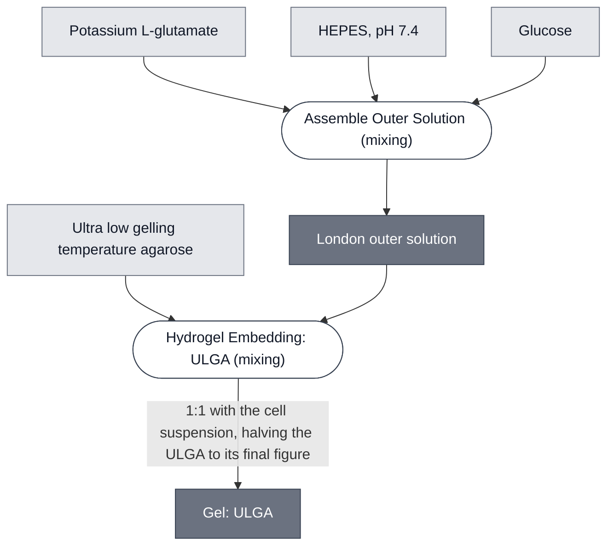

# Overview

ULGA Gel is an ultra-low-gelling-temperature agarose hydrogel, dissolved directly into the outer solution it will become and set by cooling. It is the matrix the London demo runs in. Compare to [Alginate Gel](../gel-alginate/spec.md), which reaches an equivalent result by ionic crosslinking instead of a thermal set, and to [PEGDA Gel](../gel-pegda/spec.md), whose geometry is set by projected light rather than by its container.

The property that makes ULGA usable with synthetic cells is its gel point. It sets at (8–17)°C, far below standard agarose, so the window between "still liquid enough to mix" and "cold enough to damage the contents" is wide.

:::{attention} 🚧 Draft
This page is a work in progress and not yet ready for use.
:::

(gel-ulga-reference-composition)=
# Reference Composition

:::::{tab-set}

<!-- gen:composition-diagram -->
::::{tab-item} Module Dependencies

::::
<!-- /gen:composition-diagram -->

::::{tab-item} Gel

:::{table} ULGA gel, as prepared.
:label: comp-gel-ulga

| Component | Working concentration | Notes |
| --- | --- | --- |
| ULGA | 1% (w/v) in the prepared solution; 0.5% (w/v) once combined 1:1 with the cell suspension | dissolved into the outer solution below, not into water. Works from 0.2% to 0.5% in the set gel. **Lower gives faster kinetics; higher holds a better on-off state**, so the density is a dynamic-range lever rather than a preference. 0.2% immobilizes GUVs |
| Potassium L-glutamate | 578 mM | |
| HEPES, pH 7.4 | 72 mM | |
| Glucose | 300 mM | |
| **Osmolarity** | **~920 mOsm** | the sum of the components above. Whether this figure was measured or calculated is not recorded |
:::

::::

:::::

Unlike the other three gels, ULGA is specified together with its solution rather than as an additive to someone else's. The salts and sugar above are the [London Chassis](../london-chassis/spec.md) outer solution, which matches inner to outer at about 920 mOsm.

**Osmolarity is additive.** The figure above is the sum of every component's contribution, the polymer included. At 1% (w/v) the ULGA itself adds on the order of 0.1 mOsm — negligible against 920, but not zero. The salts and sugar set it.

A separate configuration replaces those three with 1200 mM glucose and 0.1 mM CaCl₂, used where the embedded cells carry [Base Cytosol](../base-cytosol/spec.md) rather than [S30 Lysate](../s30-lysate/spec.md). The 1200 mM figure is not arbitrary — above roughly 1200 mOsm, CPRG leakage from loaded liposomes drops sharply.

(gel-ulga-expected-behavior)=
:::{table} The material's temperature window.
| Bound | Value | What it is |
| --- | --- | --- |
| Lower | **8 °C** | the gelling point |
| Upper | **50 °C** | the **melting** point |
:::

:::{attention} The upper bound is not a working temperature, and this window is not the one a payload needs
**8 °C and 50 °C are different quantities**, a gelling point and a melting point. Supplied by Jon, 2026-09-21, from the supplier's materials specification page. **That is a catalog figure for a nominal product and not a measurement of either Node's stock**, and the measured gelling point of the agarose actually in use is still an open ask. @Editor(london): what temperature does your A5030 set at?

**50 °C is not a temperature at which the payload can be mixed in.** The window is still correct on this page because the gel is not what forbids it. **The payload is**, and that is a Requirement the payload imposes on its Container rather than a property of this polymer. See [Abstract: Gel](../abstract-gel/spec.md), which carries the same window for the class.

**So do not narrow this field to record a payload's limit.** A tighter band belongs on the page of the thing being held, pointing here.
:::

# Expected Behavior

## Osmolarity

**This gel provides an osmolarity; it does not tolerate one.** The distinction matters when swapping a module in or out. An outer solution — and a gel is one, since the polymer dissolves into it — states a **range it provides**. What tolerates a range is the cell inside, and that tolerance is a property of its membrane rather than of this gel.

| Configuration | Osmolarity | Used with |
| --- | --- | --- |
| Standard, with the London Chassis outer solution | ~920 mOsm | [S30 Lysate](../s30-lysate/spec.md) cells |
| High-glucose, 1200 mM glucose + 0.1 mM CaCl₂ | ~1200 mOsm | [Base Cytosol](../base-cytosol/spec.md) cells, where CPRG retention matters |

**The upper figure is a threshold, not a preference.** Above roughly 1200 mOsm, CPRG leakage from loaded liposomes falls sharply — so the high-glucose configuration is chosen for dye retention, not for the cells' sake.

**No tolerated range is established for any membrane used with this gel.** Measuring one means putting [Dye Liposomes](../dye-liposomes/spec.md) across a panel of outer solutions and scoring liposome integrity. Until that exists, match empirically.

## Gels

Expect a gel that stays liquid while warm, tolerates mixing with intact synthetic cells, and sets on cooling below its gel point without a crosslinker, a divalent load or any illumination.

Two results are confirmed in this matrix. At 1.5%, the two-liposome PLA1/CPRG/LacZ chemistry gives a visible color change from about 3 h at 37 °C, easily discernible by 16 h — see [PLA1 Lysis Module](../effector-pla1/spec.md). At 1%, encapsulated cells give a GFP readout scored after 2.5 h.

:::{note} The colorimetric result was measured at a superseded concentration
The 1.5% above is the condition that experiment ran at, and it is kept for that reason. New work uses 1% (w/v) in the prepared solution, which gives 0.5% (w/v) in the set gel.

The London Node confirmed the 1:1:2 combining ratio on 2026-09-09. Under that ratio 1.5% gives 0.75% (w/v) in the set gel, above the 0.2% to 0.5% working range — so the confirmed colorimetric result comes from a condition current practice does not use.
:::

:::{attention} The temperatures are not established
No dissolution temperature, hold time, or cooling target is recorded for this gel. Standard low-melting-agarose technique is to heat until the solution runs clear, then hold it above the gel point until use, but that is convention rather than a measured protocol here.
:::

(gel-ulga-requirements)=
# Requirements

Requires a heat excursion to dissolve — near boiling, with stirring — followed by cooling to a temperature that is still above the gel point but safe for the cells being mixed in. Anything mixed in at that point must survive the cooling and the set; nothing but the ULGA itself is present for the near-boiling step, and a component added onto the set gel afterwards experiences neither.

Requires the outer solution to be prepared first, since the agarose is dissolved into it rather than being added to a finished gel.

Imposes no divalent load and no illumination on its contents.

# Processes

Prepared and set by [Hydrogel Embedding: ULGA](../../processes/embed-ulga-hydrogel/main.md).

# Materials

:::{table} Purchased materials.

| Name | Category | Product | Manufacturer | Part # | Link |
| --- | --- | --- | --- | --- | --- |
| ULGA | Reagent | Ultra low gelling temperature agarose | Sigma-Aldrich | A5030 | [link](https://www.sigmaaldrich.com/GB/en/product/sial/a5030) |
:::

The source records this agarose as both Sigma-Aldrich A5030 and A2576, "Agarose, Type IX-A, ultra low gelling temperature". London Node: they are interchangeable.

# Credits

Developed by Julia Purrinos De Oliveira (London Node), with the PLA1 colorimetric variant by Jonah McDonald and Charlie Newell.
