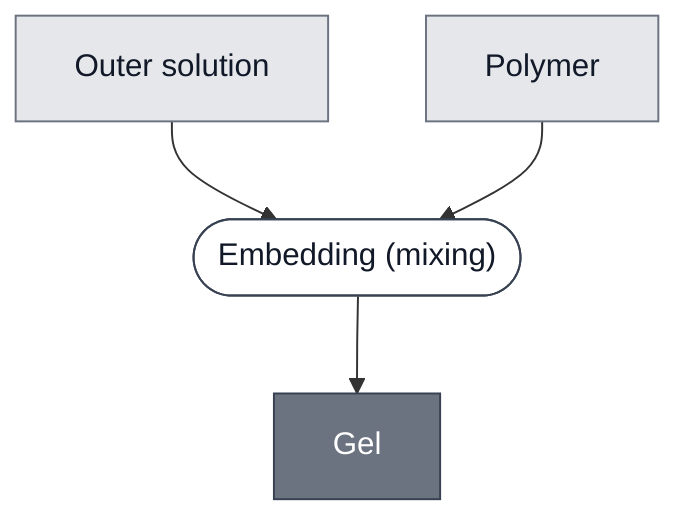

# Overview

<!-- gen:position -->
**Position.** Refines [Container](../container/spec.md). Refined by [Gel: Alginate](../gel-alginate/spec.md), [Photopatterned Gel](../photopatterned-gel/spec.md), [Thermal Gel](../thermal-gel/spec.md).
<!-- /gen:position -->

A class: a polymer network set in an outer solution.

In every member, the network holds things in fixed relation to one another. A gel does not enclose what it holds. It fixes where things are and leaves them in contact with the solution around them. Members differ in the polymer and in what makes the network set.

:::{attention} 🚧 Draft
This page is a work in progress and not yet ready for use.
:::

# Reference Composition

:::::{tab-set}

<!-- gen:composition-diagram -->
::::{tab-item} Module Dependencies

::::
<!-- /gen:composition-diagram -->

::::{tab-item} Outer Solution

:::{table} What each member dissolves its polymer into.
| Member | Outer solution |
| --- | --- |
| [Gel: ULGA](../gel-ulga/spec.md) | [Outer Solution: Glutamate-HEPES-Glucose](../outer-solution-glutamate/spec.md) |
| [Gel: LGA](../gel-lga/spec.md) | an [Outer Solution](../outer-solution/spec.md) |
| [Gel: Alginate](../gel-alginate/spec.md) | a buffer matched to what is embedded, normally that population's own outer solution |
| [Gel: PEG-Norbornene](../gel-peg-norbornene/spec.md) | PBS, deionized water or a buffer |
| [Gel: PEGDA](../gel-pegda/spec.md) | PBS |
:::

::::

::::{tab-item} Polymer

:::{table} What each member sets with, and what sets the network.
| Member | Polymer | What sets the network |
| --- | --- | --- |
| [Gel: ULGA](../gel-ulga/spec.md) | ultra-low-gelling-temperature agarose | cooling |
| [Gel: LGA](../gel-lga/spec.md) | low-gelling-temperature agarose | cooling |
| [Gel: Alginate](../gel-alginate/spec.md) | sodium alginate | divalent calcium |
| [Gel: PEG-Norbornene](../gel-peg-norbornene/spec.md) | 4-arm PEG-norbornene with a PEG4SH crosslinker | 405 nm light, step-growth thiol-ene |
| [Gel: PEGDA](../gel-pegda/spec.md) | PEGDA575 | 405 nm light, radical acrylate |
:::

::::

:::::

A gel is a polymer mixed into the outer solution it will become: one compartment, with no membrane between them.

[Gel: PEG-Norbornene](../gel-peg-norbornene/spec.md) and [Gel: PEGDA](../gel-pegda/spec.md) form a subclass, [Photopatterned Gel](../photopatterned-gel/spec.md): light sets their geometry from a projected image rather than from the shape of the container.

# Expected Behavior

A component embedded in a gel stays where it was when the gel set, and stays in contact with the outer solution around it. The gel separates components in space and not by a boundary, so an enzyme and its substrate can sit in one gel and not react.

# Requirements

Requires a solvent phase to form in. Every member is cast into the outer solution it will become.

# Processes

A member is set by one of the routes of [Embedding](../../processes/embed-gel/main.md): [Embedding: Ionic Crosslinking](../../processes/embed-ionic-crosslinking/main.md), [Embedding: Thermal Setting](../../processes/embed-thermal-setting/main.md) or [Embedding: Photodevelopment](../../processes/embed-photodevelopment/main.md).

# Credits

:::{attention} Credits are draft
Contributor attribution on this page has not been confirmed with the Node. Assign each credit explicitly before this page is merged to `main`.
:::
