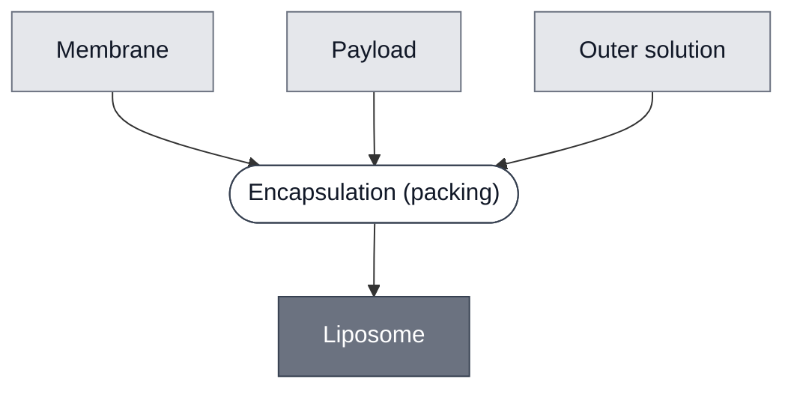

# Overview

<!-- gen:position -->
**Position.** Refines [Vesicle](../vesicle/spec.md). Refined by [SensorCell[3OC6-HSL ⟶ PLA1]](../ahsl-sensing-cell/spec.md), [SensorCell[aTc ⟶ PLA1]](../atc-sensing-cell/spec.md), [Base Cell](../base-cell/spec.md), [Cell: Base Cytosol, POPC/Chol (9:1)](../cell-base-cytosol-popc-chol/spec.md), [Cell: S30 Lysate, POPC](../cell-s30-popc/spec.md), [Dye Liposomes](../dye-liposomes/spec.md), [GUV: CPRG](../guv-cprg/spec.md), [SensorCell[pH ⟶ PLA1]](../ph-sensing-cell/spec.md), [Substrate LUV: CPRG](../substrate-cprg-luv/spec.md), [Substrate SUV: CPRG](../substrate-cprg-suv/spec.md), [SensorCell[theophylline ⟶ LacZ]](../theophylline-sensing-cell/spec.md).
<!-- /gen:position -->

A [vesicle](../vesicle/spec.md) whose bilayer is made of lipid. **Its sibling is a polymersome**, whose bilayer is made of block copolymer; this corpus has none.

**This is the material axis, and it is independent of size.** A liposome may be a [GUV](../guv/spec.md), an [SUV](../suv/spec.md) or an [LUV](../luv/spec.md), which is why this class refines Vesicle and not one of those three.

**Eleven members, assigned 2026-10-05.** This page argued until then that assigning them would record a distinction separating nothing, because every vesicle in the corpus is a liposome. Jon overruled it: *"synthetic cells should refine liposomes, as should any of the substrate vesicles and dye vesicles (by virtue of the fact that they are built from lipids)"*.

**The argument was wrong about what a parent is for.** A class that holds only what currently distinguishes members is a sorting key. The material axis is a fact about what each Module is made of, and it is true of all eleven whether or not a polymersome ever arrives. Leaving it unasserted did not keep the corpus neutral; it left eleven Modules silent about their own bilayer.

:::{attention} 🚧 Draft
This page is a work in progress and not yet ready for use.
:::

# Reference Composition

**A lipid membrane around a payload.** The refinement is one narrowing of the parent: [Membrane](../membrane/spec.md) is lipid by its own definition, so naming it is what makes this class narrower than Vesicle.

:::::{tab-set}

<!-- gen:composition-diagram -->
::::{tab-item} Module Dependencies

::::
<!-- /gen:composition-diagram -->

:::::

# Members

**Eleven, every one verified to take a POPC-based membrane.** The nine GUV-scale Modules, plus the CPRG LUV and the CPRG SUV.

**The first polymersome is still what makes the distinction do work**, and it now has somewhere to land that is not empty on both sides.

# Expected Behavior

As [Vesicle](../vesicle/spec.md). **Being made of lipid adds no behavior the parent does not state** — what a lipid bilayer does differently from a polymer one is not measured anywhere here.

# Requirements

Requires a lipid membrane, and an interior to close around.

# Constituent Modules

- [Membrane](../membrane/spec.md) — a lipid bilayer, which is the whole of the refinement
- **Payload** — what it closes around, as on the parent: a cytosol, a substrate or a dye

# Credits

:::{attention} Credits are draft
Contributor attribution on this page has not been confirmed with the Node. Assign each credit explicitly before this page is merged to `main`.
:::
