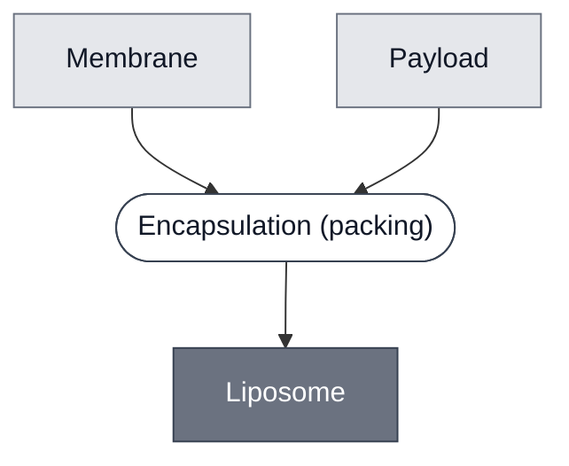

# Overview

<!-- gen:position -->
**Position.** Refines [`vesicle`](../vesicle/spec.md). Refined by nothing on this branch.
<!-- /gen:position -->

A [vesicle](../vesicle/spec.md) whose bilayer is made of lipid. **Its sibling is a polymersome**, whose bilayer is made of block copolymer; this corpus has none.

**This is the material axis, and it is independent of size.** A liposome may be a [GUV](../guv/spec.md), an [SUV](../suv/spec.md) or an [LUV](../luv/spec.md), which is why this class refines Vesicle and not one of those three.

**No members are assigned, and that is deliberate.** Every vesicle documented here is a liposome, so giving eleven Modules this parent would record a distinction that separates none of them from any other. The page exists so the axis is written down and a polymersome has somewhere to attach.

:::{attention} 🚧 Draft
This page is a work in progress and not yet ready for use.
:::

# Reference Composition

**A lipid membrane around a payload.** The refinement is one narrowing of the parent: [Membrane](../membrane/spec.md) is lipid by its own definition, so naming it is what makes this class narrower than Vesicle.

:::::{tab-set}

<!-- gen:composition-diagram -->
::::{tab-item} Module Dependencies

::::
<!-- /gen:composition-diagram -->

:::::

# Members

**None yet, and the absence is the record.** The first polymersome makes this distinction real and gives both classes their members on the same day.

# Expected Behavior

As [Vesicle](../vesicle/spec.md). **Being made of lipid adds no behavior the parent does not state** — what a lipid bilayer does differently from a polymer one is not measured anywhere here.

# Requirements

Requires a lipid membrane, and an interior to close around.

# Constituent Modules

- [Membrane](../membrane/spec.md) — a lipid bilayer, which is the whole of the refinement
- **Payload** — what it closes around, as on the parent: a cytosol, a substrate or a dye

# Credits

:::{attention} Credits are draft
Contributor attribution on this page has not been confirmed with the Node. Assign each credit explicitly before this page is merged to `main`.
:::
