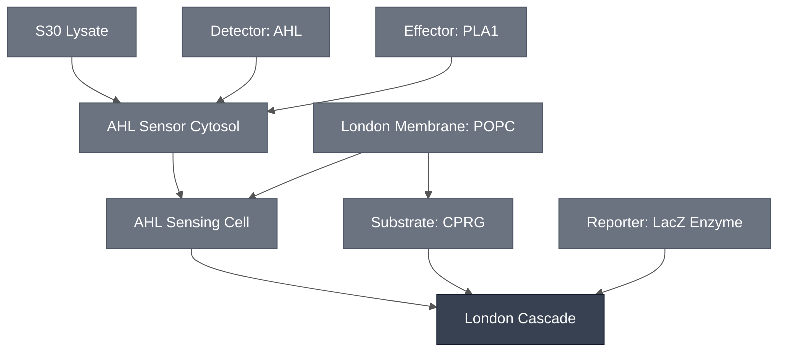

# Overview

The London Cascade combines the [AHL Sensing Cell](../ahl-sensing-cell/spec.md) with the [PLA1 Lysis Module](../effector-pla1/spec.md) and the [LacZ Reporter](../reporter-lacz/spec.md) to turn AHL exposure into a visible color change. AHL activates the LuxR/pLux promoter inside the sensing cell, driving expression of PLA1 which then lyses its own liposome and a neighboring CPRG-loaded liposome, releasing CPRG into an outer solution containing β-galactosidase (LacZ), which then converts yellow CPRG into magenta chlorophenol red.

:::{attention} 🚧 Draft
This page is a work in progress and not yet ready for use.
:::

# Reference Composition

:::::{tab-set}

<!-- gen:composition-diagram -->
::::{tab-item} Module Dependencies

::::
<!-- /gen:composition-diagram -->

::::{tab-item} DNA

:::{table}
| **Name** | **Length (bp)** | **File** | **Supply route** |
| --- | --- | --- | --- |
| `LuxR-PLA1` | 2237 | — | Expressed in the AHL Sensing Cell. One molecule: constitutive `BBa_J23101`→`luxR`, plus `pLux` driving PLA1. Replaces the `LuxR-deGFP` reporter variant. London's own documents call it `P70lux-PLA1-term`. |
| LuxR receiver | not documented | — | Not documented — expressed or supplied as protein |
:::

:::{note} LuxR is expressed from the same plasmid as its target
LuxR is not supplied as purified protein. Each London sensing construct carries a constitutive `BBa_J23101` promoter driving `luxR`, and a `pLux` promoter driving the payload, on one molecule — so `LuxR-PLA1` and `LuxR-deGFP` each express their own receiver. The DevCells demo uses `LuxR-PLA1`; `LuxR-deGFP` is the reporter variant under test.
:::

:::{attention} Construct not yet in `nucleus-eng/DNA`
`LuxR-PLA1` is not yet confirmed in [nucleus-eng/DNA](https://github.com/nucleus-eng/DNA) — see the [PLA1 Lysis Module](../effector-pla1/spec.md) DNA tab for the same gap. Do not add a length or file entry here until the construct is confirmed and its length verified against the source file.
:::

::::

::::{tab-item} AHL Sensing Cell

The [AHL Sensing Cell](../ahl-sensing-cell/spec.md), carrying `LuxR-PLA1` as its payload in place of `LuxR-deGFP`.

:::{table} AHL Sensing Cell inner solution, one level deep.
:label: comp-london-cascade-sensing

| Module | Working concentration | Notes |
| --- | --- | --- |
| [AHL Sensor Cytosol](../ahl-sensor-cytosol/spec.md) | S30 Lysate at reaction concentration | Transcription and translation. Composed before encapsulation, not added to a closed chassis |
| [London Membrane: POPC](../membrane-popc/spec.md) | 100% POPC | Closes the cytosol in one encapsulation step |
| [AHL Sensing Module](../detector-3oc6-hsl/spec.md) | `LuxR-PLA1` plasmid at 15 ng/µL final | The payload swap. The Sensing Cell carries `LuxR-deGFP` at 37 ng/µL instead. LuxR is not supplied separately — it is on this same molecule, under a constitutive promoter. |
| [PLA1 Lysis Module](../effector-pla1/spec.md) | covered by `LuxR-PLA1` | PLA1 is expressed from the plasmid above, not supplied separately. |
:::

:::{table} AHL Sensing Cell membrane — [London Membrane: POPC](../membrane-popc/spec.md).
:label: comp-london-cascade-sensing-membrane

| Component | Target percentage (%) |
| --- | --- |
| POPC | 100 |
:::

::::

::::{tab-item} Substrate Liposome

A second, dedicated liposome population carrying the chromogenic substrate. See [Substrate: CPRG](../substrate-cprg/spec.md).

**The London Node has moved from SUVs to GUVs** (2026-09-09), so this population is now made by the same phase-transfer route as the sensing cells rather than by film hydration and extrusion. It is slower, and it removes a whole process from the cascade.

:::{table} Substrate liposome lumen.
:label: comp-london-cascade-suv

| Component | Working concentration |
| --- | --- |
| CPRG substrate | 50 mM at hydration, approx. 30 mg/mL — per [Substrate: CPRG](../substrate-cprg/spec.md) |
:::

:::{table} Substrate liposome membrane — [London Membrane: POPC](../membrane-popc/spec.md).
:label: comp-london-cascade-suv-membrane

| Component | Target percentage (%) |
| --- | --- |
| POPC | 100 |
:::

[Substrate: CPRG](../substrate-cprg/spec.md)'s Requirements accept either lipid composition — POPC, or POPC:cholesterol — so the 100% POPC bilayer here is not a discrepancy with the Module. The loading concentration is bilayer-independent and carries over either way.

::::

::::{tab-item} Outer Solution

:::{table} Exterior solution.
:label: comp-london-cascade-outer

| Component | Working concentration |
| --- | --- |
| Potassium L-glutamate | 578 mM |
| HEPES, pH 7.4 | 72 mM |
| Glucose | 300 mM |
| ULGA | 1.5%, dissolved in the solution above — see [ULGA Hydrogel Embedding](../../processes/embed-ulga-hydrogel/main.md) |
| AHL (3-oxo-C6-HSL) inducer | 10 µM; 5 µM is also used, and both appear in reported results. Present in the induced condition only. |
| β-galactosidase (LacZ) | 20 U/mL, added as purified protein — per [LacZ Reporter](../reporter-lacz/spec.md). London supplies LacZ purified rather than expressing it in-reaction. |
:::

The first three components are the same salts and sugar at the same concentrations as the [AHL Sensing Cell](../ahl-sensing-cell/spec.md), which matches its inner and outer solutions at ≈ 920 mOsm. Matching them here keeps encapsulated contents from being driven across the bilayer by an osmotic gradient before the cascade fires.

AHL may instead be supplied as supernatant from an AHL-producing bacterial culture, diluted 10:1 — 20 µL into 200 µL of hydrogel.

::::

:::::

(london-cascade-expected-behavior)=
# Expected Behavior

## Cells

With S30 lysate-encapsulated liposomes and quorum sensing active, a color change appears both in the presence and the absence of AHL. At 15 ng/µL plasmid DNA and 5 µM purified AHL, the difference between the +AHL and −AHL conditions is only slightly discernible after 16 h at 37 °C.

The same configuration has been reproduced in gel format in two laboratories, in both solution and gel formats. Rupture is temperamental — synthetic cells do not always rupture. Leaky expression is present here too, though the signal stays discernible.

:::{attention} Net characterization
The AHL-gated PLA1/LacZ colorimetric readout is not yet robust. The signal is real — a color difference between the +AHL and −AHL conditions has been observed — but it is only slightly discernible, and the two-liposome lysis-and-release mechanism ruptures inconsistently even where the result has been repeated across laboratories. Treat this Module as an optimization target, not a validated colorimetric cascade.
:::

:::{note} A constitutive configuration of the same chemistry gives a clearer result
Run in Nucleus Cytosol without quorum sensing, the same PLA1/CPRG two-liposome chemistry produces a color change from ~3 h at 37 °C, easily discernible by 16 h and reproduced across multiple days. That result establishes the PLA1/LacZ/CPRG chemistry and is specified in full on the [PLA1 Lysis Module](../effector-pla1/spec.md) page. It carries no LuxR/pLux gating, so it is evidence for the chemistry rather than for AHL detection.
:::

# Requirements

Requires sigma-70 transcription and translation (e.g. [S30 Lysate](../s30-lysate/spec.md)). The `LuxR-PLA1` construct is driven by the *E. coli* P70/pLux promoter, not pT7, so it does not express in a T7-only cytosol.

Requires AHL (3-oxo-C6-HSL) as the inducer and the LuxR receiver protein to gate the promoter (e.g. [Detector: AHL](../detector-3oc6-hsl/spec.md)).

Requires two separate liposome populations — the PLA1-payload sensing population and a CPRG-loaded population (e.g. [London Chassis](../london-chassis/spec.md)).

The readout depends on PLA1 lysing both compartments to release CPRG, so this cascade has no bulk-cytosol route.

Requires that no LacZ protein share a compartment with CPRG until the reporter module is turned on (see [LacZ Reporter Module](../reporter-lacz/spec.md)).

# Implementations

- [London DevCell](../../implementations/london-devcell/main.md): places this cascade in its demo operating context.

# Processes

Six steps, listed in the order they are performed. Every one has a Process page except the first, which needs none, and the fourth, which has none.

**Shared**

1. **Reconstitute the cytosol.** [S30 Lysate](../s30-lysate/spec.md) is supplied as a kit — premix, extract and amino acid mix — so it is mixed rather than built from a protocol. This is where the London Cascade departs from a Nucleus Cytosol build, which assembles its cytosol through a documented process.

**Sensing population**

2. [Encapsulation: Phase Transfer](../../processes/assemble-base-cell/main.md) — forms the [AHL Sensing Cell](../ahl-sensing-cell/spec.md) by emulsion phase transfer: S30 Lysate carrying `LuxR-PLA1`, which supplies both the LuxR receiver and the PLA1 payload, inside a [100% POPC membrane](../membrane-popc/spec.md). Sucrose assists the transfer, and inner and outer osmolarity are matched at ≈ 920 mOsm.

**Reporter population**

3. [Encapsulation: Phase Transfer](../../processes/assemble-base-cell/main.md) — prepares the substrate liposomes carrying [CPRG](../substrate-cprg/spec.md), by the same phase-transfer route as the sensing population. **This replaces SUV encapsulation**, which the London Node stopped using in favor of GUVs (2026-09-09): the cascade is slower to make and has one fewer process to track, because both populations now come from one method.

**Shared, once both populations exist**

4. **Co-incubate the two populations 1:1** in a shared outer solution containing LacZ, giving an equimolar mixture of the two synthetic cell populations. No Process page covers this step.
5. [ULGA Hydrogel Embedding](../../processes/embed-ulga-hydrogel/main.md) — the gel format the London demo uses. The population mixture is combined 1:1 with ULGA at 1% (w/v), giving **0.5% (w/v) final** — so the cascade's overall ratio is **1:1:2**, sensing cells to substrate cells to gel mixture. The cascade also runs in solution; see [AHL Sensing Cell](../ahl-sensing-cell/spec.md).
6. [Colorimetric Readout](../../processes/colorimetric-readout/main.md) — the CPRG conversion, yellow to magenta, read by absorbance and by eye.

:::{important} The combining ratio, confirmed at the bench
Step 4 was previously recorded as a gap: a reader could make each population from the pages linked here and still not know how much of each to use.

Confirmed with the London Node, 2026-09-09: the two populations are mixed **1:1**, then that mixture is combined **1:1 with 1% (w/v) ULGA** for a **0.5% final** gel — an overall **1:1:2**. ULGA works from **0.2% to 0.5%**, and lower concentrations give faster kinetics.

**No Process page covers step 4.** Every combination step needs one, so the gap is now a missing page rather than a missing number.
:::

# Constituent Modules

- [AHL Sensing Cell](../ahl-sensing-cell/spec.md)
- [PLA1 Lysis Module](../effector-pla1/spec.md)
- [LacZ Enzyme](../reporter-lacz-enzyme/spec.md) — dispersed free in the gel, not encapsulated
- [Substrate: CPRG](../substrate-cprg/spec.md) — held in the second liposome population

# Credits

Developed by Jonah McDonald and Charlie Newell (London Node).

:::{attention} Credits are draft
Contributor attribution on this page has not been confirmed with the Node. Assign each credit explicitly before this page is merged to `main`.
:::
