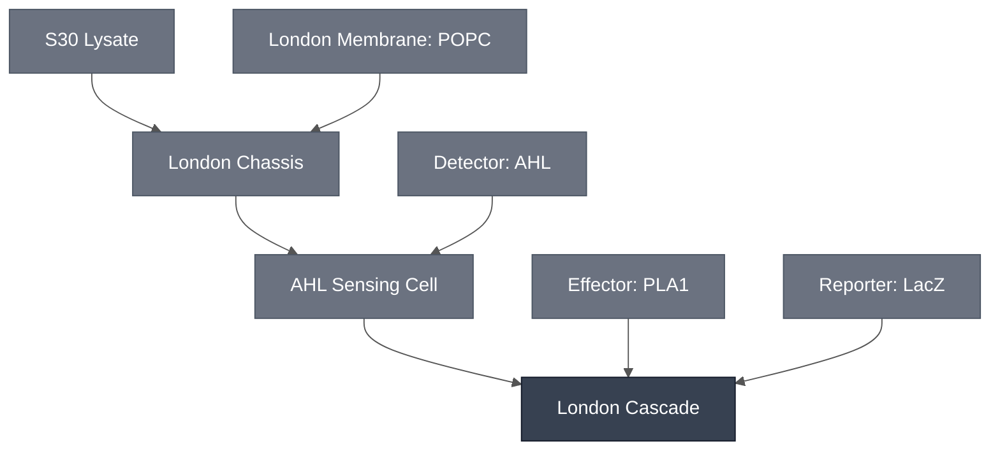

# Overview

The London Cascade combines the [AHL Sensing Cell](../ahl-sensing-cell/spec.md) with the [PLA1 Lysis Module](../effector-pla1/spec.md) and the [LacZ Reporter](../reporter-lacz/spec.md) to turn AHL exposure into a visible color change.

AHL activates the LuxR/pLux promoter inside the sensing cell. Here that promoter drives a PLA1 construct (`P70lux-PLA1-term`) rather than the GFP payload of the [AHL Sensing Cell](../ahl-sensing-cell/spec.md). Expressed PLA1 ruptures its own liposome and a neighboring CPRG-loaded liposome, releasing CPRG into an exterior β-galactosidase (LacZ) solution, which converts yellow CPRG into magenta chlorophenol red.

:::{attention} 🚧 Draft
This page is a work in progress and not yet ready for use.
:::

See the [AHL Sensing Cell](../ahl-sensing-cell/spec.md) spec for the underlying LuxR/pLux sensing data — encapsulation, plasmid dosing, and temperature dependence. This page covers what changes when PLA1 replaces GFP as the output.

```mermaid
%%{init: {'theme': 'base', 'themeVariables': {'lineColor': '#555555', 'edgeLabelBackground': '#ffffff'}}}%%
flowchart LR
    AHL["AHL (3-oxo-C6-HSL)<br/>5 µM, exterior"] --> SENSE["AHL Sensing Cell:<br/>LuxR/pLux binds AHL,<br/>drives P70lux-PLA1-term<br/>(15 ng/µL DNA)"]
    SENSE -->|"PLA1 expressed"| LYSIS["PLA1 Lysis Module:<br/>self-lysis of the<br/>sensing synthetic cell"]
    LYSIS -->|"ruptures neighboring<br/>CPRG-loaded synthetic cell"| RELEASE["CPRG released into<br/>exterior solution"]
    RELEASE -->|"β-galactosidase"| READOUT["LacZ Reporter:<br/>yellow CPRG →<br/>magenta chlorophenol red"]

    classDef confirmed fill:#def5ee,stroke:#009E73,color:#00402e;
    classDef leaky fill:#fff3cd,stroke:#b8860b,color:#5c4400;

    class AHL,SENSE,LYSIS,RELEASE confirmed;
    class READOUT leaky;

    click SENSE "/docs/modules/ahl-sensing-cell/spec"
    click LYSIS "/docs/modules/effector-pla1/spec"
    click READOUT "/docs/modules/reporter-lacz/spec"
```

Schematic representation of the London Cascade mechanism. The readout step is shaded because it is the leaky, only slightly discernible part of the chain (see [Expected Behavior](#expected-behavior)). Rupture is unreliable: synthetic cells do not always rupture.

# Reference Composition

:::::{tab-set}

<!-- gen:composition-diagram -->
::::{tab-item} Module Dependencies

::::
<!-- /gen:composition-diagram -->

::::{tab-item} DNA

:::{table}
| **Name** | **Length (bp)** | **File** | **Supply route** |
| --- | --- | --- | --- |
| `P70lux-PLA1-term` | not yet determined | — | Expressed in the AHL Sensing Cell; replaces `pLux-GFP` |
| LuxR receiver | not documented | — | Not documented — expressed or supplied as protein |
| β-galactosidase (LacZ) | not applicable | — | Supplied as purified enzyme in the outer solution, not expressed |
:::

:::{attention} Construct not yet in `nucleus-eng/DNA`
`P70lux-PLA1-term` is not yet confirmed in [nucleus-eng/DNA](https://github.com/nucleus-eng/DNA) — see the [PLA1 Lysis Module](../effector-pla1/spec.md) DNA tab for the same gap. Do not add a length or file entry here until the construct is confirmed and its length verified against the source file.
:::

::::

::::{tab-item} AHL Sensing Cell

The [AHL Sensing Cell](../ahl-sensing-cell/spec.md) with `P70lux-PLA1-term` in place of `pLux-GFP`.

:::{table} AHL Sensing Cell inner solution, S30 lysate condition.
:label: comp-london-cascade-sensing

| Component | Working concentration |
| --- | --- |
| `P70lux-PLA1-term` plasmid DNA | 15 ng/µL |
| S30 lysate premix, extract, amino acid mix, sucrose, RNase inhibitor | Not documented for the PLA1 payload; see [AHL Sensing Cell](../ahl-sensing-cell/spec.md) for the closest documented analog |
:::

:::{table} AHL Sensing Cell membrane — [London Membrane: POPC](../membrane-popc/spec.md).
:label: comp-london-cascade-sensing-membrane

| Component | Target percentage (%) |
| --- | --- |
| POPC | 100 |
:::

::::

::::{tab-item} Substrate SUV

A second, dedicated liposome population carrying the chromogenic substrate. See [Substrate SUV: CPRG](../substrate-cprg-suv/spec.md).

:::{table} Substrate SUV lumen.
:label: comp-london-cascade-suv

| Component | Working concentration |
| --- | --- |
| CPRG substrate | Not reported for this cascade configuration |
:::

:::{table} Substrate SUV membrane — [London Membrane: POPC](../membrane-popc/spec.md).
:label: comp-london-cascade-suv-membrane

| Component | Target percentage (%) |
| --- | --- |
| POPC | 100 |
:::

::::

::::{tab-item} Outer Solution

:::{table} Exterior solution.
:label: comp-london-cascade-outer

| Component | Working concentration |
| --- | --- |
| AHL (3-oxo-C6-HSL) inducer | 5 µM |
| β-galactosidase (LacZ) | Not reported for this cascade configuration; see [LacZ Reporter](../reporter-lacz/spec.md) for the enzyme's general characterization |
:::

The osmolarity components of the outer solution are not documented for this cascade.

::::

:::::

# Expected Behavior

## Cells

With S30 lysate-encapsulated liposomes and quorum sensing active, a color change appears both in the presence and the absence of AHL. At 15 ng/µL plasmid DNA and 5 µM purified AHL, the difference between the +AHL and −AHL conditions is only slightly discernible after 16 h at 37 °C.

The same configuration has been reproduced in gel format in two laboratories, in both solution and gel formats. Rupture is temperamental — synthetic cells do not always rupture. Leaky expression is present here too, though the signal stays discernible.

:::{attention} Net characterization
The AHL-gated PLA1/LacZ colorimetric readout is not yet robust. The signal is real — a color difference between the +AHL and −AHL conditions has been observed — but it is only slightly discernible, and the two-liposome lysis-and-release mechanism ruptures inconsistently even where the result has been repeated across laboratories. Treat this Module as an optimization target, not a validated colorimetric cascade.
:::

:::{note} A constitutive configuration of the same chemistry gives a clearer result
Run in Nucleus Cytosol without quorum sensing, the same PLA1/CPRG two-liposome chemistry produces a color change from ~3 h at 37 °C, easily discernible by 16 h and reproduced across multiple days. That result establishes the PLA1/LacZ/CPRG chemistry. It carries no LuxR/pLux gating, so it is evidence for the chemistry rather than for AHL detection.
:::

# Requirements

Requires sigma-70 transcription and translation (e.g. [S30 Lysate](../s30-lysate/spec.md)). The `P70lux-PLA1-term` construct is driven by the *E. coli* P70/pLux promoter, not pT7, so it does not express in a T7-only cytosol.

Requires AHL (3-oxo-C6-HSL) as the inducer and the LuxR receiver protein to gate the promoter (e.g. [Detector: AHL](../detector-ahl/spec.md)).

Requires two separate liposome populations — the PLA1-payload sensing population and a CPRG-loaded population (e.g. [London Chassis](../london-chassis/spec.md)) — plus β-galactosidase in the exterior solution (e.g. [LacZ Reporter](../reporter-lacz/spec.md)). The readout depends on PLA1 lysing both compartments to release CPRG, so this cascade has no bulk-cytosol route.

# Implementations

- [London DevCell](../../implementations/london-devcell/main.md): places this cascade in its demo operating context.

# Process

The London Cascade requires encapsulating two separate liposome populations (the PLA1-payload sensing population and the CPRG-loaded reporter population) and combining them in a shared exterior LacZ solution, following the same synthetic cell mineral-oil phase-transfer route documented on the [London Chassis](../london-chassis/spec.md) and [AHL Sensing Cell](../ahl-sensing-cell/spec.md) specs.

:::{attention} Process gap
The individual steps are documented: [Encapsulation: Phase Transfer](../../processes/assemble-base-cell/main.md), [SUV Encapsulation](../../processes/encapsulate-suv/main.md), and [ULGA Hydrogel Embedding](../../processes/embed-ulga-hydrogel/main.md). What is **not** documented is the co-incubation step that combines the two liposome populations at the ratio this cascade needs — that remains a gap.
:::

:::{attention} Exterior LacZ leakage — mitigation not yet written up
Exterior LacZ, or LacZ/CPRG product, leaks after PLA1-triggered lysis. This is an open issue for two-liposome cascades of this kind. A proteinase K treatment — 50 °C for 10 min, then 40 °C for 1 h, then spin down — is a candidate mitigation, but is not yet written up as a process. See [PLA1 Lysis Module § Known Future Work](../effector-pla1/spec.md#known-future-work).
:::

# Constituent Modules

- [AHL Sensing Cell](../ahl-sensing-cell/spec.md)
- [PLA1 Lysis Module](../effector-pla1/spec.md)
- [LacZ Reporter](../reporter-lacz/spec.md)

# Credits

Developed by Jonah McDonald and Charlie Newell (London Node).
