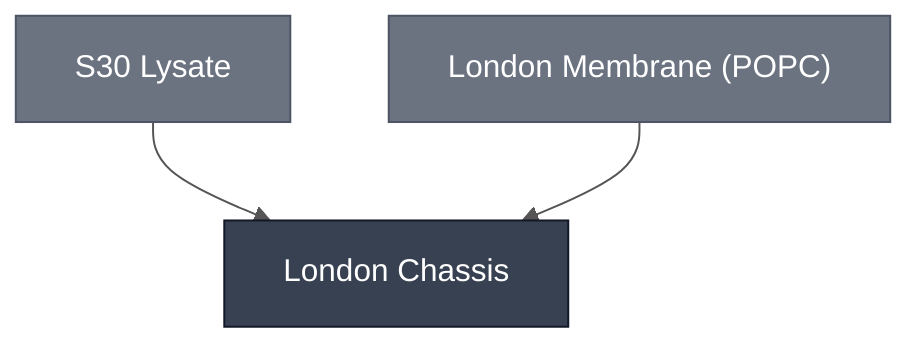

# Overview

The London Chassis is used for the London Node's DevStudio Demo and combines [S30 Lysate](../s30-lysate/spec.md) with a [100% POPC membrane](../membrane-popc/spec.md). This cell is extended in downstream demo variants by adding sensing and reporter modules (e.g., AHL Sensing Module (@Claude: link to explicit docs page)).

:::{attention} 🚧 Draft
This page is a work in progress and not yet ready for use.
:::

## Reference Composition

:::::{tab-set}

::::{tab-item} Cytosol

The inner solution encapsulated into the London Chassis is [S30 Lysate](../s30-lysate/spec.md) at reaction concentration, with sucrose to assist [encapsulation by phase transfer](../../processes/assemble-base-cell/main), and RNase inhibitor to improve performance.

:::{table}
:label: comp-london-cytosol

| Component                                                | Final Concentration                                | Volume for one reaction (µL) |
| -------------------------------------------------------- | -------------------------------------------------- | ---------------------------- |
| S30 Lysate (premix + extract + amino acid mix, combined) | 1× (kit components, each at working concentration) | 20.00                        |
| Sucrose                                                  | 276 mM                                             | 3.75                         |
| RNase inhibitor                                          | 1840 U/mL                                          | 1.25                         |
| Nuclease-free water                                      | —                                                  | 2.2                          |
| Total volume (µL)                                        |                                                    | 27.20                        |

:::
::::

::::{tab-item} Membrane

| Component                    | Target Percentage (%) | Molecular Weight (g/mol) | Stock concentration (mg/mL) | Volume to add (µL) (@Claude: pull these from membrane spec page once recalculated) | Notes                                                                      |
| ---------------------------- | --------------------- | ------------------------ | --------------------------- | ---------------------------------------------------------------------------------- | -------------------------------------------------------------------------- |
| POPC                         | 99                    | 760.076                  | 25                          | 80                                                                                 | -                                                                          |
| (Optional) DSPE-PEG2000      | 0.85                  | 2805.5                   | 10                          | 10.32                                                                              | stabilizes membrane (@Claude: verify, and add to questionnaire; duplicate) |
| (Optional) 18:1 Cyanine 5 PC | 0.1                   | 1316.26                  | 1                           | 3.423                                                                              | red fluorescence                                                           |

The membrane is the [London Membrane](../membrane-popc/spec.md) (100% POPC), optionally functionalized with red fluorescent Cyanine 5 PC, or DSPE-PEG2000.

::::

::::{tab-item} Outer Solution

:::{table}
:label: comp-london-outer

| Component                        | Concentration |
| -------------------------------- | ------------- |
| Potassium L-glutamate            | 578 mM        |
| HEPES (pH 7.4)                   | 72 mM         |
| Glucose                          | 300 mM        |

:::

Osmolarity of inner and outer solutions target ~920 mOsm.

::::

:::::

# Process

The chassis is formed by encapsulating [S30 Lysate](../s30-lysate/spec.md) in a [100% POPC membrane](../membrane-popc/spec.md) using  [emulsion phase transfer](../../processes/assemble-base-cell/main.md). Use this cell in outer solution at 920 mOsm, or empirically match your outer and inner solution osmolarities by measuring with a vapor-pressure osmometer. 

# Expected Behavior

:::{attention} Needs Expected Behavior
@Claude: add this to London Questionnaire. Verbal description of expected behavior (e.g., cell size, brightness, density of prep, etc.) and reference images.
:::

# Constituent Modules

- [S30 Lysate](../s30-lysate/spec.md)
- [London Membrane: POPC](../membrane-popc/spec.md)

# Credits

Developed by Ion Ioannou and Jonah McDonald (London node, Elani Lab).
