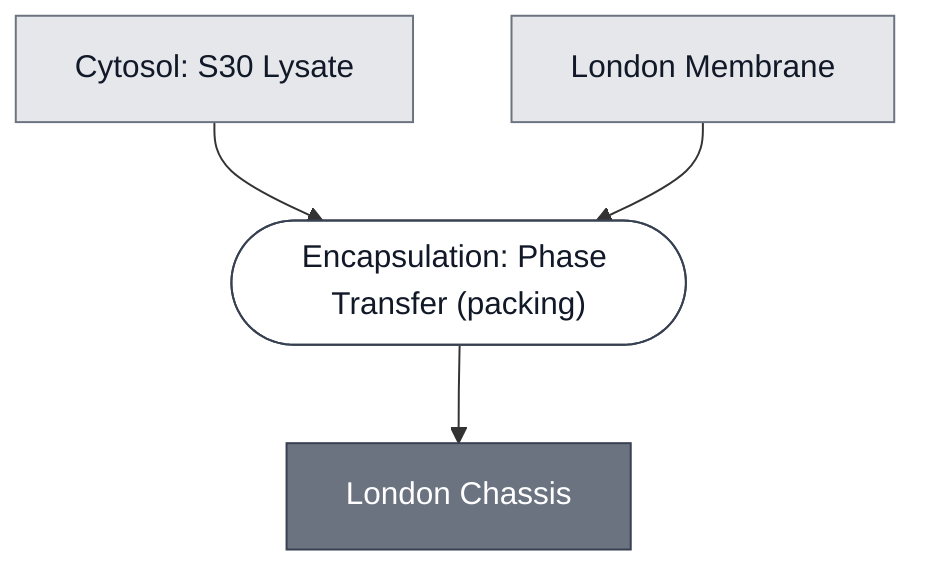

# Overview

The London Chassis is used for the London Node's DevStudio Demo and combines [S30 Lysate](../s30-lysate/spec.md) with a [100% POPC membrane](../membrane-popc/spec.md). This cell is extended in downstream demo variants by adding sensing and reporter modules (e.g., the [AHL Sensing Module](../detector-3oc6-hsl/spec.md), giving the [AHL Sensing Cell](../ahl-sensing-cell/spec.md)).

:::{attention} 🚧 Draft
This page is a work in progress and not yet ready for use.
:::

# Reference Composition

:::::{tab-set}

<!-- gen:composition-diagram -->
::::{tab-item} Module Dependencies

::::
<!-- /gen:composition-diagram -->

::::{tab-item} Cytosol

The inner solution encapsulated into the London Chassis is [S30 Lysate](../s30-lysate/spec.md) at reaction concentration, with sucrose to assist [encapsulation by phase transfer](../../processes/assemble-base-cell/main.md), and RNase inhibitor to improve performance.

:::{table}
:label: comp-london-cytosol

| Component                                                | Final Concentration                                | Volume for one reaction (µL) |
| -------------------------------------------------------- | -------------------------------------------------- | ---------------------------- |
| S30 Lysate (premix + extract + amino acid mix, combined) | 1× (kit components, each at working concentration) | 20.00                        |
| Sucrose                                                  | 276 mM                                             | 3.75                         |
| RNase inhibitor                                          | 1840 U/mL                                          | 1.25                         |
| Nuclease-free water                                      | —                                                  | 2.2                          |
| Total volume (µL)                                        |                                                    | 27.20                        |

:::
::::

::::{tab-item} Membrane

The membrane is the [London Membrane](../membrane-popc/spec.md) (100% POPC), optionally functionalized with red fluorescent Cyanine 5 PC, or DSPE-PEG2000. The two optional lipids come from two separate documented preparations and are not combined in one membrane.

:::{table} London Membrane preparations, as documented on the [London Membrane](../membrane-popc/spec.md) spec.
:label: comp-london-membrane

| Preparation                    | Target composition (mol %)     | POPC (µL) | DSPE-PEG2000 (µL) | 18:1 Cyanine 5 PC (µL) | Total lipid (mg) |
| ------------------------------ | ------------------------------ | --------- | ----------------- | ---------------------- | ---------------- |
| PEGylated membrane             | 99.15 POPC : 0.85 DSPE-PEG2000 | 130.4     | 10.32             | —                      | 3.36             |
| Fluorescently labeled membrane | 99.9 POPC : 0.1 Cyanine 5 PC   | 79.863    | —                 | 3.423                  | 2.00             |

:::

::::

::::{tab-item} Outer Solution

:::{table}
:label: comp-london-outer

| Component                        | Concentration |
| -------------------------------- | ------------- |
| Potassium L-glutamate            | 578 mM        |
| HEPES (pH 7.4)                   | 72 mM         |
| Glucose                          | 300 mM        |

:::

Osmolarity of inner and outer solutions target ~920 mOsm.

::::

:::::

(london-chassis-expected-behavior)=
# Expected Behavior

## Cells

Three phase-transfer routes have been compared for encapsulating S30 Lysate in POPC. The Elani-lab protocol with Optiprep in the inner solution gives the cleanest and highest-yield preparation. The same protocol without Optiprep gives fewer cells, and the Schroeder route (JoVE, 2020) gave yields low enough that it was dropped.

Yield is counted as cells at or above 5 µm per imaging field. In the Elani route, adding 5 mg/mL BSA and raising Optiprep to 15% raised that count about 1.5×, from roughly 27 to roughly 42. Counts hold through incubation at 37 °C, and in the Optiprep condition cells stay round and abundant for 48 h, averaging 80 per field at 1 h and 66 at 48 h. Membrane stability is therefore not what limits yield.

**Yield and expression pull against each other.** Optiprep above about 5% of the inner solution suppresses cell-free expression, so the conditions that give the most cells give no signal at all — see [AHL Sensing Cell](../ahl-sensing-cell/spec.md) for that result and its controls. The configuration demonstrated to express is the one without Optiprep, at the cost of yield. Expect to choose.

:::{attention} Size is a threshold, not a distribution
Cell size is recorded only as the ≥5 µm cutoff used for counting. @Editor(london): a size distribution, a measure of brightness, and reference images are still needed.
:::

# Requirements

Requires a membrane to encapsulate the cytosol (e.g. [London Membrane: POPC](../membrane-popc/spec.md)).

# Processes

The chassis is formed by encapsulating [S30 Lysate](../s30-lysate/spec.md) in a [100% POPC membrane](../membrane-popc/spec.md) using  [emulsion phase transfer](../../processes/assemble-base-cell/main.md). Use this cell in outer solution at 920 mOsm, or empirically match your outer and inner solution osmolarities by measuring with a vapor-pressure osmometer. 

- [ULGA Hydrogel Embedding](../../processes/embed-ulga-hydrogel/main.md) — the London hydrogel format

# Constituent Modules

- [S30 Lysate](../s30-lysate/spec.md)
- [London Membrane: POPC](../membrane-popc/spec.md)

# Implementations

- [London DevCell](../../implementations/london-devcell/main.md): the chassis for the London demo's synthetic cells.

# Credits

Developed by Ion Ioannou and Jonah McDonald (London Node, Elani Lab).

:::{attention} Credits are draft
Contributor attribution on this page has not been confirmed with the Node. Assign each credit explicitly before this page is merged to `main`.
:::
