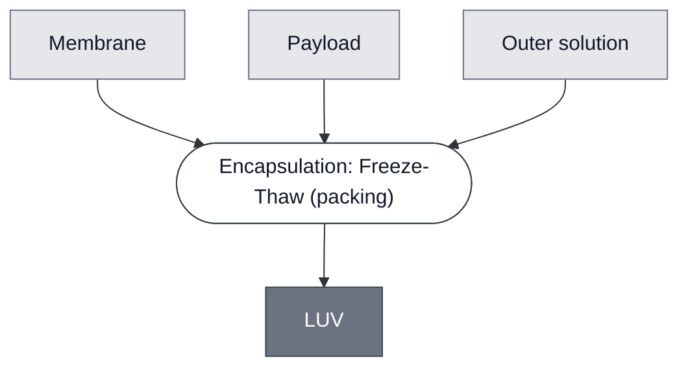

# Overview

<!-- gen:position -->
**Position.** Refines [Vesicle](../vesicle/spec.md). Refined by [Substrate LUV: CPRG](../substrate-cprg-luv/spec.md).
<!-- /gen:position -->

A **Large Unilamellar Vesicle** — a single lipid bilayer closed around an aqueous interior, in the size regime the name denotes. **What makes a Module a member is the process that closes it**: every member of this class is produced by [Encapsulation: Freeze-Thaw](../../processes/encapsulate-luv/main.md).

**One member today**, and its own page says the name is not yet confirmed by a measurement.

**Size and material are independent axes.** This class is the size one; [Liposome](../liposome/spec.md) is the material one, and both refine [Vesicle](../vesicle/spec.md). A member of this class may also be a liposome, so the two parents do not compete.

:::{attention} 🚧 Draft
This page is a work in progress and not yet ready for use.
:::

# Reference Composition

**A bilayer closed around a payload**, and this class states no formulation: its members differ in both the membrane and what is inside. What they share is the route and the size regime it produces.

**Size.** Between the other two. **Unmeasured** — its one member records that nothing has been sized, so the name rests on the preparation.

:::::{tab-set}

<!-- gen:composition-diagram -->
::::{tab-item} Module Dependencies

::::
<!-- /gen:composition-diagram -->

::::{tab-item} Membrane

The bilayer is any member of [Membrane](../membrane/spec.md). This page fixes the size and the route, not the lipids: an LUV made by freeze-thaw can carry any of them.

:::{table} The bilayer, unnarrowed at this level.
:label: comp-luv-membrane

| Component | Target percentage (%) |
| --- | --- |
| not fixed here | — |
:::

::::

:::::

# Members

:::{table} Every Module produced by this route.
| Member |
| --- |
| [Substrate LUV: CPRG](../substrate-cprg-luv/spec.md) |
:::

# Expected Behavior

A member holds its interior apart from the outside until something breaches the bilayer. **The class says nothing about what that is** — lysis, a pore, or no breach at all.

# Requirements

Requires a membrane that closes, and an interior to close around.

# Constituent Modules

- [Membrane](../membrane/spec.md) — the bilayer that closes. Which one is the member's choice
- **Payload** — what it closes around, and it has no class page: a cytosol, a substrate or a dye, depending on the member

# Credits

:::{attention} Credits are draft
Contributor attribution on this page has not been confirmed with the Node. Assign each credit explicitly before this page is merged to `main`.
:::
