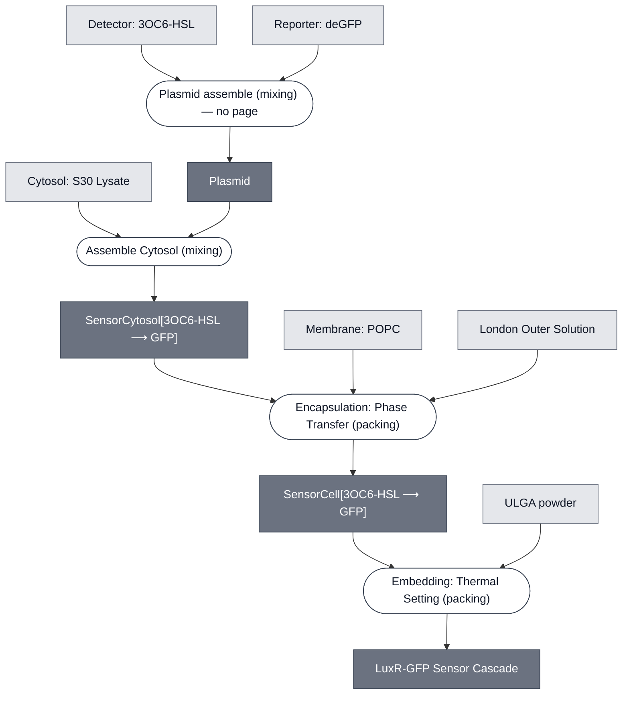

# Overview

<!-- gen:position -->
**Position.** Refines nothing declared. Refined by nothing on this branch.
<!-- /gen:position -->

A sensing cascade that detects 3OC6-HSL in S30 lysate and reports fluorescence. LuxR binds the analyte and relieves repression of deGFP, which a spectrometer reads under a UV lamp.

**This is one of two 3OC6-HSL demos, and they are not variants of one design.** The other is [CRAIC](../craic-cascade/spec.md), which senses the same analyte in [Base Cytosol](../base-cytosol/spec.md) and reports color through LacZ and CPRG. This one uses [S30 Lysate](../s30-lysate/spec.md) and reports fluorescence. They share the analyte and the detector family and nothing downstream of that.

:::{attention} 🚧 Draft
This page is a work in progress and not yet ready for use.
:::

# Reference Composition

:::::{tab-set}

<!-- gen:composition-diagram -->
::::{tab-item} Module Dependencies

::::
<!-- /gen:composition-diagram -->

::::{tab-item} Constituent Modules

- [Cytosol: S30 Lysate](../s30-lysate/spec.md)
- [Detector: 3OC6-HSL](../detector-3oc6-hsl/spec.md)
- [Reporter: deGFP](../reporter-degfp/spec.md)
- [Membrane: POPC](../membrane-popc/spec.md)
- [London Outer Solution](../outer-solution-london/spec.md)
- [Gel: ULGA](../gel-ulga/spec.md)

::::

:::::

# Expected Behavior

3OC6-HSL crosses the membrane, LuxR binds it, and deGFP is expressed. The readout is fluorescence rather than a color change, which is what separates this cascade from every other one in this corpus.

# Requirements

Requires an observation step that this corpus does not yet describe. The board draws a spectrometer under a UV lamp; no process page documents that reading, and `observe` carries no profile on the theory side, so the leg is named here and not composed.

# Processes

- [Assemble Cytosol](../../processes/assemble-cytosol/assemble-cytosol-main.md)
- [Encapsulation: Phase Transfer](../../processes/assemble-base-cell/main.md)
- [Embedding: Thermal Setting](../../processes/embed-thermal-setting/main.md)

# Credits

Transcribed from the DevStudio whiteboard of 2026-09-24. Structure follows that board.
