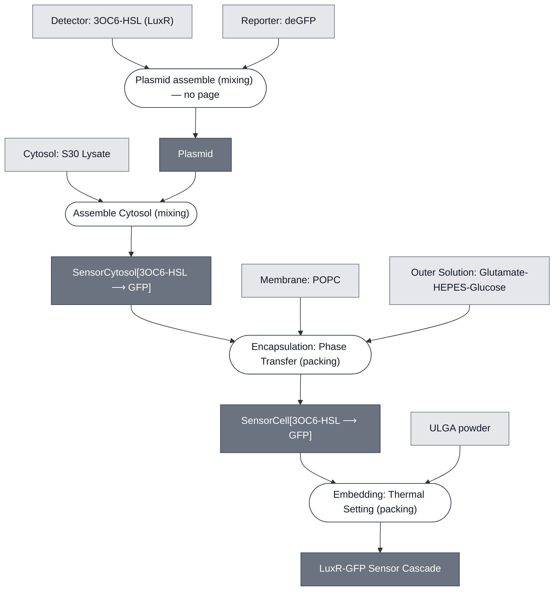

# Overview

<!-- gen:position -->
**Position.** Refines nothing declared. Refined by nothing on this branch.
<!-- /gen:position -->

A sensing cascade that detects 3OC6-HSL in S30 lysate and reports fluorescence. LuxR binds the analyte and relieves repression of deGFP, which a spectrometer reads under a UV lamp.

[CRAIC](../craic-cascade/spec.md) senses the same analyte in [Base Cytosol](../base-cytosol/spec.md) and reports color through LacZ and CPRG.

:::{attention} 🚧 Draft
This page is a work in progress and not yet ready for use.
:::

# Reference Composition

:::::{tab-set}

<!-- gen:composition-diagram -->
::::{tab-item} Module Dependencies

::::
<!-- /gen:composition-diagram -->

::::{tab-item} Constituent Modules

:::{table} One row per input in `spec.yml`.
:label: comp-luxr-gfp-cascade-modules

| Module | Role in this cascade |
| --- | --- |
| [Cytosol: S30 Lysate](../s30-lysate/spec.md) | Transcription and translation. Sigma-70, which this construct needs |
| [Detector: 3OC6-HSL (LuxR)](../detector-3oc6-hsl/spec.md) | Binds the analyte and activates `pLux` |
| [Reporter: deGFP](../reporter-degfp/spec.md) | The payload `pLux` drives |
| [Membrane: POPC](../membrane-popc/spec.md) | Closes the cytosol in one encapsulation step |
| [Outer Solution: Glutamate-HEPES-Glucose](../outer-solution-glutamate/spec.md) | The phase the cell is formed into |
| [Gel: ULGA](../gel-ulga/spec.md) | Holds the cells. The board marks it `2x` against an unstated reference |
:::

::::

::::{tab-item} DNA

:::{table} Both forms exist in `nucleus-eng/DNA`. Which one this cascade ran is not recorded — see the note.
:label: comp-luxr-gfp-cascade-dna

| **Name** | **Length (bp)** | **File** | **Supply route** |
| --- | --- | --- | --- |
| `LuxR-deGFP-linear` | 1952 | [LuxR-deGFP-linear.gb](https://github.com/nucleus-eng/DNA/blob/devcells/devstudio-constructs/reporters/detector-3oc6-hsl/LuxR-deGFP-linear.gb) | The linear cassette. One molecule: constitutive `BBa_J23101` driving `luxR`, plus `pLux` driving deGFP |
| `pOpen-LuxR-deGFP` | 3890 | [pOpen-LuxR-deGFP.gb](https://github.com/nucleus-eng/DNA/blob/devcells/devstudio-constructs/reporters/detector-3oc6-hsl/pOpen-LuxR-deGFP.gb) | The same cassette in the pOpen backbone, with `ori` and `AmpR` |
| LuxR receiver | not documented | — | Not supplied separately. It is on the molecule above, under a constitutive promoter |
:::

:::{note} The two forms are not interchangeable, and this page does not say which was used
`nucleus-eng/DNA` `README.md` states that a linear cassette and its pOpen plasmid "share a cassette and are **functionally equivalent but not sequence-identical**, so a page citing one is not citing the other."

The corpus points both ways for this cascade. [SensorCell[3OC6-HSL ⟶ PLA1]](../ahsl-sensing-cell/spec.md) cites `LuxR-deGFP` at 1952 bp, the linear form, for a cell that is also S30 Lysate. [LuxR-LacZ Sensor Cascade](../luxr-lacz-cascade/spec.md) states the opposite rule for the PLA1 variant: the linear form is "for Base Cytosol" and the circular form is the one "for S30". **Both rows are kept until a run record settles it.**
:::

:::{note} Two pages give two concentrations for this plasmid
[SensorCell[3OC6-HSL ⟶ PLA1]](../ahsl-sensing-cell/spec.md) and [SensorCytosol[3OC6-HSL ⟶ PLA1]](../ahsl-sensor-cytosol/spec.md) both say `LuxR-deGFP` at **40 ng/µL** final, from a 1056 ng/µL stock, 0.95 µL per reaction. [LuxR-LacZ Sensor Cascade](../luxr-lacz-cascade/spec.md) says **37 ng/µL**. The Cytosol tab carries 40 because that row states its stock and its volume, which is the stronger claim. The disagreement is recorded here rather than resolved.
:::

::::

::::{tab-item} Cytosol

The sensing cell interior, one level deep.

:::{table} SensorCytosol[3OC6-HSL ⟶ GFP].
:label: comp-luxr-gfp-cascade-cytosol

| Component | Working concentration | Notes |
| --- | --- | --- |
| [Cytosol: S30 Lysate](../s30-lysate/spec.md) | At reaction concentration | Not separately documented for this cascade |
| `LuxR-deGFP` plasmid | 40 ng/µL final, from a 1056 ng/µL stock — 0.95 µL per reaction | Carries both the receiver and the payload. See the DNA tab for the disagreement with 37 ng/µL |
:::

::::

::::{tab-item} Membrane

:::{table} Synthetic cell membrane — [Membrane: POPC](../membrane-popc/spec.md).
:label: comp-luxr-gfp-cascade-membrane

| Component | Target percentage (%) |
| --- | --- |
| POPC | 100 |
:::

::::

:::::

# Expected Behavior

3OC6-HSL crosses the membrane, LuxR binds it, and deGFP is expressed. The readout is fluorescence rather than a color change.

# Requirements

Requires a spectrometer reading of deGFP fluorescence under a UV lamp.

:::{attention} No process page documents the reading
@Editor: add a process page for the spectrometer reading under a UV lamp and link it here. The reading is not yet a step in the composition above.
:::

# Processes

- [Assemble Cytosol](../../processes/assemble-cytosol/assemble-cytosol-main.md)
- [Encapsulation: Phase Transfer](../../processes/assemble-base-cell/main.md)
- [Embedding: Thermal Setting](../../processes/embed-thermal-setting/main.md)

# Implementations

- [LuxR-GFP Demo](../../implementations/devstudio-luxr-gfp-demo/main.md): the cascade that demo builds.

# Credits

:::{attention} Credits are draft
Contributor attribution on this page has not been confirmed with the Node. Assign each credit explicitly before this page is merged to `main`.
:::
